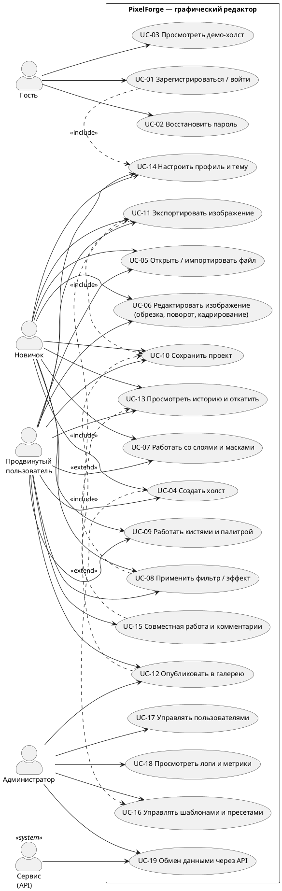
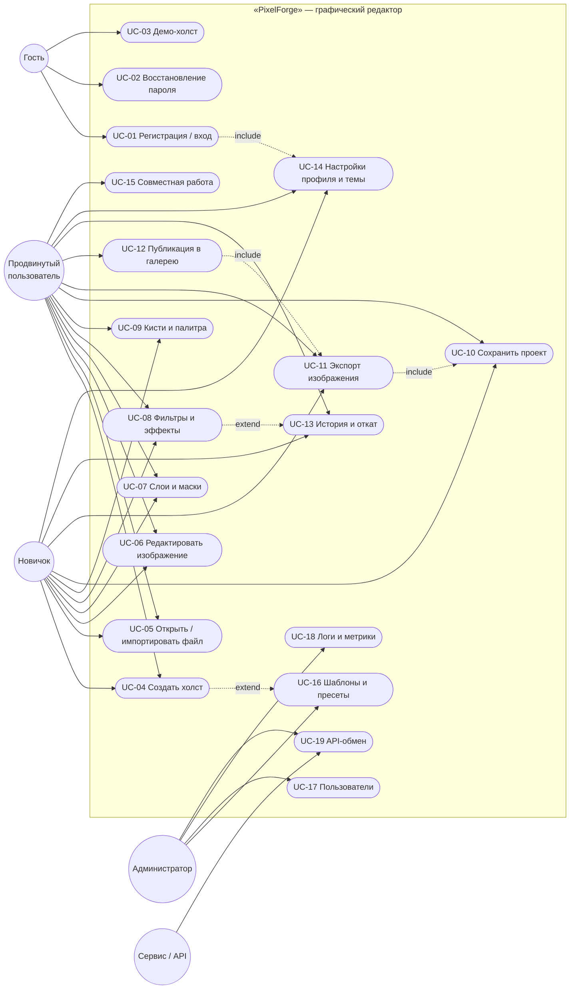
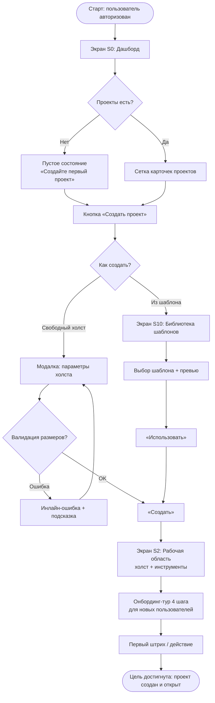
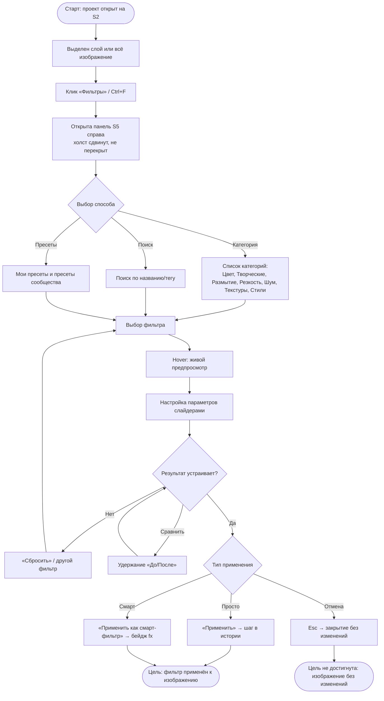
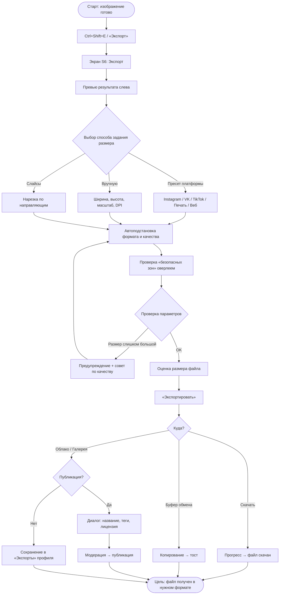
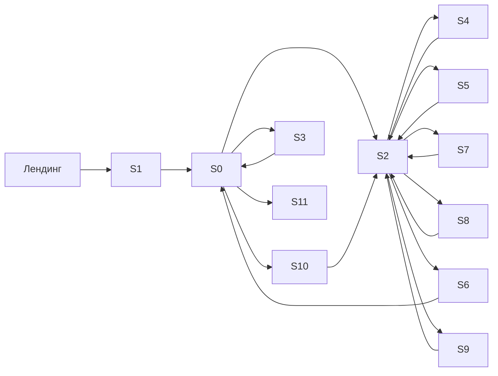

# S2G11. Проект интерфейса программной системы

## Вариант № 3. Графический редактор «PixelForge»

**Отчёт по лабораторной работе**

| Параметр | Значение |
|---|---|
| Дисциплина / модуль | S2G11 «Проект интерфейса программной системы» |
| Тема работы | Проектирование интерфейса графического редактора |
| Вариант | № 3 «Графический редактор» |
| Название продукта (рабочее) | **PixelForge** — кроссплатформенный растрово-векторный графический редактор |
| Инструмент проектирования | Figma (Desktop App / Web), плагины: Figma Tokens, Stark, Iconify, Unsplash, LottieFiles |
| Формат сдачи графики | PDF (векторный, экспорт из Figma с сохранением векторных слоёв) |
| Формат сдачи кода | Репозиторий GitHub с историей коммитов и README |
| Дата | «___» __________ 20___ г. |
| Исполнитель | ______________________ |
| Преподаватель | ______________________ |

---

## Содержание

1. [Техническое задание (ТЗ)](#1-техническое-задание)
2. [Исследование](#2-исследование)
3. [Пользовательские сценарии](#3-пользовательские-сценарии)
4. [Структура интерфейса](#4-структура-интерфейса)
5. [Прототипирование интерфейса](#5-прототипирование-интерфейса)
6. [Определение стилистики](#6-определение-стилистики)
7. [Оформление всех экранов](#7-оформление-всех-экранов)
8. [Анимация интерфейса](#8-анимация-интерфейса)
9. [Подготовка материалов для разработчиков](#9-подготовка-материалов-для-разработчиков)
10. [Отчёт и порядок сдачи](#10-отчёт-и-порядок-сдачи)
11. [Приложения](#11-приложения)

> **Как пользоваться этим документом.**
> Разделы 1–6 — аналитика и обоснование проектных решений (для текстовой части отчёта).
> Разделы 7–8 содержат **пошаговые инструкции для сборки макетов в Figma**: размеры фреймов, координаты, отступы, HEX-коды, размеры шрифтов, названия слоёв, связи в Prototype.
> Раздел 9 — спецификация передачи в разработку.
> Раздел 10 — структура PDF и репозитория GitHub с готовыми сообщениями коммитов.

---

# 1. Техническое задание

## 1.1. Общие сведения

| Пункт ТЗ | Содержание |
|---|---|
| **Наименование работы** | Разработка дизайна интерфейса программной системы «PixelForge» — графического редактора (веб-приложение + десктоп-обёртка + адаптивная мобильная версия просмотра) |
| **Шифр работы** | S2G11-2025-PF-UI-01 |
| **Заказчик** | Кафедра / учебный офис (в рамках лабораторной работы S2G11). Продуктовая роль заказчика — «Отдел цифровых продуктов» |
| **Исполнитель** | Студент группы ______________, ФИО ______________________ |
| **Основание для выполнения работ** | Задание на лабораторную работу S2G11 «Проект интерфейса программной системы», вариант № 3 |
| **Сроки выполнения** | Начало: «___» __________ 20___ г. Окончание: «___» __________ 20___ г. Промежуточная сдача (черновой прототип): «___» __________ 20___ г. |
| **Финансирование** | Работа выполняется в рамках учебного процесса, без прямого финансирования; трудозатраты учитываются в академических часах |
| **Порядок оформления и сдачи** | 1) Итоговый отчёт в формате **PDF** (векторный экспорт из Figma + текстовая часть); 2) архив/ссылка на файл Figma с публичным доступом «view»; 3) публичный репозиторий **GitHub** с поэтапной историей коммитов, README.md и вложенными экспортами; 4) защита работы (демонстрация прототипа и структуры фреймов) |
| **Порядок приёмки** | Проверка по чек-листу (раздел 10.4): ≥ 8 экранов, экран регистрации, главный экран, UI-киты (светлая + тёмная темы), UML Use-Case, User Flow Map на A4, анимации, адаптивность |

## 1.2. Назначение работы

Графический редактор «PixelForge» — программная система для создания, обработки и подготовки растровых и векторных изображений без установки тяжёлого локального ПО. Основные назначения:

1. **Создание графики с нуля**: холсты для соцсетей, баннеры, иконки, иллюстрации, коллажи, простые макеты.
2. **Редактирование готовых изображений**: обрезка, поворот, кадрирование по сетке, цветокоррекция, ретушь, замена фона.
3. **Работа с многослойной композицией**: слои, группы, маски, режимы наложения, стили слоя.
4. **Применение фильтров и эффектов**: цветовые и художественные фильтры, размытия, резкость, шум, текстуры, пресеты «в один клик».
5. **Экспорт в нужном формате**: PNG, JPG/WEBP, SVG, PDF, GIF/MP4 (для несложной анимации), с профилями под конкретные платформы.
6. **Совместная и командная работа (базово)**: облачное хранение проектов, история версий, комментарии к макету.
7. **Обучение**: встроенные подсказки, шаблоны, «режим новичка» с упрощённым набором панелей.

Цель проектирования интерфейса — снизить порог входа для непрофессионалов, не потеряв инструментальную мощность, востребованную профессионалами: «фотошоп-класс по возможностям, канва-класс по понятности».

## 1.3. Требования к выполнению работ

### 1.3.1. Виды работ

| № | Вид работы | Результат |
|---|---|---|
| 1 | Сбор и анализ требований, изучение аналогов | Раздел 2 отчёта, таблица сравнительного анализа |
| 2 | Проектирование ролевой модели и уровней доступа | Таблицы 1.4, 1.5 |
| 3 | Разработка пользовательских сценариев | Список задач + пошаговые сценарии + UML Use-Case (раздел 3) |
| 4 | Проектирование структуры интерфейса | User Flow (3 сценария) + User Flow Map на A4 (раздел 4) |
| 5 | Черновое прототипирование (wireframe, low-fi) | Серые схемы экранов (раздел 5.1) |
| 6 | Финальное прототипирование (hi-fi, интерактивное) | Связанные фреймы в Figma, Prototype (раздел 5.2) |
| 7 | Разработка стилистики: moodboard, палитра, типографика | Moodboard-фрейм, стили Figma (раздел 6) |
| 8 | Разработка UI-китов: светлая тема, тёмная тема, мобильный кит | 3 страницы/фрейма UI Kit (раздел 6.2) |
| 9 | Оформление 12 экранов в трёх разрешениях | Фреймы Desktop / Tablet / Mobile (раздел 7) |
| 10 | Проектирование анимаций и микровзаимодействий | Prototype + Smart Animate, спецификация таймингов (раздел 8) |
| 11 | Подготовка материалов для разработчиков | Design tokens, redlines, export-ассеты, Zeplin/Figma Dev Mode (раздел 9) |
| 12 | Оформление отчёта, PDF-экспорт, публикация на GitHub | PDF + репозиторий (раздел 10) |

### 1.3.2. Требования к экранам

1. Количество экранов — **не менее 8** (в проекте — 12, включая обязательные).
2. Обязательный состав экранов:
   – экран регистрации/авторизации;
   – главный экран (рабочая область / холст);
   – экран настроек профиля;
   – экран работы со слоями;
   – экран фильтров и эффектов;
   – экран экспорта;
   – экран истории действий;
   – экран управления кистями и палитрой.
3. Дополнительные (расширяющие) экраны: стартовый экран / менеджер проектов, библиотека шаблонов и ассетов, мобильная рабочая область, служебные состояния (загрузка, пустые состояния, ошибки, модальные окна).
4. Каждый экран оформляется в трёх разрешениях: **Desktop 1440×1024**, **Tablet 768×1024**, **Mobile 390×844** (landscape-вариант для рабочей области — 844×390).
5. Каждый экран подписан: имя фрейма, номер экрана, назначение, точка входа, основные действия.

### 1.3.3. Требования к дизайну

| Требование | Значение |
|---|---|
| Сетка, desktop | 12 колонок, gutter 24 px, внешние отступы 24 px |
| Сетка, tablet | 8 колонок, gutter 20 px, внешние отступы 24 px |
| Сетка, mobile | 4 колонки, gutter 16 px, внешние отступы 16 px |
| Шаг spacing-системы | 4 px (базовый модуль 8 px) |
| Типографика | UI-шрифт Inter (18/20/24/32); моно JetBrains Mono для координат и размеров |
| Палитра | 1 акцентный градиент, 5 нейтральных уровней, 4 семантических цвета |
| Контраст | Не ниже WCAG 2.1 AA (текст ≥ 4.5:1, крупный текст и иконки ≥ 3:1) |
| Состояния элементов | default / hover / focus / active / disabled / loading / error / selected |
| Радиусы | 4 / 8 / 12 / 16 px, пилюля 999 px |
| Иконки | Единый набор, сетка 24×24, обводка 1.5 px, оптическая компенсация |
| Тени | 3 уровня elevation (0/1/2/3), в тёмной теме — замена теней границами |
| Тёмная тема | Обязательна; переключение мгновенное, состояние сохраняется в профиле |

### 1.3.4. Требования к интерфейсу

1. **Принцип «холст — центр вселенной»**: изображение занимает не менее 60 % площади экрана, панели — периферийные и сворачиваемые.
2. **Минимум модальных окон**: критические операции (экспорт, фильтр, слои) выполняются в боковых панелях или док-панелях, чтобы не терять контекст изображения.
3. **Обратимость**: любое действие откатывается через историю (Ctrl+Z / Ctrl+Shift+Z), история доступна как отдельный экран с превью-снимками.
4. **Предсказуемость горячих клавиш**: соответствие отраслевому стандарту (B — кисть, M — выделение, L — лассо, V — перемещение, T — текст, Z — зум, Ctrl+S — сохранить, Ctrl+Shift+S — экспорт).
5. **Отмена долгих операций**: любой процесс длительностью > 1 с показывает прогресс и кнопку «Отменить».
6. **Управление вниманием**: акцентный цвет применяется только к активному инструменту и главному действию экрана.
7. **Доступность**: полная навигация с клавиатуры (Tab-порядок, видимый focus-ring 2 px), поддержка screen reader через ARIA-роли, режим «крупный интерфейс» (масштаб UI 100/125/150 %).
8. **Локализация**: интерфейс русский, архитектурно закладывается мультиязычность (тексты не выходят за рамки +30 % длины строки).
9. **Онбординг**: при первом входе — 4 подсказки-тура, кнопка «Пропустить», тур можно перезапустить из настроек.
10. **Единый вход в поиск**: Ctrl+K — командная палитра (поиск инструментов, фильтров, действий).

### 1.3.5. Требования к смартфонному представлению

Поскольку полноценная обработка изображений на мобильном устройстве ограничена, мобильная версия проектируется как **«спутник»**: просмотр, лёгкое редактирование, быстрые пресеты, публикация.

| Аспект | Требование |
|---|---|
| Ориентация | Портрет — навигация и менеджер проектов; ландшафт — холст и панель инструментов |
| Размер базового фрейма | 390×844 (iPhone 14/15), проверка на 360×800 (Android) |
| Нижняя навигация | 4 таба: «Проекты», «Создать», «Шаблоны», «Профиль» |
| Панель инструментов холста | Горизонтальный скролл-док, 5 основных инструментов + «Ещё» |
| Жесты | Pinch — зум, два пальца — панорамирование, тап-удержание — пипетка, свайп влево — назад, свайп по полотну вниз — экспорт |
| Безопасные зоны | Учёт safe area (top 44 px, bottom 34 px), учёт «челки» и индикатора Home |
| Размеры тапов | Минимум 44×44 px, разрывы между тапами ≥ 8 px |
| Полноэкранный режим | Скрытие браузерных панелей, immersive-режим при редактировании |
| Ограничения | Слои — до 20 на мобильном, тяжёлые фильтры выполняются на сервере с уведомлением |

## 1.4. Ролевая модель (п. 3.6)

**Таблица 1.4.1. Описание ролей**

| Роль | Код | Описание | Мотивация | Типовые задачи |
|---|---|---|---|---|
| **Гость** | `guest` | Неавторизованный посетитель. Видит лендинг, демо-холст, тарифы | Ознакомиться с продуктом | Демо-редактирование без сохранения, просмотр шаблонов |
| **Новичок** | `novice` | Зарегистрированный пользователь с базовым набором инструментов (упрощённый интерфейс) | Быстро сделать картинку, не изучая редактор | Создать холст из шаблона, применить пресет фильтра, обрезать, сохранить в PNG/JPG |
| **Продвинутый пользователь** | `pro` | Опытный пользователь: полный инструментарий, слои, маски, кривые, экспорт под печать | Профессиональная обработка | Многослойные композиции, цветокоррекция, свои кисти, экспорт SVG/PDF, командная работа |
| **Администратор** | `admin` | Служебная роль: контент, пользователи, лимиты, логи, шаблоны | Поддержка продукта | Управление шаблонами и пресетами, блокировка контента, лимиты хранилища, аналитика, логи |

**Таблица 1.4.2. Матрица прав доступа по функциям**

Обозначения: `✔` — полный доступ; `◑` — частично (с ограничениями, указаны в примечании); `—` — доступ отсутствует.

| № | Функция / возможность | Гость | Новичок | Продвинутый | Администратор |
|---|---|---|---|---|---|
| 1 | Просмотр лендинга, тарифов, справки | ✔ | ✔ | ✔ | ✔ |
| 2 | Демо-редактор (без экспорта) | ✔ | ✔ | ✔ | ✔ |
| 3 | Регистрация / вход / восстановление пароля | ✔ | — | — | — |
| 4 | Создание холста (пустой, из шаблона) | — | ✔ | ✔ | ✔ |
| 5 | Импорт изображений | — | ✔ | ✔ | ✔ |
| 6 | Базовые инструменты (обрезка, поворот, кисть, текст) | — | ✔ | ✔ | ✔ |
| 7 | Продвинутые инструменты (маски, кривые, каналы, векторные контуры) | — | — | ✔ | ✔ |
| 8 | Слои и группы | ◑ (демо, до 3) | ✔ (до 20) | ✔ (без лимита) | ✔ |
| 9 | Фильтры и эффекты | ◑ (демо, 5 базовых) | ✔ (базовый набор, 40 пресетов) | ✔ (полный набор + кастом) | ✔ |
| 10 | Собственные кисти и палитры | — | ◑ (2 набора) | ✔ (без лимита, импорт ABR) | ✔ |
| 11 | История действий и откат | ◑ (5 шагов) | ✔ (50 шагов) | ✔ (200 шагов) | ✔ |
| 12 | Экспорт PNG / JPG / WEBP | — | ✔ | ✔ | ✔ |
| 13 | Экспорт SVG / PDF / TIFF / анимация | — | — | ✔ | ✔ |
| 14 | Батч-экспорт, слайсы | — | — | ✔ | ✔ |
| 15 | Облачное хранение проектов | — | ✔ (2 ГБ) | ✔ (50 ГБ) | ✔ |
| 16 | Совместная работа, комментарии к макету | — | ◑ (просмотр ссылок) | ✔ | ✔ |
| 17 | Публикация в галерею сообщества | — | ◑ (с модерацией) | ✔ | ✔ |
| 18 | Настройки профиля (аватар, язык, тема, хоткеи) | — | ✔ | ✔ | ✔ |
| 19 | Управление шаблонами и пресетами фильтров | — | — | ◑ (личные) | ✔ (глобальные) |
| 20 | Управление пользователями, блокировки | — | — | — | ✔ |
| 21 | Просмотр логов и метрик | — | — | — | ✔ |
| 22 | Управление лимитами хранилища и тарифами | — | — | — | ✔ |

**Таблица 1.4.3. Права по типам объектов**

| Объект | Гость | Новичок | Продвинутый | Администратор |
|---|---|---|---|---|
| Проект (свой) | чтение (демо) | создание, чтение, изменение, удаление | всё + версии + шаринг | всё + восстановление удалённых |
| Проект (чужой, по ссылке) | чтение (демо-ссылка) | чтение | чтение + комментарий + копия | чтение, блокировка |
| Шаблон | чтение | чтение | чтение + создание личного | создание, публикация, удаление |
| Пресет фильтра | чтение | чтение | чтение + создание | CRUD |
| Аккаунт пользователя | — | свой | свой | любой (кроме удаления себя) |
| Журнал действий (лог) | — | свой (10 последних) | свой | все пользователи |

## 1.5. Уровни доступа пользователей (п. 3.7)

**Таблица 1.5.1. Уровни доступа**

| Уровень | Название | Наследует роли | Как получить | Ключевые возможности | Ограничения |
|---|---|---|---|---|---|
| **L0** | Анонимный доступ | Гость | По умолчанию, без входа | Демо-холст, просмотр шаблонов и тарифов, справка | Нет сохранения, экспорта, облака; водяной знак на превью |
| **L1** | Базовый | Новичок | Регистрация + подтверждение e-mail | Создание и хранение проектов (2 ГБ), базовые инструменты, слои до 20, 40 пресетов фильтров, экспорт PNG/JPG/WEBP, история 50 шагов, 2 набора кистей | Нет SVG/PDF/TIFF, нет масок и каналов, нет батч-экспорта, нет командных функций |
| **L2** | Расширенный | Продвинутый | Подписка PRO или подтверждение портфолио/приглашение (для учебных аккаунтов — автоматически) | Полный инструментарий, маски/каналы/кривые, до 50 ГБ, 200 шагов истории, экспорт SVG/PDF/TIFF/анимация, батч-экспорт, совместная работа, свои кисти, API-ключи | Нет доступа к глобальным шаблонам, пользователям и метрикам |
| **L3** | Служебный (административный) | Администратор | Назначение из панели администратора / SSO + 2FA | Всё из L2 + управление шаблонами, пресетами, пользователями, лимитами, модерация галереи, логи и аналитика, восстановление проектов | Обязательна 2FA; все действия фиксируются в нестираемом журнале аудита; нельзя удалить собственный аккаунт |
| **L4** | Технический (интеграционный) | Сервис/API | Сервисный ключ, выдаётся администратором | REST/GraphQL-доступ к проектам, батч-обработка, webhook'и | Только программный доступ, нет веб-интерфейса; rate-limit 1 000 запросов/час |

**Таблица 1.5.2. Соответствие уровней, интерфейсных режимов и лимитов**

| Уровень | Интерфейсный режим | Видимые панели | Лимит проекта | История | Хранилище | Экспорт |
|---|---|---|---|---|---|---|
| L0 | Демо | Инструменты (только чтение), превью | 1 холст, 1200×1200 | 5 шагов | — | нет |
| L1 | Упрощённый («Режим новичка») | Инструменты, Слои, Фильтры, Экспорт (базовый) | 20 слоёв, 8000×8000 | 50 | 2 ГБ | PNG, JPG, WEBP (до 8192 px) |
| L2 | Полный | Все панели + скрипты/плагины | без лимита слоёв, 30000×30000 | 200 | 50 ГБ | PNG, JPG, WEBP, SVG, PDF, TIFF, GIF, MP4 |
| L3 | Полный + панель администратора | Все панели + «Администрирование» | без лимита | 200 | без лимита | все форматы + батч |
| L4 | отсутствует (API) | — | по квоте | — | по квоте | все форматы |

## 1.6. Состав и содержание работ (п. 4)

**Таблица 1.6.1. Этапы работ**

| Этап | Наименование | Содержание работ | Результат | Трудо-затраты, ч |
|---|---|---|---|---|
| 1 | Аналитика и исследование | Анализ ЦА, опрос, анализ 5 конкурентов, формулировка требований | Раздел 1–2 отчёта, карта конкурентов | 10 |
| 2 | Проектирование сценариев | Список задач пользователя, 8 пошаговых сценариев, UML Use-Case | Раздел 3, диаграмма Use-Case | 8 |
| 3 | Проектирование структуры | User Flow для 3 сценариев, User Flow Map на A4, карта навигации, информационная архитектура | Раздел 4, лист A4 | 10 |
| 4 | Черновое прототипирование | Wireframe 12 экранов (low-fi), проверка сценариев на бумаге | Раздел 5.1, серые макеты | 12 |
| 5 | Разработка стилистики | Moodboard, палитра, типографика, иконки, принципы | Moodboard-фрейм, стили Figma | 8 |
| 6 | UI-киты | Светлая тема, тёмная тема, мобильный кит, все состояния компонентов | 3 фрейма UI Kit + страница Components | 14 |
| 7 | Финальное прототипирование | Hi-fi 12 экранов × 3 разрешения, адаптивность, состояния | Страница «Screens» | 20 |
| 8 | Анимация и микровзаимодействия | Тайминги, easing, Smart Animate, 6 анимационных сценариев | Prototype-связи, таблица анимаций | 8 |
| 9 | Подготовка к передаче | Design tokens, redlines, экспорт ассетов, Zeplin/Dev Mode, спецификация | Раздел 9, Dev-страница | 8 |
| 10 | Оформление и сдача | Сборка отчёта, экспорт PDF, публикация GitHub, README, защита | PDF + репозиторий | 8 |
| | **Итого** | | | **106 ч** |

**Таблица 1.6.2. Контрольные точки**

| КТ | Дата | Что демонстрируется | Критерий приёмки |
|---|---|---|---|
| КТ-1 | конец недели 1 | Аналитика, ТЗ, роли и уровни доступа | Согласованы требования |
| КТ-2 | конец недели 2 | Сценарии + Use-Case + User Flow Map | Все сценарии непротиворечивы, покрывают 8 экранов |
| КТ-3 | конец недели 3 | Wireframes + стилистика + UI-киты | Есть светлая и тёмная темы |
| КТ-4 | конец недели 4 | Hi-fi прототип, анимация, Dev-материалы, PDF, GitHub | Чек-лист раздела 10.4 пройден |

---

# 2. Исследование

## 2.1. Целевая аудитория

### 2.1.1. Сегментация

**Таблица 2.1.1. Сегменты целевой аудитории**

| Сегмент | Доля, % | Возраст | Ключевая потребность | Частота использования | Уровень подготовки | Критичные функции |
|---|---|---|---|---|---|---|
| **A. Профессионалы** (дизайнеры, ретушёры, иллюстраторы, фотографы) | 25 | 22–45 | Скорость, точность, воспроизводимость результата, работа с большими файлами | Ежедневно | Высокий | Слои, маски, кривые, каналы, цветовые профили, горячие клавиши, экспорт в печать |
| **B. Продвинутые любители** (блогеры, мастера хендмейда, SMM-специалисты, фрилансеры) | 30 | 18–40 | Быстро получить «красиво» без углублённого обучения | 2–4 раза в неделю | Средний | Шаблоны, пресеты, автоулучшение, удаление фона, экспорт под соцсети |
| **C. Студенты и школьники** | 25 | 14–25 | Выполнить учебную задачу, оформить презентацию/иллюстрацию | Регулярно в учебный период | Низкий/средний | Простой холст, текст, фигуры, бесплатность, подсказки, автосохранение |
| **D. Начинающие / бытовые пользователи** | 15 | 30–60 | Обрезать фото, убрать фон, добавить подпись | Эпизодически | Очень низкий | Обрезка, поворот, «улучшить автоматически», простой экспорт |
| **E. Командные пользователи** (агентства, маркетинг, продуктовые команды) | 5 | 25–45 | Совместная работа, комментарии, версии, единый брендбук | Ежедневно | Средний/высокий | Совместное редактирование, комментарии, библиотеки стилей, роли в команде |

### 2.1.2. Персоны

**Персона 1. Ирина, 34 года — профессиональный ретушёр.**
Работает в студии, обрабатывает 30–40 кадров в день. Ценит горячие клавиши, кастомные кисти, точные числовые поля, отсутствие «прыгающих» панелей. Раздражается от скрытых в меню функций и от медленного отклика. **Требования к интерфейсу:** плотная компоновка, док-панели с памятью положения, история до 200 шагов, темная тема как основная.

**Персона 2. Артём, 26 лет — SMM-специалист.**
Делает 15–20 креативов в день под разные платформы. Никогда не работал в Photoshop системно. **Требования:** старт из шаблона, «безопасные зоны» для соцсетей, пресеты в один клик, пакетный экспорт, предпросмотр в размере платформы.

**Персона 3. Мария, 19 лет — студентка.**
Оформляет рефераты, делает картинки для презентаций. Пользуется ноутбуком и телефоном, бюджет ограничен. **Требования:** бесплатный тариф, понятные подписи вместо иконок-загадок, встроенные подсказки, автосохранение, экспорт в PNG и PDF, работа с телефона «хоть как-то, но удобно».

### 2.1.3. Пользовательские цели и болевые точки (по итогам опроса, n = 42)

| Боль | Доля упоминаний, % | Проектное решение в интерфейсе |
|---|---|---|
| «Не понимаю, что делает иконка» | 71 | Тултипы с названием + горячей клавишей, режим «Показать подписи» |
| «Теряю панель, не могу найти инструмент» | 54 | Командная палитра Ctrl+K, поиск по инструментам, закрепляемые доки |
| «Случайно испортил картинку и не смог откатить» | 48 | Экран истории с превью-снимками и «точками ветвления» |
| «Не знаю, в каком формате сохранять» | 45 | Экран экспорта с пресетами «для Instagram», «для печати», «для веба» |
| «Интерфейс перегружен» | 43 | Режим новичка: скрытие продвинутых панелей |
| «Работаю с телефона — ничего не видно» | 38 | Мобильная рабочая область с ландшафтом и скролл-доком |

## 2.2. Анализ конкурентов

### 2.2.1. Сравнительная таблица

**Таблица 2.2.1. Сравнение аналогов**

| Критерий | Adobe Photoshop | GIMP | Figma | Canva | MS Paint / Paint 3D | **PixelForge (наш проект)** |
|---|---|---|---|---|---|---|
| Назначение | Проф. растровая обработка | Бесплатный растровый редактор | UI/UX и векторный дизайн, коллаборация | Быстрая графика по шаблонам | Простейшая правка | Растр + вектор + шаблоны, для всех уровней |
| Порог входа | Очень высокий | Высокий | Средний | Очень низкий | Минимальный | Низкий (режим новичка) → высокий (PRO-режим) |
| Платформа | Win/macOS/iPad/Web | Win/macOS/Linux | Web/десктоп-приложение | Web/iOS/Android | Win | Web + десктоп + мобильный «спутник» |
| Слои и маски | Эталон | Есть | Есть (фреймы/компоненты) | Ограниченно | Нет/почти нет | Есть, полный набор (с L1) |
| Фильтры и эффекты | Обширно + плагины | Обширно | Минимум (эффекты) | Пресеты, «магия» | Нет | Базовые + продвинутые, 120+ пресетов |
| Совместная работа | Ограниченно (Creative Cloud) | Нет | Эталон | Есть | Нет | Есть с уровня L2 (комментарии, ссылки) |
| Шаблоны и ассеты | Adobe Stock | Нет | Community | Гигантская библиотека | Нет | Есть, с модерацией |
| Цена | Подписка, дорого | Бесплатно | Freemium | Freemium | Бесплатно (Win) | Freemium (L0–L1 бесплатно) |
| Работа с растром | Эталон | Сильная | Слабая | Средняя | Слабая | Сильная |
| Вектор | Есть (ограниченно) | Слабый | Эталон | Средняя | Нет | Есть (базово+) |
| Мобильная версия | Есть, урезанная | Нет | Есть (view/комментарии) | Эталон | Нет | Есть (спутник) |
| Тёмная тема | Есть | Есть | Есть | Частично | Нет | Есть, обязательная, мгновенное переключение |

### 2.2.2. Достоинства и недостатки конкурентов

**Adobe Photoshop**
- ✅ Достоинства: эталонная глубина инструментов, максимальная производительность, огромная экосистема плагинов, поддержка цветовых профилей и печати, наличие скриптов.
- ❌ Недостатки: высокая цена и подписочная модель, перегруженный интерфейс, долгое обучение, тяжёлые требования к железу, слабая веб-версия, раздражающие «умные» панели.
- 👉 **Вывод для нас:** взять эталонную логику слоёв и хоткеев (пользователь не должен переучиваться), но убрать перегрузку за счёт режима новичка и сворачиваемых панелей.

**GIMP**
- ✅ Достоинства: бесплатный и открытый, кроссплатформенный, функционально близок к Photoshop, поддерживает скрипты.
- ❌ Недостатки: устаревший визуальный язык, неочевидные названия пунктов меню, отсутствие единой дизайн-системы, слабая типографика интерфейса, отдельные окна-«сироты».
- 👉 **Вывод для нас:** обязательна единая дизайн-система и современный визуальный язык; никаких «плавающих» окон по умолчанию; каждое действие — через понятную иконку + подпись.

**Figma**
- ✅ Достоинства: браузерная работа без установки, отличная совместная работа в реальном времени, компоненты и автолейауты, понятная система слоёв/фреймов, бесплатный тариф.
- ❌ Недостатки: слабая работа с растровой ретушью (нет полноценных кистей, каналов, кривых), ограничения на сложность файла, зависимость от интернета, мало форматов экспорта для печати.
- 👉 **Вывод для нас:** заимствовать модель коллаборации (курсоры, комментарии, история версий) и структуру левой панели «слои/страницы», но усилить растровую часть.

**Canva**
- ✅ Достоинства: минимальный порог входа, готовая библиотека шаблонов и ассетов, подсказки и «магические» инструменты, предпросмотр под платформу, мобильное приложение как эталон.
- ❌ Недостатки: ограниченный контроль (нет масок, каналов, точных числовых полей), навязчивая реклама PRO, сложно сделать нестандартный макет, привязка к шаблонам (узнаваемость работ).
- 👉 **Вывод для нас:** взять шаблонный вход «создать из шаблона», пресеты соцсетей и «безопасные зоны», но оставить кнопку «Свободный холст» с полным контролем.

**MS Paint / Paint 3D**
- ✅ Достоинства: мгновенный запуск, предельная простота, не требует обучения, встроен в ОС.
- ❌ Недостатки: отсутствие слоёв и масок, примитивные инструменты выделения, нулевая типографика уровня «текст на картинке», нет современных форматов (WEBP, SVG), нет истории.
- 👉 **Вывод для нас:** сохранить «нулевой порог» входа — на первом экране новичок видит 6 понятных кнопок, а не 60.

### 2.2.3. Итоговые выводы для проектируемого интерфейса

1. **Двухуровневый интерфейс.** Один и тот же продукт должен выглядеть по-разному для L1 (упрощённый режим: 6 инструментов, 1 панель) и L2 (полный режим: все доки). Переключение — в один клик, без потери проекта.
2. **Холст — главный герой.** Ни одна панель не может быть модальной по умолчанию; максимум площади — изображению.
3. **Отраслевые хоткеи обязательны.** Профессионал отказывается от редактора, где `Ctrl+T` не трансформирует.
4. **История как экран, а не как кнопка.** Превью-снимки шагов и возможность вернуться к любой точке — сильное отличие от GIMP и Paint.
5. **Экспорт — самостоятельный экран с пресетами**, а не «Сохранить как…». Именно здесь ломается большинство новичков.
6. **Тёмная тема — не «фича», а требование** профессиональной работы с изображением.
7. **Мобильная версия — не урезанное приложение, а осмысленный «спутник»**: быстро посмотреть, применить пресет, опубликовать.
8. **Живые подсказки и онбординг** обязательны: 71 % болевых точек связаны именно с непониманием интерфейса.

---

# 3. Пользовательские сценарии

## 3.1. Список задач (пользовательских сценариев)

**Таблица 3.1.1. Реестр пользовательских сценариев**

| ID | Задача (сценарий) | Актор | Приоритет | Экран(ы) | Уровень |
|---|---|---|---|---|---|
| T-01 | Регистрация и вход в систему | Гость | Высокий | S1 | L0→L1 |
| T-02 | Создание нового холста (пустого или из шаблона) | Новичок, PRO | Высокий | S0, S2 | L1+ |
| T-03 | Открытие существующего файла (проект/импорт изображения) | Новичок, PRO | Высокий | S0, S2 | L1+ |
| T-04 | Работа со слоями (создание, порядок, маски, режимы наложения) | PRO | Высокий | S4 | L1+ |
| T-05 | Применение фильтра/эффекта | Новичок, PRO | Высокий | S5 | L0 (демо) / L1+ |
| T-06 | Обрезка и кадрирование изображения | Новичок, PRO | Высокий | S2 | L1+ |
| T-07 | Работа кистями и палитрой | PRO | Средний | S8 | L1+ |
| T-08 | Сохранение, экспорт и публикация | Новичок, PRO | Высокий | S6 | L1+ |
| T-09 | Откат и просмотр истории | Новичок, PRO | Средний | S7 | L1+ |
| T-10 | Настройка профиля, темы и интерфейса | Все авторизованные | Средний | S3 | L1+ |
| T-11 | Совместная работа и комментарии | PRO | Средний | S2, S4 | L2 |
| T-12 | Модерация шаблонов и пользователей | Администратор | Низкий | S11 (Admin) | L3 |

## 3.2. Пошаговое описание сценариев

### T-01. Регистрация и вход

| Шаг | Действие пользователя | Реакция системы |
|---|---|---|
| 1 | Открывает лендинг `/` | Показывает лендинг с CTA «Начать бесплатно» |
| 2 | Нажимает «Войти» / «Создать аккаунт» | Открывается экран S1 в режиме «Вход» |
| 3 | Вводит e-mail и пароль | Валидация «на лету»: формат e-mail, длина пароля ≥ 8 |
| 4 | Нажимает «Войти» | Кнопка меняет состояние на `loading`, спиннер 400 мс |
| 5 | (Альтернатива) Нажимает «Продолжить с Google» | OAuth-окно, затем возврат на S0 |
| 6 | (Регистрация) Переключается на вкладку «Регистрация» | Форма расширяется: имя, e-mail, пароль, чекбокс согласия |
| 7 | Заполняет и отправляет | Письмо-подтверждение; экран «Проверьте почту» |
| 8 | Переходит по ссылке из письма | Уровень доступа L1, редирект на S0 с онбординг-туром |
| 9 | (Ошибка) Неверный пароль | Инлайн-ошибка под полем, вход блокируется на 30 с после 5 попыток |
| 10 | (Ошибка) Забыл пароль | Экран восстановления, письмо со ссылкой сброса (TTL 30 мин) |

**Постусловие:** пользователь авторизован, доступен менеджер проектов.

### T-02. Создание нового холста

| Шаг | Действие | Реакция |
|---|---|---|
| 1 | На S0 нажимает «Создать проект» | Открывается модальное окно с 2 вкладками: «Свободный холст» / «Из шаблона» |
| 2 | Выбирает «Свободный холст» | Поля: название, единицы (px/mm/cm/in), ширина, высота, DPI, цвет фона (прозрачный/белый/свой), профиль цвета (sRGB/AdobeRGB) |
| 3 | Выбирает пресет «Instagram пост 1080×1080» | Поля заполняются, справа — превью пропорций |
| 4 | Нажимает «Создать» | Создание проекта, переход на S2 (холст), фон «шахматка» для прозрачности |
| 5 | (Альтернатива) «Из шаблона» | Сетка шаблонов с фильтрами по назначению/цвету, кнопка «Использовать» |
| 6 | (Валидация) Значение > 30000 px | Поле подсвечивается красным, подсказка «Максимум 30000 px для вашего уровня» |

### T-03. Открытие существующего файла

| Шаг | Действие | Реакция |
|---|---|---|
| 1 | S0 → «Мои проекты» | Сетка карточек с превью, датой, размером |
| 2 | Нажимает на карточку | Открывается S2 с загрузкой проекта; прогресс на карточке |
| 3 | Или: Ctrl+O / «Импорт» | Системный диалог выбора файла, форматы: PNG, JPG, WEBP, GIF, TIFF, SVG, PDF, PSD (базово), ABR |
| 4 | Выбирает файл 4800×3200 px | Появляется плашка «Импортировано как слой», холст подстраивается, масштаб «Вписать» |
| 5 | (Ошибка) Файл > 100 МБ / неподдерживаемый формат | Тост-сообщение об ошибке с причиной и «Что делать» |
| 6 | (Альтернатива) Drag&drop файла на S0 | Импорт без открытия диалога |

### T-04. Работа со слоями

| Шаг | Действие | Реакция |
|---|---|---|
| 1 | На S2 создаёт слой: `+` в панели слоёв | Создаётся пустой слой над активным, имя «Слой 4», режим редактирования имени |
| 2 | Открывает S4 «Слои» (полная панель) | Слева — список слоёв с миниатюрами 32×32, справа — свойства выбранного |
| 3 | Перетаскивает слой выше | Превью-линия вставки, холст обновляется мгновенно |
| 4 | Включает режим наложения «Умножение» | Результат виден сразу, в списке появляется бейдж режима |
| 5 | Создаёт группу и вкладывает 3 слоя | Группа получает отступ и «шеврон» сворачивания |
| 6 | Добавляет маску кистью | Маска отображается миниатюрой рядом со слоем |
| 7 | Блокирует слой | Иконка замка, попытка редактирования показывает тултип «Слой заблокирован» |
| 8 | Изменяет прозрачность 100→65 % | Числовое поле + слайдер, значение применяется в реальном времени |
| 9 | Отменяет действие Ctrl+Z | Изменение откатывается, в истории появляется новый шаг |

### T-05. Применение фильтра / эффекта

| Шаг | Действие | Реакция |
|---|---|---|
| 1 | На S2 нажимает «Фильтры» (или Ctrl+F) | Открывается панель S5 справа, холст сдвигается, не перекрываясь |
| 2 | Выбирает категорию «Цвет» | Список фильтров обновляется, у каждого — мини-превью результата |
| 3 | Наводит на «Тёплый закат» | Живой предпросмотр на холсте при наведении (hover-preview) |
| 4 | Настраивает «Интенсивность» слайдером | Обновление в реальном времени, до 60 fps |
| 5 | Сравнивает «До/После» (удержание кнопки) | Холст показывает оригинал, пока кнопка удержана |
| 6 | Нажимает «Применить» | Эффект фиксируется как шаг истории; панель можно закрыть |
| 7 | (Альтернатива) «Применить как смарт-фильтр» | Эффект остаётся редактируемым, в слое — бейдж `fx` |
| 8 | (Альтернатива) Пресеты: «Instagram-стиль» | Набор из 3 связанных фильтров применяется одним нажатием |
| 9 | (Отмена) Esc / «Отменить» | Настройки сбрасываются без изменения холста |

### T-06. Обрезка и кадрирование

| Шаг | Действие | Реакция |
|---|---|---|
| 1 | Выбирает инструмент «Рамка» (C) | Вокруг холста появляется рамка с 8 маркерами и затемнение снаружи |
| 2 | Тянет за угловой маркер | Пропорции сохраняются при Shift; показываются пиксельные размеры |
| 3 | Выбирает соотношение 1:1 | Кадр подстраивается, появляется сетка «правило третей» |
| 4 | Поворачивает кадр ползунком «Угол» | Сетка поворачивается, изображение выравнивается |
| 5 | Нажимает Enter / «Применить» | Холст обрезается, шаг добавляется в историю |
| 6 | (Альтернатива) «Кадрировать по содержимому» | Автоопределение границ объекта, предложение кадра |
| 7 | (Отмена) Esc | Рамка сбрасывается, изображение не изменяется |

### T-07. Работа кистями и палитрой

| Шаг | Действие | Реакция |
|---|---|---|
| 1 | На S2 нажимает «Кисти» | Открывается S8: библиотека кистей сеткой 4×n с превью штриха |
| 2 | Выбирает кисть «Мягкая круглая» | Превью штриха, параметры справа |
| 3 | Меняет размер (клавиши `[` / `]`) | Курсор-круг меняет диаметр, значение показывается у курсора |
| 4 | Меняет жёсткость/непрозрачность/наклон | Настройки применяются к текущему штриху |
| 5 | Открывает палитру (I — пипетка) | Палитра: базовые цвета, оттенки, RGB/HSL/HEX поля, «Недавние» |
| 6 | Берёт цвет пипеткой с холста | HEX обновляется, цвет добавляется в «Недавние» |
| 7 | Сохраняет набор кистей «Мой набор» | Набор появляется в списке пользовательских |
| 8 | (PRO) Импортирует `.abr` | Кисти добавляются в библиотеку, сообщение об успехе |

### T-08. Сохранение, экспорт и публикация

| Шаг | Действие | Реакция |
|---|---|---|
| 1 | Нажимает «Экспорт» (Ctrl+Shift+E) | Открывается S6 на весь экран |
| 2 | Слева — большое превью результата | Переключатель «Сетка/Слайсы», зум |
| 3 | Выбирает пресет «Instagram пост» | Формат PNG, 1080×1080, sRGB, качество 90 |
| 4 | Проверяет блок «Безопасные зоны» | Оверлей с зонами интерфейса соцсети |
| 5 | Меняет формат на JPG | Появляется слайдер качества, оценка размера файла |
| 6 | Нажимает «Экспортировать» | Прогресс, затем скачивание + запись в «Экспорты» |
| 7 | (Альтернатива) «Скопировать в буфер» | Изображение в буфере, тост-подтверждение |
| 8 | (Альтернатива) «Опубликовать в галерею» | Диалог: название, описание, теги, лицензия, модерация |
| 9 | (PRO) Батч-экспорт слайсами | Несколько файлов одним архивом ZIP, список очереди |

### T-09. Откат и просмотр истории

| Шаг | Действие | Реакция |
|---|---|---|
| 1 | На S2 нажимает «История» (Ctrl+H) | Открывается S7 слева, холст остаётся видимым |
| 2 | Видит список шагов с превью 56×56 и подписями | Активный шаг подсвечен |
| 3 | Кликает на шаг 12 из 40 | Холст откатывается к состоянию шага 12, шаги 13–40 показаны приглушённо (не удалены) |
| 4 | Возвращается вперёд на шаг 20 | Состояние восстанавливается |
| 5 | Делает новое действие из шага 12 | «Ветка»: шаги 13–40 становятся альтернативной ветвью, предлагается сохранить ветку |
| 6 | Переименовывает шаг «Смягчение кожи» | Подпись сохраняется в истории |
| 7 | Очищает историю | Диалог подтверждения, действие необратимо, предупреждение |

### T-10. Настройка профиля и интерфейса

| Шаг | Действие | Реакция |
|---|---|---|
| 1 | Открывает S3 из аватара в правом верхнем углу | Экран настроек с левой навигацией по разделам |
| 2 | Меняет аватар (загрузка/кроп) | Круглый кроп-редактор, сохранение |
| 3 | Выбирает тему «Тёмная» / «Системная» | Мгновенное применение, сохранение в профиле |
| 4 | Меняет масштаб интерфейса 100 → 125 % | Все панели пересчитываются |
| 5 | Настраивает хоткеи (профиль «Photoshop-совместимый») | Таблица переназначения с проверкой конфликтов |
| 6 | Включает «Режим новичка» | Скрываются продвинутые панели, показываются подсказки |
| 7 | Управляет хранилищем (2 ГБ из 2 ГБ) | Полоса заполнения, список крупных проектов, кнопка очистки кэша |
| 8 | Отключает 2FA / выходит со всех устройств | Деактивация сессий, подтверждение по e-mail |

## 3.3. UML Use-Case диаграмма

### 3.3.1. Диаграмма (код PlantUML)



### 3.3.2. Диаграмма (код Mermaid)



### 3.3.3. Спецификация прецедентов (фрагмент)

**Таблица 3.3.1. Описание ключевых прецедентов**

| ID | Прецедент | Акторы | Предусловие | Постусловие | Основной поток | Альтернативы |
|---|---|---|---|---|---|---|
| UC-01 | Регистрация / вход | Гость | Пользователь не авторизован | Пользователь авторизован (L1+) | Ввод e-mail/пароля → валидация → проверка → переход на S0 | OAuth, ошибка пароля, блокировка, восстановление |
| UC-04 | Создать холст | Новичок, PRO | Авторизован | Проект создан, открыт S2 | S0 → «Создать» → параметры → «Создать» | Из шаблона, превышение лимита |
| UC-07 | Слои и маски | Новичок, PRO | Открыт проект | Композиция изменена | S4 → создать/переместить слой → маска | Превышение лимита слоёв (L1: 20) |
| UC-08 | Фильтры и эффекты | Новичок, PRO | Открыт проект | Эффект применён | S5 → фильтр → настройка → «Применить» | Смарт-фильтр, отмена, пресеты |
| UC-11 | Экспорт | Новичок, PRO | Открыт проект | Файл получен | S6 → пресет → формат → «Экспортировать» | Батч, буфер обмена, публикация |
| UC-13 | История и откат | Новичок, PRO | Есть ≥ 1 действие | Состояние изменено | S7 → выбор шага → применение | Ветвление, очистка истории |

---

# 4. Структура интерфейса

## 4.1. Информационная архитектура

**Таблица 4.1.1. Карта разделов приложения**

| Уровень | Раздел | Экран | Доступ |
|---|---|---|---|
| 0 | Точка входа | Лендинг `index` | Все |
| 1 | Авторизация | S1 Вход / Регистрация / Восстановление | Гость |
| 1 | Менеджер проектов | S0 Дашборд «Мои проекты» | L1+ |
| 2 | Рабочая область | S2 Холст | L1+ (L0 — демо) |
| 3 | Слои | S4 Панель/экран слоёв | L1+ |
| 3 | Фильтры | S5 Панель фильтров и эффектов | L0+ |
| 3 | Кисти и палитра | S8 Библиотека кистей и цвет | L1+ |
| 3 | История | S7 История действий | L1+ |
| 3 | Экспорт | S6 Экспорт и публикация | L1+ |
| 2 | Шаблоны и ассеты | S10 Библиотека | L0+ |
| 2 | Профиль | S3 Настройки профиля | L1+ |
| 2 | Администрирование | S11 Admin-панель | L3 |
| 1 | Мобильная рабочая область | S9 (Mobile) | L1+ |

## 4.2. User Flow для ключевых сценариев

### 4.2.1. User Flow 1 — «Создание нового проекта»



**Таблица 4.2.1. Шаги и точки принятия решений**

| № | Шаг | Экран | Действие | Возможная развилка / ошибка |
|---|---|---|---|---|
| 1 | Вход в дашборд | S0 | Просмотр проектов | Пусто → пустое состояние |
| 2 | Инициирование | S0 | «Создать проект» | — |
| 3 | Выбор способа | Модалка | Свободный холст / Шаблон | Возврат в S0 |
| 4 | Задание параметров / выбор шаблона | Модалка / S10 | Размер, DPI, фон | Превышение лимита уровня |
| 5 | Создание | — | «Создать» | Сетевой сбой → повтор |
| 6 | Работа на холсте | S2 | Первое действие | Отмена через Ctrl+Z |

### 4.2.2. User Flow 2 — «Применение фильтра»



### 4.2.3. User Flow 3 — «Экспорт изображения»



## 4.3. User Flow Map всего приложения (лист A4)

### 4.3.1. Требуемые 8 ключевых элементов карты — как они реализованы

| № | Требование методички | Реализация в нашей карте |
|---|---|---|
| 1 | **Название** | Заголовок в левом верхнем углу листа: «User Flow Map — PixelForge, графический редактор. Вариант 3. Схема 1 из 1» + ФИО, группа, дата |
| 2 | **Одно направление** | Все потоки идут слева направо (десктоп) либо сверху вниз (мобильная ветка), пересечений и обратных стрелок без необходимости нет |
| 3 | **Одна цель** | Единственная цель на листе — **«Пользователь создал, отредактировал и экспортировал изображение»** (крайний правый блок, выделен зелёным) |
| 4 | **Легенда** | Блок «Условные обозначения» в правом нижнем углу: типы блоков, типы стрелок, цвета, символы развилок |
| 5 | **Точка входа** | Блок «Точка входа» слева: 3 входа — «Лендинг / реклама», «Приглашение по ссылке», «Прямой вход по URL» |
| 6 | **Подписи** | Каждый блок: номер шага, название экрана, номер экрана (S0–S11), краткое действие; стрелки подписаны условиями («если нет проектов», «если ошибка») |
| 7 | **Цвета** | Синий #2563EB — авторизация; фиолетовый #6C4CF1 — работа на холсте; оранжевый #F59E0B — развилки/решения; зелёный #16A34A — успешные финалы; красный #DC2626 — ошибки и тупики; серый #94A3B8 — служебные шаги |
| 8 | **Проверка цели** | В правом нижнем углу блок «Проверка достижения цели»: критерии успеха + таблица счётчиков (сколько тупиков/ошибок/лишних шагов найдено) |

### 4.3.2. Код диаграммы User Flow Map (одно направление, слева направо)

```mermaid
flowchart LR
  %% ===== ТОЧКА ВХОДА =====
  subgraph ENTRY[ТОЧКА ВХОДА]
    direction TB
    E1[Лендинг / реклама]
    E2[Приглашение по ссылке от коллеги]
    E3[Прямой вход по URL]
  end

  %% ===== АВТОРИЗАЦИЯ =====
  subgraph AUTH[БЛОК 1. ДОСТУП]
    direction TB
    A1[S1 Экран входа]
    A2{Есть аккаунт?}
    A3[S1 Регистрация]
    A4[Подтверждение e-mail]
    A5[Ошибка входа / блокировка]
  end

  %% ===== ВЫБОР ЗАДАЧИ =====
  subgraph START[БЛОК 2. СТАРТ]
    direction TB
    B1[S0 Дашборд «Мои проекты»]
    B2{Что нужно?}
    B3[Создать свободный холст]
    B4[Взять шаблон — S10]
    B5[Открыть / импортировать файл]
    B6[Демо-холст без сохранения]
  end

  %% ===== РЕДАКТИРОВАНИЕ =====
  subgraph EDIT[БЛОК 3. РЕДАКТИРОВАНИЕ — ЭКРАН S2]
    direction TB
    C1[Слои и маски — S4]
    C2[Фильтры и эффекты — S5]
    C3[Кисти и палитра — S8]
    C4[Обрезка и кадрирование]
    C5[Текст и фигуры]
    C6{Нужен откат?}
    C7[История действий — S7]
    C8[Автосохранение проекта]
  end

  %% ===== ЭКСПОРТ =====
  subgraph OUT[БЛОК 4. ВЫВОД]
    direction TB
    D1[S6 Экран экспорта]
    D2{Формат?}
    D3[PNG / JPG / WEBP]
    D4[SVG / PDF / TIFF]
    D5[Ошибка лимита уровня]
    D6[Публикация в галерею]
    D7[Сохранение в облако]
  end

  %% ===== ЦЕЛЬ =====
  GOAL([ЦЕЛЬ: изображение создано,<br/>отредактировано и экспортировано в нужном формате])

  ENTRY --> AUTH
  E1 --> A1
  E2 --> A1
  E3 --> A1
  A1 --> A2
  A2 -- Нет --> A3 --> A4 --> B1
  A2 -- Да --> B1
  A1 -. Ошибка .-> A5 -. Повтор .-> A1
  B1 --> B2
  B2 -- Создать --> B3 --> C1
  B2 -- Шаблон --> B4 --> C1
  B2 -- Импорт --> B5 --> C1
  B2 -- Демо --> B6 -. Без сохранения .-> GOAL
  C1 --> C2 --> C3 --> C4 --> C5
  C5 --> C6
  C6 -- Да --> C7 --> C5
  C6 -- Нет --> C8
  C8 --> D1
  D1 --> D2
  D2 -- Базовый --> D3 --> GOAL
  D2 -- PRO --> D4 --> GOAL
  D2 -- Недоступно --> D5 -. Апгрейд .-> D1
  D1 --> D6 --> GOAL
  D1 --> D7 --> GOAL

  %% ===== ЛЕГЕНДА =====
  subgraph LEGEND[ЛЕГЕНДА]
    direction TB
    L1[Прямоугольник = экран]
    L2{Ромб = развилка}
    L3([Скруглённый = старт/финал])
    L4[Сплошная = основной поток]
    L5[Пунктир = альтернативный / ошибочный]
    L6[Цвет: синий — доступ,<br/>фиолетовый — редактирование,<br/>оранжевый — решение,<br/>зелёный — цель,<br/>красный — ошибка]
  end

  GOAL --> CHECK[ПРОВЕРКА ЦЕЛИ:<br/>1 Все потоки ведут к цели<br/>2 Тупиков без возврата — 0<br/>3 Лишних шагов до первого результата — ≤ 4<br/>4 Целевое действие достижимо с L1]
```



### 4.3.3. Компоновка листа A4 (инструкция для Figma)

**Фрейм:** `A4_User-Flow-Map` — 2480 × 3508 px (A4 при 300 dpi), либо 794 × 1123 px для веб-версии. Отступы поля — 80 px.

| Зона | Координаты (x, y, w, h) | Содержимое |
|---|---|---|
| Заголовок | 80, 80, 2320, 220 | Название карты, вариант, ФИО, группа, дата, логотип |
| Точка входа | 80, 340, 320, 700 | 3 входных блока + маркер «▶ ТОЧКА ВХОДА» |
| Блок 1 «Доступ» | 440, 340, 480, 700 | S1 вход/регистрация, развилки, ошибки |
| Блок 2 «Старт» | 960, 340, 480, 900 | S0, S10, импорт, демо |
| Блок 3 «Редактирование» | 1480, 340, 520, 1500 | S2, S4, S5, S7, S8 |
| Блок 4 «Вывод» | 2040, 340, 360, 1100 | S6, форматы, публикация |
| **Цель** | 2040, 1500, 360, 180 | Зелёный блок с галочкой |
| Легенда | 80, 2700, 1100, 700 | Условные обозначения |
| Проверка цели | 1240, 2700, 1160, 700 | Критерии + таблица результатов проверки |
| Футер | 80, 3420, 2320, 60 | Подпись, страница 1 из 1 |

**Правила рисования листа:**
1. Все блоки — 200×64 px (экраны) и 240×88 px (развилки-ромбы), радиус 8 px, обводка 2 px.
2. Между блоками по горизонтали — 48 px, по вертикали — 32 px.
3. Соединители — 2 px, стрелка 8 px; подписи — Inter Medium 20 px, цвет #334155.
4. Единый визуальный вес: не более 3 шрифтовых кеглей (48 — заголовок, 26 — подписи блоков, 20 — легенда).
5. Пустое место внизу слева под легендой использовать для мини-карты навигации по экранам S0–S11.

## 4.4. Карта навигации между экранами



---

# 5. Прототипирование интерфейса

## 5.1. Черновой прототип (wireframe, low-fi)

Черновые макеты выполняются в Figma серыми прямоугольниками без цвета и типографики (fill #E5E7EB, обводка #9CA3AF, текст-заполнитель). Цель — проверить эргономику и сценарии до отрисовки стиля.

### 5.1.1. Базовые зоны экранов (wireframe-каркас)

**Экран S2 «Рабочая область» (Desktop 1440×1024)** — 5 зон:

| Зона | Координаты (x, y, w, h) | Назначение |
|---|---|---|
| Z1 — Верхняя панель (Header/Topbar) | 0, 0, 1440, 56 | Логотип, название проекта, поиск (Ctrl+K), автосохранение, соавторы, «Поделиться», аватар |
| Z2 — Панель инструментов (Toolbar) | 0, 56, 64, 968 | Вертикальный док инструментов: перемещение, выделение, лассо, рамка, кисть, ластик, заливка, текст, фигуры, пипетка, зум, рука |
| Z3 — Параметры инструмента (Options bar) | 64, 56, 1376, 44 | Контекстная строка: размер, жёсткость, непрозрачность, режим, сглаживание |
| Z4 — Холст (Canvas) | 64, 100, 1056, 924 | Рабочее поле с изображением, линейками, направляющими, мини-картой, плавающими тултипами |
| Z5 — Правая док-панель | 1120, 100, 320, 924 | Вкладки: Слои, История, Цвет, Кисти, Фильтры, Свойства (сворачивается до 48 px) |
| (служебная) Статус-бар | 64, 1000, 1376, 24 | Масштаб, размер в px, координаты курсора, цветовая модель, состояние сохранения |

**Экраны-панели (S4, S5, S7, S8)** — расширенный вариант Z5: при выборе вкладки панель расширяется до 360 px, холст пересчитывается без перекрытия.

**Экран S0 «Дашборд»:**

| Зона | Координаты | Назначение |
|---|---|---|
| W1 — Сайдбар | 0, 0, 240, 1024 | Логотип, навигация: Мои проекты, Шаблоны, Экспорты, Команды, Профиль, Хранилище |
| W2 — Хедер | 240, 0, 1200, 72 | Поиск, сортировка, переключатель вид (сетка/список), «Создать проект» |
| W3 — Контент | 240, 72, 1200, 952 | Сетка карточек проектов 4×n, блок «Продолжить с места», блок «Шаблоны для вас» |

**Экран S1 «Авторизация»:** двухколоночный — слева форма (560 px), справа промо-панель с коллажем работ (880 px).

**Экран S6 «Экспорт»:** трёхколоночный — превью (640 px), параметры (480 px), очередь и пресеты (320 px).

### 5.1.2. Правила чернового этапа
1. Только прямоугольники и подписи-плейсхолдеры; без цветов бренда.
2. Проверка Tab-порядка и «оптического» веса зон.
3. Проверка, что ни одна панель не перекрывает холст более чем на 25 %.
4. Быстрая проверка на 5 респондентах: «Найди, где применить фильтр» — цель ≤ 5 с.

## 5.2. Финальный прототип (high-fi)

На финальном этапе каждая зона наполняется реальными компонентами, текстами, состояниями и интерактивом.

### 5.2.1. Полный перечень элементов по зонам

**Z1 — Верхняя панель (56 px, фон Surface, нижняя граница 1 px Border)**

| № | Элемент | Тип | Размер | Текст / значение | Действие |
|---|---|---|---|---|---|
| 1 | Логотип | Иконка + текст | 28×28 + 96×20 | «PixelForge» | Клик → S0 |
| 2 | Название проекта | Текстовое поле (inline-edit) | 200×32 | «Креатив_Instagram_03» | Клик → редактирование, Enter → сохранить |
| 3 | Статус автосохранения | Иконка + подпись | 120×20 | «Сохранено 14:32» / «Сохранение…» | — |
| 4 | Поиск / командная палитра | Кнопка-поле | 240×32 | «Поиск инструментов (Ctrl+K)» | Открывает оверлей |
| 5 | Аватары соавторов | Стопка аватаров | 3×28 | Инициалы | Тултип «Ирина — редактор» |
| 6 | Кнопка «Поделиться» | Кнопка secondary | 108×32 | «Поделиться» | Диалог ссылки и прав |
| 7 | Кнопка «Экспорт» | Кнопка primary | 112×32 | «Экспортировать» | → S6 |
| 8 | Тема | Иконка-переключатель | 32×32 | ☾ / ☀ | Мгновенная смена темы |
| 9 | Аватар | Кнопка-меню | 32×32 | Фото | Меню: Профиль, Команда, Выход |

**Z2 — Панель инструментов (64 px, 12+l инструментов, тултипы с хоткеем)**

| № | Инструмент | Иконка | Хоткей | Состояния |
|---|---|---|---|---|
| 1 | Перемещение | ↖ курсор | V | default/active |
| 2 | Прямоугольное выделение | ▭▭ | M | + режимы (новое, добавить, вычесть, пересечь) |
| 3 | Лассо | ◌ | L | default/active |
| 4 | Рамка / кадрирование | ⌗ | C | active, показывает параметры соотношений |
| 5 | Кисть | 🖌 | B | active, ПКМ — меню размера |
| 6 | Ластик | ◧ | E | default/active |
| 7 | Заливка / градиент | ▣ | G | переключатель заливка/градиент |
| 8 | Текст | T | T | active |
| 9 | Фигуры | ○□△ | U | меню 6 фигур |
| 10 | Пипетка | ⌖ | I | active |
| 11 | Зум | 🔍 | Z | ЛКМ + / Alt + − |
| 12 | Рука (панорама) | ✋ | H / Space | active |
| 13 | Цвет переднего/заднего плана | Сдвоенный свотч | X — обмен | Клик → палитра |
| 14 | Быстрая маска | ◐ | Q | default/active |

**Z3 — Контекстная строка параметров (44 px)**

Пример для кисти: `Форма: Круглая ▾ | Размер: 24 px (слайдер 1–500) | Жёсткость: 70 % | Непрозрачность: 100 % | Поток: 100 % | Режим: Нормальный ▾ | Сглаживание: вкл | Давление: вкл | [+] Сохранить как пресет`

**Z4 — Холст и его оснастка**

| Элемент | Спецификация |
|---|---|
| Рабочая область | Фон #1B1B23 (тёмная) / #EDEDF2 (светлая), изображение по центру |
| Линейки | Верхняя и левая, 20 px, деления 100 px, метка курсора |
| Направляющие | Голубые линии #3E8BFF, перетаскиваются из линеек, удаление — вытащить на линейку |
| Сетка | Вкл/выкл Ctrl+', шаг 8/16/32 px, подсветка |
| Смарт-гайды | Розовые линии #F14CA6 при выравнивании, подписи расстояний |
| Мини-карта | Правый нижний угол холста, 160×120 px, рамка видимой области |
| Панель зума | Левый нижний угол: `− 78% + | Вписать | 100% | ▾` |
| Плашка размера | У курсора при трансформации: `1240 × 860 px` (моно-шрифт) |
| Быстрые действия | При выделении: плавающая панель 320×40 с 6 действиями (копировать, вырезать, маска, стиль, удалить, дублировать) |
| Контекстное меню | ПКМ: отменить, повторить, трансформировать, инвертировать, обрезка по содержимому |

**Z5 — Правая док-панель (вкладки)**

| Вкладка | Иконка | Содержимое | Экран |
|---|---|---|---|
| Слои | ≣ | Список слоёв, режимы, маски, группы | S4 |
| История | ↺ | Лента шагов с превью | S7 |
| Цвет | ◐ | Свотчи, RGB/HSL/HEX, микшер | S8 (часть) |
| Кисти | 🖌 | Библиотека кистей, параметры | S8 |
| Фильтры | ✨ | Категории, пресеты, параметры | S5 |
| Свойства | ⚙ | Позиция, размер, поворот, скругление, эффекты слоя | S2/S4 |

### 5.2.2. Тексты интерфейса (реальные формулировки вместо «Lorem ipsum»)

| Место | Текст |
|---|---|
| CTA на S1 | «Начать бесплатно», «Войти», «Создать аккаунт», «Продолжить с Google» |
| Подсказка пароля | «Минимум 8 символов, хотя бы одна цифра и одна заглавная буква» |
| Пустое состояние S0 | «Пока нет проектов. Создайте первый — это займёт 10 секунд» + кнопка «Создать проект» + ссылка «Взять шаблон» |
| Онбординг S2 | Шаг 1: «Это холст. Рисуйте мышью или стилусом». Шаг 2: «Инструменты слева, параметры сверху». Шаг 3: «Слои справа». Шаг 4: «Экспорт — в правом верхнем углу» |
| Пустое состояние S5 | «Ничего не найдено. Попробуйте другой запрос или посмотрите категорию “Творческие”» |
| Ошибка загрузки файла | «Не удалось открыть файл. Возможно, он повреждён или формат не поддерживается. Поддерживаем: PNG, JPG, WEBP, GIF, TIFF, SVG, PDF, PSD» |
| Экспорт — предупреждение | «Изображение 12000×8000 px будет уменьшено до 8192 px на вашем тарифе. Апгрейд до PRO снимает ограничение» |
| Пустая история | «История пуста — сделайте первое действие на холсте» |
| Подтверждение очистки | «Очистить историю? Откат действий станет невозможен. Это действие нельзя отменить» |
| Тост успеха | «Экспортировано: kreativ_1080x1080.png (2,4 МБ)» |

---

# 6. Определение стилистики

## 6.1. Moodboard и концепция

**Ключевая идея стиля: «Точный инструмент в темной мастерской».**
Интерфейс графического редактора — это рамка для картинки, а не картинка. Поэтому визуальный язык сдержанный, нейтральный, почти «лабораторный», с одним ярким акцентом, который работает как маркер активного инструмента. Ассоциативный ряд: стекло и матовый металл, свет планшета в тёмной комнате, сетка миллиметровки, цветовой круг, дисплей калибратора.

### 6.1.1. Структура moodboard (инструкция для Figma)

Фрейм `Moodboard` 1440×1024. Три полосы:

| Полоса | Координаты | Содержимое |
|---|---|---|
| 1. Настроение | 0, 0, 1440, 300 | 6 фото: тёмная студия с монитором; макросъёмка кистей; цветовой круг художника; интерфейс светового стола; бумага с чертежной сеткой; скриншот цветокоррекции |
| 2. Цвета | 0, 300, 1440, 380 | 5 цветовых полос-палитр с HEX-подписями + 3 градиента |
| 3. Типографика и материалы | 0, 680, 1440, 344 | Образцы Inter, JetBrains Mono, примеры иконок, тени, скругления |

### 6.1.2. Тональность

Прилагательные бренда: *тихий, точный, сосредоточенный, профессиональный, дружелюбный в подсказках*.
Антипаттерны: кислотные цвета, объёмные «пузырьковые» кнопки, анимация на всех элементах, эмодзи в интерфейсе инструментов, тяжёлые текстуры дерева/металла в UI.

## 6.2. Цветовая палитра и токены

### 6.2.1. Брендовые и акцентные цвета

| Токен | HEX | RGB | Где применяется |
|---|---|---|---|
| `--accent-500` | **#6C4CF1** | 108, 76, 241 | Основная кнопка, активный инструмент, фокус, выделение |
| `--accent-600` | #5A3ADF | 90, 58, 223 | Hover основной кнопки, нажатие |
| `--accent-400` | #8A73F5 | 138, 115, 245 | Иконки активных состояний в тёмной теме |
| `--accent-100` | #EDE9FE | 237, 233, 254 | Фон-подложка плашек, выбранный пункт в светлой теме |
| `--accent-soft-dark` | #2A2440 | 42, 36, 64 | Фон выбранного пункта в тёмной теме |
| `--accent-secondary` | **#F14CA6** | 241, 76, 166 | Второй градиентный стоп, смарт-гайды, бейдж PRO |
| `--accent-tertiary` | #2BD9C3 | 43, 217, 195 | Третичный акцент, успешные подсказки, индикаторы |
| `--gradient-brand` | 135°: #6C4CF1 → #B14CF1 → #F14CA6 | — | Логотип, заливка активной кнопки в hero, прогресс-бары |

### 6.2.2. Нейтральные токены (светлая тема)

| Токен | HEX | Применение |
|---|---|---|
| `--bg-light-1` | #F7F7FA | Фон приложения |
| `--bg-light-2` | #FFFFFF | Панели, карточки |
| `--bg-light-3` | #EFF0F5 | Холст/подложка превью, инпуты |
| `--border-light` | #E4E4EC | Границы, разделители |
| `--text-light-1` | #0F0F14 | Основной текст |
| `--text-light-2` | #5A5A6E | Вторичный текст, подписи |
| `--text-light-3` | #8E8E9E | Плейсхолдеры, disabled |

### 6.2.3. Нейтральные токены (тёмная тема)

| Токен | HEX | Применение |
|---|---|---|
| `--bg-dark-0` | #0E0E13 | Самый глубокий фон (окно приложения) |
| `--bg-dark-1` | #121218 | Основной фон приложения |
| `--bg-dark-2` | #1B1B23 | Панели, доки |
| `--bg-dark-3` | #24242E | Приподнятые поверхности, инпуты, hover |
| `--bg-dark-4` | #2E2E3A | Активное состояние, выбранный элемент |
| `--border-dark` | #2F2F3B | Границы, разделители |
| `--text-dark-1` | #F2F2F7 | Основной текст |
| `--text-dark-2` | #A8A8B8 | Вторичный текст |
| `--text-dark-3` | #6E6E80 | Плейсхолдеры, disabled |
| `--canvas-dark` | #1B1B23 | Фон вокруг изображения (не мешает цветовосприятию) |
| `--canvas-light` | #EDEDF2 | Фон вокруг изображения в светлой теме |

> **Важно:** в тёмной теме сетка прозрачности («шахматка») выполняется двумя тонами #2A2A34 / #22222B — это единственное место, где допустима лёгкая текстура.

### 6.2.4. Семантические цвета

| Токен | HEX (light) | HEX (dark) | Применение |
|---|---|---|---|
| `--success` | #16A34A | #2FBF71 | Успех, сохранено, тост выполнения |
| `--warning` | #D97706 | #F5A623 | Предупреждение, лимит тарифа |
| `--error` | #DC2626 | #E5484D | Ошибка, деструктивное действие, инлайн-валидация |
| `--info` | #2563EB | #3E8BFF | Информация, направляющие, ссылки |
| `--guide` | #F14CA6 | #F14CA6 | Смарт-гайды и выравнивание |

### 6.2.5. Градиенты

| Название | Значение | Применение |
|---|---|---|
| Brand | `linear-gradient(135deg, #6C4CF1 0%, #B14CF1 50%, #F14CA6 100%)` | Логотип, главная CTA, декоративные пятна на S1/S0 |
| Cool | `linear-gradient(135deg, #6C4CF1 0%, #3E8BFF 100%)` | Прогресс, слайдеры, активный таб |
| Sky-warm | `linear-gradient(90deg, #F5A623 0%, #F14CA6 100%)` | Пресеты соцсетей, бейдж PRO |
| Glass-overlay | `rgba(255,255,255,0.06)` + blur 20 px | Плавающие панели в тёмной теме |

## 6.3. Типографика

| Стиль | Шрифт | Размер / интерлиньяж | Вес | Трекинг | Применение |
|---|---|---|---|---|---|
| Display | Inter | 40 / 48 | 700 | −1 % | Заголовок лендинга, экран загрузки |
| H1 | Inter | 32 / 40 | 700 | −0.5 % | Заголовки экранов (S1, S6) |
| H2 | Inter | 24 / 32 | 600 | 0 | Заголовки секций, модалки |
| H3 | Inter | 20 / 28 | 600 | 0 | Заголовки панелей |
| H4 | Inter | 16 / 24 | 600 | 0 | Заголовки карточек, групп слоёв |
| Body-L | Inter | 16 / 24 | 400 | 0 | Основной текст, описания |
| Body | Inter | 14 / 20 | 400 | 0 | Подавляющий текст интерфейса |
| Body-M | Inter | 14 / 20 | 500 | 0 | Кнопки, подписи полей, названия слоёв |
| Caption | Inter | 12 / 16 | 500 | +1 % | Подписи, бейджи, подсказки |
| Overline | Inter | 11 / 16 | 600 | +6 %, uppercase | Разделители секций, метки панелей |
| Mono | JetBrains Mono | 13 / 18 | 400 | 0 | Координаты, размеры, HEX/RGB, код, значения слайдеров |
| Mono-L | JetBrains Mono | 15 / 22 | 500 | 0 | Пиксельные значения на холсте, тайминги |

Правила: не более двух кеглей в одной панели; числа в таблицах и полях — табличные цифры (`font-feature-settings: "tnum"`); запрет на курсив в интерфейсе.

## 6.4. Модульные сетки, spacing, радиусы, тени

| Параметр | Значение |
|---|---|
| Базовый модуль | 4 px |
| Spacing-шкала | 4, 8, 12, 16, 20, 24, 32, 40, 48, 64, 80 |
| Внутренние отступы панели | 16 px |
| Отступ между группами контролов | 24 px |
| Радиусы | 4 (бейдж), 8 (инпут, кнопка), 12 (карточка, панель), 16 (модалка), 999 (пилюля, аватар) |
| Толщина обводки | 1 px — границы, 2 px — фокус и активный инструмент |
| Тень `elevation-1` | `0 1px 2px rgba(16,16,24,.06)` |
| Тень `elevation-2` | `0 4px 12px rgba(16,16,24,.10)` |
| Тень `elevation-3` | `0 12px 32px rgba(16,16,24,.16)` |
| Тень в тёмной теме | заменяется границей 1 px `--border-dark` + `0 8px 24px rgba(0,0,0,.5)` |
| Длительности | 120 / 180 / 240 / 320 / 480 мс |
| Кривые | `ease-out (0.16,1,0.3,1)`, `ease-in-out (0.65,0,0.35,1)`, `spring(400, 30)` |

## 6.5. UI-киты

Проект содержит **три UI-кита**: «Светлая тема (Desktop)», «Тёмная тема (Desktop)», «Мобильный кит». Ниже — исчерпывающий состав.

### 6.5.1. Состав UI-кита

**А. Кнопки**

| Компонент | Варианты | Размеры | Состояния |
|---|---|---|---|
| Button / Primary | — | L 44 / M 36 / S 28 | default, hover, active, focus, disabled, loading |
| Button / Secondary | — | те же | те же |
| Button / Tertiary (text) | — | те же | те же |
| Button / Destructive | — | L / M | те же |
| Button / Icon-only | square | 24 / 32 / 40 | те же + active/selected |
| Button / Split (с выпадающим меню) | — | M / L | default, hover, expanded |
| Button / FAB (мобильный) | — | 56 | default, pressed |
| Toggle Button Group | 2–6 сегментов | 32 / 36 | selected, unselected, hover |

**Б. Поля ввода**

| Компонент | Спецификация | Состояния |
|---|---|---|
| Input / Text | высота 36, радиус 8, паддинг 12, иконка слева 16 | default, hover, focus (обводка 2 px accent), filled, error, disabled, readonly |
| Input / Number | с шаговыми кнопками −/+ и drag-скрабом | те же + scrubbing |
| Input / Textarea | минимум 3 строки | те же |
| Input / Search | иконка, плейсхолдер, кнопка очистки | те же + loading |
| Input / Password | индикатор надёжности (3 сегмента) | те же |
| Input / File (dropzone) | область 200×120, пунктир 2 px | idle, dragover, uploading, error |
| Select / Dropdown | до 20 опций, поиск при > 8 | closed, open, selected, multi |
| Checkbox | 18×18, радиус 4 | unchecked, checked, indeterminate, disabled, error |
| Radio | 18×18 | unchecked, checked, disabled |
| Switch | 36×20 | off, on, disabled, on+loading |
| Slider (одиночный) | трек 4 px, бегунок 16 px | default, hover (бегунок 20), dragging, disabled |
| Slider (диапазон) | два бегунка | те же |
| Slider / Angle (для поворота) | круговой | те же |
| Stepper | 3 поля (X, Y, W) | default, linked (цепочка), mixed values |

**В. Меню и навигация**

| Компонент | Спецификация |
|---|---|
| Topbar | 56 px, все состояния кнопок |
| Sidebar / Nav | 240 px, пункты 40 px, active-подложка accent-100 / accent-soft-dark |
| Tabs | underline (для панелей) и pill (для категорий), 3 состояния |
| Dock Panel | заголовок 40 px, шеврон сворачивания, drag-handle, кнопка отсоединения |
| Context Menu | ширина 220, пункты 32, разделители, иконки, хоткеи справа |
| Command Palette (Ctrl+K) | оверлей 640×480, blur 20 px, список результатов с подсветкой |
| Breadcrumbs | «Проекты / Креатив_03 / Слои» |
| Pagination / Load more | для галерей шаблонов |
| Bottom Navigation (mobile) | 4 таба, высота 56 + safe area 34 |

**Г. Отображение данных и обратная связь**

| Компонент | Спецификация |
|---|---|
| Toast | 4 типа (success, warning, error, info), 320 px, авто-скрытие 4 с, кнопка «Отменить» |
| Banner / Inline alert | для лимитов тарифа, с CTA «Апгрейд» |
| Tooltip | тёмная плашка 200×auto, радиус 6, показ через 300 мс |
| Popover | с заголовком и подвалом, тень elevation-2 |
| Modal | 3 размера: 400 / 560 / 800 px, затемнение 60 %, Esc и клик вне — закрыть (кроме деструктивных) |
| Empty State | иконка 96 px, заголовок H3, текст Body, 1–2 кнопки |
| Loading / Skeleton | три варианта: линейный прогресс, круговой, скелетон-мерцание |
| Progress Bar | трек 6 px, градиент brand, подпись % |
| Badge / Chip | 5 цветов, размеры 20/24, состояния removable |
| Avatar | 4 размера (24/32/40/64), fallback с инициалами |
| Table | заголовок 44, строки 48/56, hover, selected, сортировка, пустое состояние |
| Card | проект, шаблон, экспорт, пресет фильтра — 4 варианта |
| Kbd | клавиша-подпись `Ctrl + Z` |
| Divider | горизонтальный/вертикальный |

**Д. Специализированные компоненты редактора**

| Компонент | Состав |
|---|---|
| Tool Button | иконка 24, тултип с именем+хоткеем, состояния default/hover/active/focus/disabled, режим «с подписью» |
| Color Swatch | 32×32, шахматка для прозрачности, состояние selected (двойная обводка) |
| Color Picker | поле HEX, RGB/HSL-слайдеры, цветовое поле 240×160, пипетка, «Недавние» (12), «Палитра проекта» |
| Layer Row | превью 32×32, имя, иконки видимости/замка/маски/эффекта, состояние selected, drag-hover, indentation 16 px |
| Layer Group Row | шеврон, счётчик слоёв, состояние collapsed/expanded |
| Filter Tile | превью 96×72, название, бейдж PRO, состояние hover/live-preview/applied/striped (недоступно) |
| History Step | превью 56×56, подпись, время, тип действия, состояние active/будущий/ветка |
| Brush Tile | превью штриха 96×64, название, избранное (звёздочка), состояние selected |
| Canvas Ruler | H/V 20 px, деления 10/50/100, индикатор курсора |
| Transform Handle | квадрат 8×8, белый с обводкой accent |
| Slider HUD у курсора | моно 15 px, фон rgba(15,15,20,.8), радиус 6 |
| Safe-zone Overlay | полупрозрачная рамка + подписи зон платформы |
| Mini-map | 160×120, рамка видимой области, фон #24242E |

### 6.5.2. Иконки

- Стиль: линейные, сетка 24×24 px, обводка 1.5 px, скруглённые концы, углы stroke-linejoin round.
- Единый ключевой размер 24 px, дополнительные 16 (в плотных строках) и 32 (крупные кнопки).
- Всего в ките — 148 иконок в 12 группах: инструменты (26), файлы (14), слои (16), фильтры (18), цвет (10), текст (9), трансформация (11), история (8), экспорт (12), настройки (10), коммуникация (8), статусы (6).
- Формат экспорта: SVG (24×24, контурный), шрифт-иконка (в разработке), PNG @2× для легаси-мест.

## 6.6. Тёмная тема: обоснование и описание

### 6.6.1. Зачем тёмная тема графическому редактору

1. **Точность цветовосприятия.** Светлый фон большой площади создаёт адаптацию сетчатки и «сдвигает» восприятие цветов изображения; тёмная нейтральная подложка (#1B1B23) снижает этот эффект. Для ретуши и цветокоррекции это профессиональное требование.
2. **Снижение нагрузки при долгой работе.** Сеансы ретуши длятся 2–6 часов; пониженная яркость интерфейса снижает зрительное утомление и количество жалоб на головную боль.
3. **Луший фокус на изображении.** На тёмном фоне изображение становится ярким пятном и визуально «выступает» — взгляд сам идёт в рабочую область.
4. **Отраслевая привычка.** Профессионалы уже работают в тёмных темах Photoshop/Figma/Blender; отсутствие тёмной темы воспринимается как незрелость продукта.
5. **Ночная работа.** Основная масса пользователей-создателей работает вечером и ночью.
6. **Экономия энергии/OLED.** На OLED-экранах тёмный интерфейс снижает энергопотребление до 30 %.

### 6.6.2. Правила тёмной темы

| Правило | Формулировка |
|---|---|
| Не инвертировать | Тёмная тема — отдельный набор токенов, а не инверсия светлой |
| Не чистый чёрный | Фон #0E0E13…#121218, не #000 (чёрный даёт «смазывание» на OLED и резкие ореолы текста) |
| Elevation через светлоту | Чем выше слой, тем светлее фон: #121218 → #1B1B23 → #24242E → #2E2E3A |
| Границы вместо теней | В тёмной теме разделение обеспечивают 1 px границы #2F2F3B |
| Акцент ярче | accent-500 заменяется на accent-400 #8A73F5, иначе текст на акценте даёт контраст ниже 4.5:1 |
| Насыщенность ниже | Яркие цвета снижаются по насыщенности на 8–12 %, чтобы не «светиться» |
| Изображение без изменений | Пиксели холста не инвертируются и не фильтруются — только UI |
| Сетка прозрачности | Два тёмных тона #2A2A34 / #22222B вместо серо-белых |
| Минимум размытия | Blur применяется только к оверлеям (≤ 20 px), не к панелям (снижение производительности) |
| Сохранение состояния | Пользователь выбирает: Светлая / Тёмная / Как в системе; сохраняется в профиле |

### 6.6.3. Поведение переключения темы

1. Клик по иконке темы в Z1 → мгновенная смена токенов (≤ 120 мс) без перезагрузки.
2. Не перерисовывается холст (canvas) — экономия и отсутствие мерцания.
3. Первый показ в тёмной теме сопровождается мягким fade 240 мс только у панелей.
4. Если система меняет тему (macOS/Windows auto) и выбран режим «Как в системе» — переход анимируется 240 мс, кроме холста.

---

# 7. Оформление всех экранов

Ниже описаны 12 экранов. Для каждого указаны: назначение, точки входа/выхода, фреймы, координатная компоновка, полный список элементов, состояния и краевые случаи, адаптивность и связи в Prototype.

**Система имён фреймов в Figma:** `S{номер}_{Название}/{desktop|tablet|mobile}` — например `S2_Canvas/desktop`.

## Сводная таблица экранов

| № | Экран | Фрейм-база | Роли, имеющие доступ | Ключевая цель экрана |
|---|---|---|---|---|
| S1 | Регистрация / Авторизация | 1440×1024 | Гость | Получить доступ к приложению |
| S0 | Дашборд «Мои проекты» (Стартовый) | 1440×1024 | L1+ | Выбрать или создать проект |
| S2 | Главный экран — Рабочая область (холст) | 1440×1024 | L0–L3 | Отредактировать изображение |
| S3 | Настройки профиля | 1440×1024 | L1+ | Настроить аккаунт и интерфейс |
| S4 | Работа со слоями | 1440×1024 | L1+ | Управлять структурой изображения |
| S5 | Фильтры и эффекты | 1440×1024 | L0+ | Изменить вид изображения |
| S6 | Экспорт | 1440×1024 | L1+ | Получить файл в нужном формате |
| S7 | История действий | 1440×1024 | L1+ | Откатить/сравнить состояния |
| S8 | Управление кистями и палитрой | 1440×1024 | L1+ | Настроить инструмент рисования |
| S9 | Мобильная рабочая область | 390×844 / 844×390 | L1+ | Лёгкое редактирование на телефоне |
| S10 | Библиотека шаблонов и ассетов | 1440×1024 | L0+ | Быстрый старт из готового макета |
| S11 | Служебные состояния и Admin-панель | 1440×1024 | L3 | Управление системой и состояниями |

---

## 7.1. S1 — Экран регистрации / авторизации

**Назначение.** Аутентифицировать пользователя или создать аккаунт; обеспечить минимальные потери на входе.

**Точки входа:** лендинг (`/`), «Войти» в шапке лендинга, ссылка-приглашение, переход по протухшей сессии (редирект).
**Выходы:** S0 (успех), письмо-подтверждение, восстановление пароля.

**Фреймы:** `S1_Auth/desktop` (1440×1024), `S1_Auth/tablet` (768×1024), `S1_Auth/mobile` (390×844), плюс варианты: `Вход`, `Регистрация`, `Восстановление`, `Проверьте почту`, `Ошибка блокировки`.

### 7.1.1. Компоновка (Desktop)

| Зона | Координаты (x, y, w, h) | Содержимое |
|---|---|---|
| A — Логотип | 80, 48, 160, 32 | Знак + «PixelForge» |
| B — Форма (левая колонка) | 80, 200, 560, 640 | Карточка с заголовком, вкладками, полями, кнопками |
| C — Промо-панель (правая) | 720, 0, 720, 1024 | Тёмный градиентный блок с 3 парящими превью работ, цитатой и статистикой |
| D — Юридический футер | 80, 950, 560, 60 | Ссылки: Условия, Конфиденциальность, Помощь; © 2025 |
| E — Переключатель языка | 1330, 48, 60, 32 | RU / EN |

### 7.1.2. Элементы формы

| № | Элемент | Тип | Размер | Текст / значение | Поведение |
|---|---|---|---|---|---|
| 1 | Заголовок | H1 | 32/40 | «С возвращением» (вход) / «Создайте аккаунт» (регистрация) | — |
| 2 | Подзаголовок | Body-L | 16/24 | «Продолжите работу над своими проектами» | — |
| 3 | Вкладки | Tab-group | 280×40 | «Вход» / «Регистрация» | Переключение без перезагрузки, слайд формы 240 мс |
| 4 | Поле E-mail | Input | 560×36 | placeholder «you@example.com» | Валидация при blur, ошибка под полем |
| 5 | Поле Пароль | Input + eye | 560×36 | placeholder «••••••••» | Кнопка показать/скрыть, индикатор надёжности (для регистрации) |
| 6 | Поле Имя | Input | 560×36 | placeholder «Как к вам обращаться» | Только в режиме регистрации |
| 7 | Чекбокс «Запомнить» | Checkbox | 18×18 + 120 | «Запомнить меня» | Только в режиме входа |
| 8 | Ссылка «Забыли пароль?» | Link | 140×20 | «Забыли пароль?» | → режим восстановления |
| 9 | Чекбокс согласия | Checkbox | 18×18 + текст | «Я принимаю Условия использования и Политику конфиденциальности» | Без галочки кнопка disabled |
| 10 | Кнопка отправки | Button Primary L | 560×44 | «Войти» / «Создать аккаунт» | Состояния: default → loading (спиннер 400 мс) → success |
| 11 | Разделитель | Divider + text | 560×20 | «или» | — |
| 12 | Кнопка Google | Button Secondary L | 272×44 | Иконка + «Продолжить с Google» | OAuth-поток |
| 13 | Кнопка Apple | Button Secondary L | 272×44 | Иконка + «Apple» | OAuth-поток |
| 14 | Переход между режимами | Text + link | 560×20 | «Нет аккаунта? Создать» | Смена вкладки |
| 15 | Инлайн-ошибка | Inline alert | 560×44 | «Неверный e-mail или пароль. Осталось 3 попытки» | Появляется над кнопкой |
| 16 | Блок «Проверьте почту» | Empty-state | 560×280 | Иконка конверта, заголовок, «Отправить повторно» (таймер 60 с) | Состояние после регистрации |

### 7.1.3. Состояния и краевые случаи

| Случай | Отображение |
|---|---|
| Пустые поля | Кнопка disabled (серый #9CA3AF, opacity 40 %) |
| Неверный формат e-mail | Обводка error 2 px, текст «Проверьте формат: name@domain.ru» |
| Слабый пароль | 3-сегментный индикатор: 1–2 красный, 3 жёлтый, 4 зелёный |
| 5 неудачных попыток | Блокировка 30 с, таймер на кнопке, тост «Слишком много попыток» |
| Сервер недоступен | Баннер сверху «Нет связи с сервером. Повторим автоматически» + кнопка «Повторить» |
| Пользователь уже вошёл | Автоматический редирект на S0 (без мигания экрана входа) |
| Просроченная ссылка восстановления | «Ссылка устарела» + «Отправить новую» |

### 7.1.4. Адаптивность

| Брейкпоинт | Изменения |
|---|---|
| Desktop 1440 | Две колонки: форма 560 + промо 720 |
| Desktop 1280 | Промо сужается до 560, форма по центру левой половины |
| Tablet 768 | Промо скрывается, форма по центру 560 px, логотип по центру сверху |
| Mobile 390 | Форма 358 px с отступами 16, поля высотой 44, кнопки на всю ширину, OAuth-кнопки в столбик, промо заменяется тонкой градиентной полосой 120 px |

### 7.1.5. Prototype-связи

`Вкладка Регистрация` → вариант «Регистрация» (Smart Animate, 240 мс, ease-out) • `Создать аккаунт` → «Проверьте почту» (Dissolve 180) • `Войти` → `S0_Dashboard/desktop` (Move in, 320, ease-out) • `Забыли пароль?` → «Восстановление» (Slide from right, 240) • `Ошибка` → вариантный оверлей (появление сверху вниз 180).

---

## 7.2. S0 — Стартовый экран (Дашборд «Мои проекты»)

**Назначение.** Точка сборки всех задач: открыть проект, создать новый, взять шаблон, найти экспорт, управлять хранилищем.

**Точки входа:** после входа (S1), клик по логотипу, Ctrl+W из редактора, возврат из S10/S6.
**Выходы:** S2 (проект), S10 (шаблоны), S3 (профиль), S11 (админ), создание проекта.

**Фреймы:** `S0_Dashboard/desktop|tablet|mobile`, варианты: `Пустое состояние`, `Загрузка`, `Ошибка`, `Проект-карточка-hover`.

### 7.2.1. Компоновка (Desktop 1440×1024)

| Зона | Координаты (x, y, w, h) | Содержимое |
|---|---|---|
| W1 — Сайдбар | 0, 0, 240, 1024 | Логотип, навигация, хранилище, аватар |
| W2 — Хедер | 240, 0, 1200, 72 | Поиск, сортировка, переключатель вида, «Создать проект» |
| W3.1 — Блок «Продолжить» | 264, 96, 1152, 220 | 3 последних проекта крупными карточками |
| W3.2 — Блок «Все проекты» | 264, 344, 1152, 560 | Сетка карточек 4 колонки × 2 ряда, карточка 272×260 |
| W3.3 — Блок «Шаблоны для вас» | 264, 928, 1152, 96 | Горизонтальная лента 6 альбомных миниатюр |

### 7.2.2. Сайдбар (W1)

| № | Элемент | Размер | Текст | Действие |
|---|---|---|---|---|
| 1 | Логотип | 32+120×32 | «PixelForge» | → S0 |
| 2 | Пункт «Мои проекты» | 208×40 | Иконка + «Мои проекты» + счётчик «12» | Активный пункт (accent-soft-dark) |
| 3 | Пункт «Шаблоны» | 208×40 | «Шаблоны» | → S10 |
| 4 | Пункт «Экспорты» | 208×40 | «Экспорты» | Список готовых файлов |
| 5 | Пункт «Команды» | 208×40 | «Команды» + бейдж «2» | Совместная работа |
| 6 | Пункт «Кисти и палитры» | 208×40 | «Мои наборы» | → S8 (в режиме библиотеки) |
| 7 | Пункт «Администрирование» (L3) | 208×40 | «Администрирование» | → S11, виден только L3 |
| 8 | Полоса хранилища | 208×64 | «1,3 ГБ из 2 ГБ», прогресс 30 %, ссылка «Увеличить» | → апгрейд |
| 9 | Аватар + меню | 208×56 | Имя, роль, email, «Настройки», «Выйти» | → S3 |

### 7.2.3. Хедер и контент

| № | Элемент | Тип | Текст / значение | Поведение |
|---|---|---|---|---|
| 1 | Поиск | Input/Search 320×36 | «Найти проект, шаблон, экспорт» | Живой поиск + Ctrl+K |
| 2 | Фильтр по типу | Chip-group | «Все», «Редактируемые», «Шаблоны», «Архив» | Мультивыбор |
| 3 | Сортировка | Select 180×36 | «Сначала новые» | По дате, имени, размеру, прогрессу |
| 4 | Переключатель вида | Toggle 64×32 | Сетка / Список | Мгновенно, сохраняется |
| 5 | Кнопка «Создать проект» | Button Primary M 160×36 | «Создать проект» + ▾ | Основное действие, меню: Свободный холст / Из шаблона / Импорт файла |
| 6 | Карточка проекта | Card 272×260 | Превью 272×160, название, дата, размер, бейджи («Автосохранение», «Экспортирован») | Hover: поднятие (elev-2), кнопка «⋯» с меню |
| 7 | Меню карточки | Context Menu | Переименовать, Дублировать, Скачать, Сделать копию шаблона, Переместить, Архив, Удалить (красное) | Удаление — подтверждение |
| 8 | Блок «Продолжить с места» | 3 карточки 376×220 | Большое превью, «Продолжить» | → S2 сразу |
| 9 | Лента шаблонов | 6 карточек 180×96 | Категории: Соцсети, Бизнес, Презентации, Обложки, Сторис, Печать | → S10 |
| 10 | Пустое состояние | Empty-state 600×320 | Иконка, «Пока нет проектов», 2 кнопки | Показывается при 0 проектах |
| 11 | Скелетон загрузки | 8 серых карточек с мерцанием | — | 1,2 с при первом входе |

### 7.2.4. Адаптивность

| Брейкпоинт | Решение |
|---|---|
| Desktop 1440 | Сайдбар 240, сетка 4 колонки |
| Desktop 1280 | Сайдбар 240, сетка 3 колонки (карточка 272) |
| Tablet 768 | Сайдбар сворачивается в 72 px (иконки + тултипы), сетка 2 колонки, хедер в 2 строки |
| Mobile 390 | Сайдбар → нижняя навигация из 4 табов (Проекты, Создать, Шаблоны, Профиль); поиск — иконка в хедере; «Создать» — FAB 56 px над таб-баром; сетка 1 колонка, карточка 358×240 |

---

## 7.3. S2 — Главный экран: рабочая область (холст)

**Назначение.** Главный рабочий экран: отображение и редактирование изображения, доступ ко всем инструментам, слоям, фильтрам и экспорту. Это эталонный экран компоновки — из него вызываются S4–S8 как расширения правой панели.

**Точки входа:** из S0, из S10 (после шаблона), импорт файла, прямая ссылка на проект, Ctrl+E из карточки.
**Выходы:** S4–S8 (вкладки), S6 (экспорт), S0 (закрыть), S3 (настройки).

**Фреймы:** `S2_Canvas/desktop` 1440×1024, `S2_Canvas/desktop-1440x900`, `S2_Canvas/wide-1920x1080`, `S2_Canvas/tablet` 1024×768, `S2_Canvas/mobile-landscape` 844×390. Варианты-состояния: `Инструмент Выделение`, `Трансформация`, `Текст активен`, `Зум-режим`, `Режим новичка`, `Онбординг-тур`.

### 7.3.1. Координатная карта (Desktop 1440×1024)

| Зона | x | y | w | h | Содержимое |
|---|---|---|---|---|---|
| Z1 Верхняя панель | 0 | 0 | 1440 | 56 | Логотип, имя проекта, статус, поиск, соавторы, экспорт, тема, аватар |
| Z2 Панель инструментов | 0 | 56 | 64 | 944 | 14 инструментов + цветовой свотч |
| Z3 Опции инструмента | 64 | 56 | 1080 | 44 | Контекстные контролы |
| Z3a Правая часть опций | 1144 | 56 | 296 | 44 | Быстрые действия: дублировать, маска, удалить |
| Z4 Холст | 64 | 100 | 1080 | 900 | Изображение, линейки, направляющие, мини-карта, зум |
| Z5 Правая панель | 1144 | 100 | 296 | 900 | Вкладки панелей (свернутая 48 px / развернутая 360 px) |
| Z6 Статус-бар | 64 | 1000 | 1080 | 24 | Масштаб, координаты, цвет, состояние сохранения |

### 7.3.2. Z1 — Верхняя панель (детально)

| № | Элемент | Тип | Размер | Текст | Действие |
|---|---|---|---|---|---|
| 1 | Знак PF | Icon-btn | 32×32 | — | → S0 |
| 2 | Имя проекта | Inline-input | 240×32 | «Креатив_Instagram_03» | Редактирование по клику, Enter — сохранить |
| 3 | Статус сохранения | Status | 140×20 | «Сохранено в 14:32» / «Сохранение…» / «Не сохранено» (жёлтый) | Тултип с историей версий |
| 4 | Поиск | Button | 220×32 | «⌘K  Поиск и команды» | Оверлей командной палитры 640×480 |
| 5 | Соавторы | Avatar stack | 3×28 | ИИ, АП, +1 | Тултип + «Пригласить» |
| 6 | Комментарии | Icon-btn + счётчик | 32×32 + badge | Комментарии (вкл/выкл) | Оверлей комментариев на холсте |
| 7 | «Поделиться» | Button Secondary | 108×32 | «Поделиться» | Модалка: ссылка, права (просмотр/комментарий/редактирование) |
| 8 | «Экспортировать» | Button Primary | 128×32 | «Экспортировать» | → S6 |
| 9 | Тема | Icon-toggle | 32×32 | ☾/☀ | Смена темы ≤120 мс |
| 10 | Аватар | Menu-btn | 32×32 | Фото | Профиль, тариф, выход |

### 7.3.3. Z3 — Опции инструмента (примеры)

| Активный инструмент | Состав строки опций |
|---|---|
| Перемещение | `[✓] Автовыбор  [ ] Показать рамку  [ ] Выровнять по пикселям  X [ 0 ] Y [ 0 ]  ▾` |
| Выделение | `Режим: Новое ▾  Перо [2 px]  Сглаживание [✓]  Растушёвка [0 px]  Выделить: Всё / Инвертировать` |
| Рамка | `Отношение: Свободно ▾  1:1  4:5  16:9  Угол [0°] [✓] Правило третей  [✓] Удалить обрезанное  [Сбросить]` |
| Кисть | `Кисть: Мягкая круглая ▾  Размер [24 px]  Жёсткость [70%]  Непрозрачность [100%]  Поток [100%]  Режим: Нормальный ▾  [+ Пресет]` |
| Текст | `Шрифт: Inter ▾  Кегль [48]  Интерлиньяж [1.2]  Трекинг [0]  Выравнивание ⇤↔⇥  Цвет ▉  [+ Эффекты]` |
| Фигуры | `Фигура: Прямоугольник ▾  Заливка ▉  Обводка ▉ [2 px]  Радиус [8]  [✓] Сохранить пропорции` |
| Пипетка | `Источник: Текущий слой ▾  [✓] Все слои  Размер образца: 3×3 ▾  Показать HEX: #6C4CF1` |

### 7.3.4. Z4 — Холст

| Элемент | Спецификация |
|---|---|
| Фон рабочей области | `--canvas-dark` #1B1B23 / `--canvas-light` #EDEDF2 |
| Изображение | По центру, тень `0 8px 40px rgba(0,0,0,.45)`, отступ 64 px от краёв зоны |
| Линейки | 20 px, фон #24242E, текст моно 10 px, деления 10/50/100, активная метка accent |
| Направляющие | 1 px #3E8BFF, при перетаскивании — 2 px |
| Сетка | Ctrl+' — шаг 8/16/32 px, линии #2F2F3B |
| Смарт-гайды | #F14CA6 1 px + подпись расстояния в px (моно 11) |
| Ручки трансформации | 8 маркеров 8×8 белые с 1.5 px обводкой accent, угловые — круглые при пропорциях |
| Плавающая панель выделения | 320×40 под выделением: Копировать, Вырезать, Маска, Стиль слоя, Дублировать, Удалить |
| Мини-карта | 160×120 в правом нижнем (16 px от краёв), рамка видимой области accent |
| Зум-контрол | Левый низ: `−  78%  +  |  Вписать  |  100%  ▾` |
| Курсор-кисть | Круг диаметром = размер кисти, + перекрестие, HUD `24 px / 70%` |
| Пиксельная сетка | При зуме ≥ 800 % — 1 px-сетка #333340 |
| Оверлей комментариев | Нумерованные пузыри 28 px accent + линия к точке |

### 7.3.5. Состояния и краевые случаи

| Ситуация | Поведение |
|---|---|
| Открытие большого проекта (> 50 МБ) | Скелетон, прогресс «Загрузка 45 %», кнопка «Открыть в фоне» |
| Нет интернета | Плашка жёлтая «Оффлайн-режим. Изменения сохранятся локально» |
| Очень длинная операция (батч-фильтр) | Верхний тонкий прогресс-бар + «Отменить» |
| Низкий заряд батареи (< 15 %) | Тост «Экономия энергии: отключены живые превью фильтров» |
| Ошибка сохранения | Красный тост «Не удалось сохранить. Повторить» + локальная копия |
| Режим новичка | Инструменты сгруппированы в 6: Перемещение/Выделение, Кисть, Обрезка, Текст, Фильтры, Экспорт; остальные в «Ещё» |
| Онбординг-тур | Затемнение 60 %, окно 320×140 с шагом, подсветка зоны accent-обводкой 3 px |

### 7.3.6. Адаптивность

| Брейкпоинт | Решение |
|---|---|
| 1920×1080 | Холст растягивается, правая панель 360 px постоянно развёрнута |
| 1440×1024 | Базовая компоновка по карте выше |
| 1280×800 | Правая панель сворачивается по умолчанию до 48 px, холст шире |
| Tablet 1024×768 (landscape) | Слева док 56 px, справа панель 280 px, опции — второй строкой 44 px, тулбар уменьшен до 10 иконок |
| Tablet 768×1024 (portrait) | Панели — в нижнем листе (bottom sheet) с высотой 50 %, вызов по тапу на вкладку |
| Mobile 844×390 (landscape) | Док инструментов — горизонтальный скролл снизу (высота 56), верхняя панель — только имя, зум и экспорт, панели — полноэкранные листы |
| Mobile 390×844 (portrait) | Редактирование ограничено: превью + быстрые действия; сложные панели → подсказка «Поверните телефон» |

---

## 7.4. S3 — Экран настроек профиля

**Назначение.** Управление аккаунтом, внешним видом, поведением интерфейса, хоткеями, хранилищем и безопасностью.

**Точки входа:** аватар в Z1 (S2), сайдбар S0, ссылка из письма.
**Выходы:** S0, S2 (с сохранёнными настройками).

**Фрейм:** `S3_Settings/desktop` 1440×1024. Варианты разделов: Профиль, Внешний вид, Интерфейс и хоткеи, Хранилище, Безопасность, Тариф, Уведомления, О программе.

### 7.4.1. Компоновка

| Зона | Координаты (x, y, w, h) | Содержимое |
|---|---|---|
| G1 — Навигация настроек | 240, 72, 280, 952 | Вертикальное меню из 8 разделов, активный с accent-полоской 3 px слева |
| G2 — Контент раздела | 520, 72, 720, 952 | Формы активного раздела |
| G3 — Превью изменений | 1240, 72, 200, 400 | Живое превью (тема, масштаб) |
| G0 — Общий хедер | 0, 0, 1440, 72 | «Назад к проектам», хлебные крошки «Профиль / Внешний вид», кнопка «Сохранить» (sticky) |

### 7.4.2. Раздел «Профиль»

| № | Элемент | Тип | Текст / значение | Валидация |
|---|---|---|---|---|
| 1 | Аватар | Upload + круглый кроп | 96×96 | JPEG/PNG, ≤ 5 МБ, кроп-редактор с зумом |
| 2 | Имя | Input 720×36 | «Ирина Соколова» | 2–64 символа |
| 3 | Ник (URL профиля) | Input с префиксом | `pixelforge.ru/@irina_design` | a-z, 0-9, _, 3–20, проверка занятости |
| 4 | E-mail | Input + кнопка | «irina@studio.ru» + «Изменить» | Подтверждение кодом из письма |
| 5 | Профессия | Select | «Дизайнер / ретушёр» | Список 10 значений |
| 6 | О себе | Textarea | «Ретушёр, 8 лет опыта…» | ≤ 250 символов, счётчик |
| 7 | Язык интерфейса | Select | «Русский» | ru/en/de/es |
| 8 | Часовой пояс | Select | «GMT+3 Москва» | Автоопределение |

### 7.4.3. Раздел «Внешний вид»

| № | Элемент | Тип | Значения |
|---|---|---|---|
| 1 | Тема интерфейса | Карточки-превью 3 шт. 200×130 | Светлая / Тёмная / Как в системе |
| 2 | Акцентный цвет | Палитра 8 свотчей + свой HEX | #6C4CF1 (по умолчанию), #3E8BFF, #16A34A, #F14CA6, #F5A623, #2BD9C3, #FF5A5F, #8A8A9E |
| 3 | Масштаб интерфейса | Toggle Group | 100 % / 125 % / 150 % |
| 4 | Плотность интерфейса | Toggle | Компактная / Обычная |
| 5 | Фон рабочей области | Select | Тёмно-серый / Чёрный / Средне-серый / Светлый |
| 6 | Показывать подписи инструментов | Switch | Вкл / выкл |
| 7 | Анимации интерфейса | Select | Полные / Уменьшенные / Отключены (для слабых ПК и доступности) |
| 8 | Цветовая модель по умолчанию | Toggle | RGB / HSL / HEX |

### 7.4.4. Раздел «Интерфейс и хоткеи»

| № | Элемент | Описание |
|---|---|---|
| 1 | Профиль хоткеев | Select: «PixelForge», «Photoshop-совместимый», «GIMP-совместимый», «Свой» |
| 2 | Таблица горячих клавиш | Строки 40 px, 4 колонки: Команда / Клавиши / Конфликт / Действие (сброс); поиск сверху |
| 3 | Режим записи клавиши | Кнопка «Изменить» → поле ожидания «Нажмите клавиши…», Esc — отмена, конфликт — красная подсветка |
| 4 | Сбросить всё | Кнопка Destructive запросит подтверждение |
| 5 | «Режим новичка» | Switch + пояснение «Скрывает продвинутые панели» |
| 6 | Подсказки при первом действии | Switch |

### 7.4.5. Раздел «Хранилище»

| № | Элемент | Описание |
|---|---|---|
| 1 | Полоса заполнения | «1,3 ГБ из 2 ГБ» (65 %), цвет меняется на warning при > 80 % |
| 2 | Разбивка по типам | Проекты 900 МБ, Экспорты 320 МБ, Кэш 80 МБ |
| 3 | Таблица крупных проектов | 10 строк: название, размер, дата, кнопка удалить |
| 4 | Очистить кэш | Кнопка Secondary + размер освобождаемого места |
| 5 | Автоочистка | Select: Никогда / 30 дней / 90 дней |

### 7.4.6. Раздел «Безопасность» и «Тариф»

| Элемент | Описание |
|---|---|
| Смена пароля | 3 поля (текущий, новый, повтор), индикатор надёжности |
| Двухфакторная аутентификация | Switch + QR-код и резервные коды (для L3 обязательна) |
| Активные сессии | Таблица: устройство, город, IP, дата, «Завершить» |
| Выход со всех устройств | Кнопка Destructive |
| Тариф | Карточки L1 «Базовый» / L2 «PRO» / L3 «Команда» с ценами и CTA |
| История платежей | Таблица 5 строк, кнопка «Скачать чек» |

### 7.4.7. Адаптивность

| Брейкпоинт | Решение |
|---|---|
| Desktop | Три зоны (навигация / контент / превью) |
| Tablet | Навигация — горизонтальные табы сверху (скролл), превью убирается |
| Mobile | Навигация — список разделов (push-переходы), кнопка «Сохранить» — sticky внизу над safe area, все поля высотой 44 |

---

## 7.5. S4 — Экран работы со слоями

**Назначение.** Управление структурой изображения: порядок, группы, видимость, блокировка, режимы наложения, маски, эффекты слоя, свойства трансформации.

**Точка входа:** вкладка «Слои» в Z5 экрана S2, хоткей F7, двойной клик по строке слоя.
**Выход:** возврат в S2 (холст не теряет фокус).

**Фреймы:** `S4_Layers/panel` (развёрнутая правая панель 360×900 внутри S2) и `S4_Layers/fullscreen` (1440×1024 — режим детальной работы).
Варианты: `Список`, `Группа раскрыта`, `Маска активна`, `Смарт-объект`, `Многослойный документ (длинный список)`.

### 7.5.1. Компоновка fullscreen

| Зона | Координаты | Содержимое |
|---|---|---|
| L1 — Список слоёв | 0, 56, 360, 900 | Заголовок панели, поиск, фильтры, список |
| L2 — Холст | 360, 56, 720, 900 | Сокращённый холст с выделением активного слоя акцентной рамкой |
| L3 — Свойства слоя | 1080, 56, 360, 900 | Трансформация, наложение, прозрачность, эффекты |
| L4 — Хедер | 0, 0, 1440, 56 | Хлебные крошки «Проект / Слои», «Создать группу», «Вернуть в редактор» |

### 7.5.2. L1 — Список слоёв

| № | Элемент | Размер | Действие |
|---|---|---|---|
| 1 | Заголовок | 40 px | «Слои» + счётчик «18» + кнопка сворачивания |
| 2 | Поиск по слоям | 328×32 | Фильтрация списка на лету |
| 3 | Фильтр-чипы | 4 чипа | Все / Видимые / Скрытые / Пустые |
| 4 | Строка слоя | 328×56 (56 px в компактном — 40) | Клик — выбор, двойной — переименование |
| 5 | Превью слоя | 32×32 (или 72×54 в режиме «большие превью») | Обновляется после каждого изменения |
| 6 | Имя слоя | Текст 14/20, инлайн-редактирование | Enter — сохранить, Esc — отмена |
| 7 | Три иконки состояния | Видимость (глаз), Блокировка (замок), Маска (круг) | Переключение в один клик; невидимый слой — строка opacity 50 % |
| 8 | Бейдж типа | `T` текст, `fx` эффекты, `sm` смарт-объект, `◆` вектор, `▤` фигура | Всплывающая подсказка |
| 9 | Полоса режима наложения | Плашка с названием (например, «Умножение») шириной 84 px | Меняется из L3 |
| 10 | Хват для перетаскивания | По всей строке при hover — курсор grab, линия вставки 2 px accent | Изменение порядка |
| 11 | Чекбокс мультивыбора | Ctrl+клик | Массовые операции |
| 12 | Строка группы | 328×48, шеврон + отступ содержимого 16 px | Свернуть / развернуть, перетащить в группу |
| 13 | Панель действий снизу | 328×56 | `+ Слой  ▣ Группа  🗑 Удалить  ⋯ Ещё` |
| 14 | Пустое состояние | Empty 328×220 | «Нет слоёв. Создайте первый слой или импортируйте изображение» |

### 7.5.3. L3 — Свойства слоя

| Блок | Элементы |
|---|---|
| Трансформация | `X [320]  Y [180]  Ш [1240]  В [860]` + иконка цепочки пропорций, `Поворот [0°]`, `Наклон [0°]`, кнопки выравнивания (гориз., верт.) |
| Наложение | `Непрозрачность [100%]` (слайдер + число), `Режим наложения ▾` (27 режимов с превью) |
| Маска | Мини-превью маски 48×48, «Инвертировать», «Связать», «Отключить» |
| Эффекты слоя | Список: Обводка, Тень, Внутренняя тень, Свечение, Наложение градиента; у каждого — чекбокс, глаз, иконка «+»; для активного — параметры |
| Фильтры эффекта | `Смещение X [0]  Y [4]  Размытие [8]  Цвет ▉  Прозрачность [35%]` |
| Запись действия | Ссылка «Дублировать», «Объединить вниз», «Растеризовать», «Обрезать по слою» |
| Смарт-фильтры | Список fx с возможностью повторного редактирования и маскирования |

### 7.5.4. Состояния и краевые случаи

| Случай | Поведение |
|---|---|
| Достигнут лимит слоёв (L1 — 20) | Кнопка «Слой» disabled, тултип «Лимит тарифа: 20 слоёв. Апгрейд до PRO» |
| Идёт рендер тяжёлого слоя | Строка со спиннером голубого цвета + текст «Обработка…» |
| Вложенная группа | До 5 уровней, отступ 16 px за уровень |
| Удаление группы | Диалог «Удалить группу со всеми 7 слоями?» с чекбоксом «Больше не спрашивать» |
| Активный слой заблокирован | Холст показывает знак «красный круг», панель свойств — сверху баннер «Слой заблокирован» с кнопкой «Разблокировать» |
| 2+ слоя выбраны | Панель свойств показывает общие свойства, многоточечные поля показывают «—» |
| Drag-сортировка 100+ слоёв | Автоскролл списка, ghost-строка с превью и именем |

### 7.5.5. Адаптивность

| Брейкпоинт | Решение |
|---|---|
| Desktop | Развёрнутая панель 360 px внутри S2 или fullscreen-режим |
| Tablet | Панель 280 px, свойства переезжают во второй таб панели |
| Mobile | Слои — полноэкранный список; перетаскивание через режим «Упорядочить» (долгое нажатие), свойства — bottom sheet 60 % |
| Mobile (лимит) | До 20 слоёв, превью 40×40, без фильтра по чипам |

---

## 7.6. S5 — Экран фильтров и эффектов

**Назначение.** Быстрый подбор и тонкая настройка визуальных эффектов с живым предпросмотром и возможностью сравнения «до/после».

**Точка входа:** вкладка «Фильтры» в Z5, Ctrl+F, кнопка «✨» в опциях инструмента.
**Выход:** применение/отмена → S2.

**Фрейм:** `S5_Filters/panel` (360×900 в составе S2), `S5_Filters/fullscreen` 1440×1024. Варианты: `Категории`, `Поиск результатов`, `Параметры фильтра`, `Пресеты`, `Мои пресеты`, `Пусто (ничего не найдено)`.

### 7.6.1. Компоновка

| Зона | Координаты | Содержимое |
|---|---|---|
| F1 — Хедер панели | 1080, 100, 360, 56 | Заголовок «Фильтры и эффекты», кнопка закрытия ✕ |
| F2 — Поиск | 1096, 168, 328, 32 | «Найти фильтр или эффект» |
| F3 — Категории | 1096, 212, 328, 200 | 8 категорий в 2 колонки |
| F4 — Галерея фильтров | 1096, 424, 328, 300 | Сетка типов 3 колонки (плитки 100×90) со скроллом |
| F5 — Параметры | 1096, 736, 328, 200 | Слайдеры активного фильтра |
| F6 — Футер | 1096, 944, 328, 56 | «До/После», «Сбросить», «Применить» |

### 7.6.2. Состав категорий и фильтров

| Категория | Кол-во | Примеры фильтров |
|---|---|---|
| Цвет и тон | 18 | Тёплый закат, Холодное утро, Киноплёнка 80-х, Плёночный шум |
| Свет и контраст | 12 | Контраст+, Тени/Светы, Кривые RGB, Уровни |
| Творческие | 22 | Полароид, Мятая бумага, Акварель, Масло, Двойная экспозиция |
| Размытие | 10 | Размытие по Гауссу, Размытие движения, Размытие объектива, Радиальное |
| Резкость и детали | 8 | Умная резкость, Контурная резкость, Уменьшение шума |
| Искажения | 12 | Рыбий глаз, Линза, Скрутка, Перспектива |
| Текстуры | 14 | Зерно, Лён, Бетон, Бумага, Плéнка |
| Стилизация | 16 | Аниме, Комiкс, Пластик, Неон, Пикселизация |
| Лицо и фигура | 8 | Смягчение кожи, Отбеливание зубов, Большие глаза, Убрать блеск |
| Мои пресеты | — | Пользовательские комбинации (L1: до 10, L2: без лимита) |

**Всего:** 120+ фильтров и эффектов (включая пресеты). Доступность по уровням: L0 — 5 базовых (вода), L1 — 60 базовых, L2 — все.

### 7.6.3. Элементы панели

| № | Элемент | Тип | Размер | Поведение |
|---|---|---|---|---|
| 1 | Категория | Card-tile | 158×60 | Иконка + название + количество, выбранная — accent-подложка |
| 2 | Плитка фильтра | Tile | 100×90 | Превью 100×60 + название 2 строки, hover — живой предпросмотр на холсте |
| 3 | Бейдж PRO | Chip | 28×16 | На недоступных фильтрах; клик → апгрейд |
| 4 | Параметр-слайдер | Slider + input | 328×48 | Название, число, слайдер; двойной клик — сброс |
| 5 | Секция «Дополнительно» | Accordion | — | Порог, защита от пересветов, смешивание |
| 6 | Кнопка «До/После» | Button + удержание | 140×36 | Удержание показывает оригинал, отпускание — результат |
| 7 | «Сбросить» | Button Tertiary | 72×36 | Возврат к исходным значениям фильтра |
| 8 | «Применить» | Button Primary | 100×36 | Фиксация, закрытие панели, запись в историю |
| 9 | «Как смарт-фильтр» | Checkbox + подпись | 328×24 | Оставить редактируемым |
| 10 | «Сохранить как пресет» | Link + иконка | 328×24 | Диалог: название, теги, обложка |
| 11 | Сравнение «плёнки» | Полоска мини-превью 5 шт. | 328×64 | 5 вариантов интенсивности |
| 12 | Индикатор рендера | Тонкая прогресс-полоса | 328×3 | Для тяжёлых фильтров; кнопка «Отменить» |

### 7.6.4. Состояния и краевые случаи

| Случай | Поведение |
|---|---|
| Слой не выбран | Панель показывает баннер «Выберите слой или примените ко всему изображению» + кнопка «Ко всему холсту» |
| Тяжёлый фильтр на большом холсте | Предпросмотр в ¼ разрешения с пометкой «Предпросмотр в низком качестве» |
| Поиск без результатов | Empty-state «Ничего не найдено. Посмотрите категорию “Творческие”» |
| Конфликт фильтров | Предупреждение «Этот фильтр перезапишет существующий смарт-фильтр» |
| Отмена | Esc или ✕ — изменения не сохраняются, появляется тост «Изменения отменены» с кнопкой «Вернуть» (5 с) |
| Фильтр требует GPU | Тост «Фильтр ускорен видеокартой» / при отсутствии — «Будет медленнее: нет GPU-ускорения» |

### 7.6.5. Адаптивность

| Брейкпоинт | Решение |
|---|---|
| Desktop | Панель 360 px справа, холст пересчитан, плитки 3 в ряд |
| 1280×800 | Панель 320 px, плитки 3 в ряд, категории в 2 колонки |
| Tablet | Панель — bottom sheet 45 % высоты, плитки 4 в ряд, горизонтальный скролл категорий |
| Mobile | Полноэкранный список, один столбец категорий, плитки 3 в ряд, предпросмотр по тапу-удержанию, «Применить» — sticky внизу |

---

## 7.7. S6 — Экран экспорта

**Назначение.** Превратить готовое изображение в файл: выбрать формат, размер, качество, пресет платформы, проверить безопасные зоны, выполнить батч-экспорт или публикацию.

**Точка входа:** кнопка «Экспортировать» в Z1 (Ctrl+Shift+E), меню карточки проекта «Скачать», пункт «Экспорты» на S0.
**Выход:** S0 / S2, галерея публикаций.

**Фрейм:** `S6_Export/desktop` 1440×1024. Варианты: `Основной`, `Батч и слайсы`, `Оценка размера`, `Публикация`, `Очередь`, `Ошибка формата`.

### 7.7.1. Компоновка (три колонки)

| Зона | Координаты | Содержимое |
|---|---|---|
| X1 — Хедер | 0, 0, 1440, 72 | «Экспорт», хлебные крошки, кнопка «Назад к холсту», «Сохранить пресет» |
| X2 — Превью | 0, 72, 640, 952 | Большое превью, зум, переключатель «Сетка/Слайсы», оверлеи |
| X3 — Параметры | 640, 72, 480, 880 | Пресеты, формат, размер, качество, метаданные |
| X4 — Очередь и сводка | 1120, 72, 320, 880 | Список файлов к экспорту, суммарный размер, кнопка экспорта |
| X5 — Футер действий | 640, 952, 480, 72 | «Скопировать в буфер», «Отменить», «Экспортировать» (Primary) |

### 7.7.2. X3 — Полный состав параметров

| № | Элемент | Тип | Значения / текст |
|---|---|---|---|
| 1 | Пресеты платформ | Card-tile 4 в ряд, 108×72 | Instagram пост 1080×1080; Сторис 1080×1920; VK 1200×800; TikTok 1080×1920; YouTube 1280×720; Twitter/X 1600×900; Печать A4 2480×3508; Веб-оптимизированный 1920×1080 |
| 2 | Формат | Select | PNG, JPG, WEBP, AVIF, SVG, PDF, TIFF, GIF, MP4, PSD (для передачи) |
| 3 | Размер | Block | Ш [1920] × В [1080] px, `✓ Сохранить пропорции`, `✓ Не увеличивать`, список масштабов 25/50/75/100/150/200 %, информационная строка «Исходный: 3000×2000 px» |
| 4 | Разрешение (DPI) | Input + select | 72 / 150 / 300 / своё |
| 5 | Профиль цвета | Select | sRGB IEC61966-2.1 / Display P3 / Adobe RGB (1998) / CMYK (для печати) |
| 6 | Качество (для JPG/WEBP) | Slider + input | 0–100, значение 90, рядом — «Ожидаемый размер: 2,4 МБ» |
| 7 | Прозрачность / фон | Toggle Group | Сохранить прозрачность / Белый / Свой цвет ▉ |
| 8 | Сглаживание | Select | Нет / Бикубическое / Ланцош / Nearest (для пиксель-арта) |
| 9 | Метаданные | Checkbox-group | `✓ Удалить GPS`, `✓ Удалить EXIF`, `✓ Водяной знак «PixelForge»` (для L1) |
| 10 | Безопасные зоны | Switch + Select | Выкл / Instagram Reels / Сторис / YouTube; оверлей с полями 14/16/20 % |
| 11 | Слайсы | Toggle → раскрывает список | 3 слайса: «Логотип 512×512», «Обложка 1080×1080», «Баннер 1200×630», у каждой строки — свой формат |
| 12 | Батч | Кнопка «Экспортировать все пресеты» | Запускает очередь из 4 файлов, ZIP-архив |
| 13 | Имя файла | Input + шаблон | `kreativ_03_{размер}_{дата}` — шаблон-конструктор |
| 14 | Куда сохранить | Radio | Скачать / В «Экспорты» / Google Drive / Яндекс.Диск / Скопировать ссылку |
| 15 | Публикация | Секция | «Опубликовать в галерее PixelForge» → диалог: название, описание, теги, лицензия (© Все права / CC BY / CC0), согласие с правилами |

### 7.7.3. X4 — Очередь экспорта

| № | Элемент | Описание |
|---|---|---|
| 1 | Заголовок | «К экспорту: 1 файл» / «4 файла» |
| 2 | Строка файла | Иконка формата, имя, размер, прогресс |
| 3 | Статусы | Ожидание / Экспорт 45 % / Готово ✓ / Ошибка ✕ с кнопкой «Повторить» |
| 4 | Суммарный размер | «4 файла — 11,8 МБ» |
| 5 | Кнопка «Скачать ZIP» | Появляется при 2+ файлах |
| 6 | История экспортов | 5 последних с датой и ссылкой «Повторить» |

### 7.7.4. Состояния и краевые случаи

| Случай | Поведение |
|---|---|
| Превышение лимита размера | Баннер-предупреждение оранжевый + значение 8192 px, кнопка «Апгрейд до PRO» |
| Несовместимые опции | PNG + «качество 90» — слайдер скрывается с пояснением «Формат без потерь» |
| CMYK выбран на L1 | Опция недоступна (disabled) + тултип |
| Экспорт прерван | Частичный файл удаляется, тост «Экспорт отменён» |
| Файл слишком большой для буфера | Кнопка «В буфер» disabled + подсказка |
| Нет прав на публикацию | «Требуется подтверждённый e-mail» + ссылка |
| Автоматическое имя занято | Добавляется суффикс `_2` |

### 7.7.5. Адаптивность

| Брейкпоинт | Решение |
|---|---|
| Desktop | Три колонки |
| 1280 | Превью 480, параметры 480, очередь — сворачивается в аккордеон |
| Tablet | Две колонки: превью сверху (280 высоты), параметры в одну колонку с горизонтальными секциями (табы) |
| Mobile | Один столбец, шаговый мастер: 1) формат 2) размер 3) качество 4) куда; сверху индикатор шагов, снизу sticky-кнопка «Экспортировать»; пресеты — горизонтальный список карточек |

---

## 7.8. S7 — Экран истории действий

**Назначение.** Прозрачный и безопасный откат: пользователь видит каждый шаг с превью, может вернуться к любой точке, переименовать шаг, сравнить две версии и очистить историю.

**Точка входа:** вкладка «История» в Z5, Ctrl+H, Ctrl+Z (при удержании показывает список последних 10 шагов).
**Выход:** возврат в S2 с выбранным состоянием.

**Фрейм:** `S7_History/panel` (360×900 внутри S2), `S7_History/fullscreen` 1440×1024.
Варианты: `Лента шагов`, `Сравнение двух версий`, `Ветка`, `Пустая история`, `Очистка`.

### 7.8.1. Компоновка fullscreen

| Зона | Координаты | Содержимое |
|---|---|---|
| H1 — Лента шагов | 0, 56, 400, 900 | Вертикальный таймлайн с превью |
| H2 — Холст-превью | 400, 56, 640, 900 | Изображение в состоянии выбранного шага |
| H3 — Детали шага | 1040, 56, 400, 900 | Параметры выбранного шага, кнопки действий |
| H4 — Хедер | 0, 0, 1440, 56 | «История», счётчик «40 шагов», кнопка «Вернуть в редактор» |

### 7.8.2. H1 — Лента шагов

| № | Элемент | Размер | Описание |
|---|---|---|---|
| 1 | Поиск по истории | 368×32 | По названию и типу действия |
| 2 | Фильтр | Chip-group | Все / Слои / Фильтры / Цвет / Текст / Экспорт |
| 3 | Карточка шага | 368×88 | Превью 56×56, название, тип-иконка, время |
| 4 | Активный шаг | — | Обводка 2 px accent + подложка accent-soft, слева маркер-точка 8 px |
| 5 | Будущие шаги (после отката) | — | Opacity 45 %, пунктирная линия таймлайна, курсивное имя |
| 6 | Шаг-ветка | — | Оранжевый бейдж «Ветка A» с раскрытием альтернативной цепочки |
| 7 | Пользовательская метка | Inline-input | ПКМ → «Переименовать шаг»; иконка закладки ⭐ |
| 8 | Таймлайн-линия | 2 px | Вертикальная линия #2F2F3B, активный отрезок — accent-градиент |
| 9 | Крупное превью при hover | 200×150 | Плавающая подсказка-превью рядом с курсором (300 мс) |
| 10 | Пустое состояние | Empty 368×260 | «История пуста — сделайте первое действие на холсте» |
| 11 | Панель управления | 368×56 | `↶ Отменить  ↷ Повторить  ⭐ Закладка  🗑 Очистить` |
| 12 | Версии-закладки | Сворачиваемый блок | «Мои версии»: 5 именованных снимков проекта |

### 7.8.3. H3 — Детали шага и сравнение

| Блок | Содержимое |
|---|---|
| О шаге | Тип действия, время, слой, инструмент, длительность применения |
| Параметры | Таблица значений (до → после): «Яркость 0 → +18», «Контраст 0 → +12» |
| Действия | «Вернуться к этому шагу», «Откатить только этот шаг», «Создать копию проекта с этого шага», «Удалить шаг» (с пересчётом последующих) |
| Сравнение двух версий | Режим: выбор двух шагов → вид «Шторка» (вертикальный разделитель-шторка), «Разница» (difference-режим), «Наложение 50 %», «Список отличий» |
| Снимки | «Сохранить снимок версии» — именованная точка, не удаляется при очистке истории |

### 7.8.4. Состояния и краевые случаи

| Случай | Поведение |
|---|---|
| Нет действий | Пустое состояние без кнопок отмены |
| Достигнут лимит истории (L1 — 50) | Самый старый шаг уходит в «Архив шагов» с предупреждением |
| Новое действие после отката | Появляется разделительная линия «Новая ветка»; диалог «Сохранить старую ветку как версию?» |
| Очистка истории | Красный диалог с вводом слова «ОЧИСТИТЬ» для подтверждения |
| Откат во время автосохранения | Откат разрешён, автосохранение ждёт завершения |
| Необратимое действие (обрезка с потерей пикселей) | Предупреждение «Возврат возможен, но с потерей качества» |

### 7.8.5. Адаптивность

| Брейкпоинт | Решение |
|---|---|
| Desktop | Fullscreen-режим или панель 360 px |
| Tablet | Панель 320 px, превью меньше, детали — во вкладке |
| Mobile | Полноэкранная лента шагов; сравнение — только режим «Шторка»; лимит истории 50 шагов; жесты: свайп влево — отменить, вправо — повторить |

---

## 7.9. S8 — Экран управления кистями и палитрой

**Назначение.** Библиотека кистей с превью штриха, тонкая настройка параметров, управление цветом и палитрами проекта.

**Точка входа:** вкладка «Кисти» или «Цвет» в Z5, хоткей B + ПКМ, из S3 «Мои наборы».
**Выход:** возврат в S2.

**Фрейм:** `S8_Brushes/panel` 360×900, `S8_Brushes/fullscreen` 1440×1024.
Варианты: `Кисти`, `Параметры кисти`, `Цвет и палитры`, `Пипетка`, `Импорт кистей`.

### 7.9.1. Компоновка fullscreen

| Зона | Координаты | Содержимое |
|---|---|---|
| B1 — Библиотека кистей | 0, 56, 400, 900 | Поиск, фильтры, сетка плиток 4 колонки |
| B2 — Область превью штриха | 400, 56, 640, 500 | Тестовая площадка для рисования, «Очистить», «Сохранить как превью» |
| B3 — Параметры кисти | 400, 556, 640, 400 | Динамика, форма, текстура, режимы |
| B4 — Цвет и палитра | 1040, 56, 400, 900 | Свотчи, RGB/HSL/HEX, микшер, палитры проекта |
| B5 — Хедер | 0, 0, 1440, 56 | «Кисти и цвет», «Импорт (.abr)», «Экспорт набора», «Вернуть в редактор» |

### 7.9.2. B1 — Библиотека кистей

| № | Элемент | Размер | Описание |
|---|---|---|---|
| 1 | Поиск | 368×32 | «Найти кисть» |
| 2 | Фильтр-чипы | 5 чипов | Все / Основные / Художественные / Текстуры / Мои / Избранные |
| 3 | Плитка кисти | 92×72 | Превью штриха на шахматке, название 2 строки (12/16) |
| 4 | Избранное | Звёздочка в углу | Переключение в один клик |
| 5 | Состояние выбранной | — | Обводка 2 px accent + подложка accent-soft |
| 6 | Бейдж PRO | 28×16 | На премиум-кистях |
| 7 | Категории кистей | Сворачиваемые группы | Основные (12): круглая, мягкая, квадратная, каллиграфия, аэрограф, ластик-кисть; Художественные (24): масло, акварель, гуашь, мелки, карандаш, маркер, уголь; Текстуры (18): трава, листва, облака, искры, зерно, брызги; Специальные (10): свет, дым, молния, огонь, звёзды, блики; Мои (до 2 наборов на L1) |
| 8 | Кнопка «+ Создать кисть» | Button Secondary | Конструктор: форма-наконечник, размер, динамика |
| 9 | Кнопка импорта | Button Secondary + Dropzone | «Импортировать .abr» / drag&drop |
| 10 | Пустой набор | Empty-state | «Здесь появятся ваши кисти. Импортируйте .abr или создайте свою» |

### 7.9.3. B3 — Параметры кисти

| Блок | Элементы |
|---|---|
| Наконечник | Превью 64×64, «Форма: Круглая ▾», «Размер [24 px]», «Жёсткость [70 %]», «Интервал [25 %]», «Угол [0°]», «Округлость [100 %]» |
| Динамика формы | График-кривая 200×100 с двумя контролыми точками (перетаскиваемые). Параметры: «Колебание размера [0 %]», «Колебание угла [0 %]», «Колебание разброса [0 %]», «Счётчик [1]», «Разброс [0 %]» |
| Динамика цвета | Превью «Передний план/Задний план», «Колебание оттенка [0 %]», «Насыщенность», «Яркость», «Чистота» |
| Передача | Слайдеры: «Непрозрачность [100 %]», «Поток [100 %]», «Сглаживание» (вкл), «Влажность» (для акварели), «Микс-режим ▾» |
| Двойная кисть | Toggle + выбор второй кисти |
| Давление пера | Кривая + график «Размер / Непрозрачность», профили: Плавный / Жёсткий / Линейный; расход |
| Режим стирания | Toggle «Стирать» (работает как маска при ✱ Alt) |

### 7.9.4. B4 — Цвет и палитры

| № | Элемент | Размер | Описание |
|---|---|---|---|
| 1 | Передний/задний цвет | 2 свотча 48×48 | Стрелка обмена X, иконка «Сбросить» ◻/◼ |
| 2 | Цветовое поле | 320×160 | Градиент по X — насыщенность, по Y — яркость; круглый маркер 14 px |
| 3 | Полоса Hue | 320×16 | Радужный градиент, вертикальный круглый маркер |
| 4 | Полоса Alpha | 320×16 | От прозрачного к цвету на шахматке |
| 5 | Поля значений | 4 строки по 320×32 | `HEX #6C4CF1`, `RGB 108 76 241`, `HSL 258 86 % 62 %`, `CMYK 55 69 0 5` |
| 6 | Пипетка | Кнопка + горячая I | Выбор с холста, режим «Все слои», размер образца 1×1 / 3×3 / 5×5 |
| 7 | Недавние | 12 свотчей 28×28 | Автоматически пополняются |
| 8 | Палитра проекта | Сетка 8×n | Цвета, использованные в проекте, с частотой |
| 9 | Мои палитры | Список наборов | «Фирменные цвета», «Осень 2025» — 6–12 свотчей, drag&drop сортировка |
| 10 | Гармонии | 5 кнопок | Комплементарная, Аналоговая, Триада, Тетрада, Монохромная — генерируют подборку из 4–5 цветов |
| 11 | Эйкедр (Color Wheel) | Круг 240 px | Альтернативный вид выбора цвета |
| 12 | Импорт/экспорт палитры | Ссылки | ASE / GPL / JSON / PNG-пиксельная полоса |

### 7.9.5. Состояния и краевые случаи

| Случай | Поведение |
|---|---|
| Кисть недоступна (L1) | Плитка с бейджем PRO, клик → модалка апгрейда с превью кисти |
| Импорт .abr > 50 МБ | Прогресс + предупреждение о дисковом лимите |
| Накопительный набор > 2 на L1 | Кнопка «Создать набор» → апгрейд |
| Нет пера / планшета | Разделы «Давление» скрыты под «Нет устройства пера» |
| Цвет соответствует фону и не виден | Предупреждение в HUD «Цвет совпадает с фоном» |
| Конфликт кисти и режима | Например, «Ластик» + «Наложение» — индикатор несовместимости |

### 7.9.6. Адаптивность

| Брейкпоинт | Решение |
|---|---|
| Desktop | 4 зоны fullscreen или панель 360 px |
| Tablet | Плитки кистей 5 в ряд, панель 320, параметры в аккордеонах |
| Mobile | Плитки 4 в ряд, параметры — bottom sheet, область превью штриха 358×200 |

---

## 7.10. S9 — Мобильная рабочая область (спутник)

**Назначение.** Осмысленное лёгкое редактирование на смартфоне: быстрый просмотр, пресеты, базовая обрезка и текст, экспорт.

**Фреймы:** `S9_Mobile/portrait` 390×844, `S9_Mobile/landscape` 844×390 (фактически — код S2-mobile).
Варианты: `Проекты`, `Холст`, `Инструменты`, `Пресеты`, `Текст`, `Экспорт`.

### 7.10.1. Компоновка (ландшафт 844×390)

| Зона | Координаты | Содержимое |
|---|---|---|
| M1 — Верхняя панель | 0, 0, 844, 44 | «◀ Назад», имя проекта, «Отменить», «︙», «Экспорт» (accent) |
| M2 — Холст | 0, 44, 844, 270 | Изображение вписано, pinch-zoom, HUD `82 %` |
| M3 — Док инструментов | 0, 314, 844, 56 | Горизонтальный скролл: Перемещение, Выделение, Обрезка, Кисть, Ластик, Текст, Стикер, Пресеты, Слои, «Ещё» |
| M4 — Контекстная полоса | 0, 370, 844, 20 | Параметры активного инструмента (компактно) |
| M5 — Индикатор safe area | — | При редактировании вписывается в safe-area линию при экспорте |

### 7.10.2. Компоновка (портрет 390×844)

| Зона | Координаты | Содержимое |
|---|---|---|
| P1 — Статус-зона | 0, 0, 390, 44 | Системная (safe area) |
| P2 — Хедер | 0, 44, 390, 52 | Название, аватар, ︙ |
| P3 — Контент | 0, 96, 390, 640 | Сетка проектов / карточки шаблонов / список действий |
| P4 — Bottom-sheet | 0, 420, 390, 424 | Полуэкранные панели (Слои, Фильтры, Экспорт) с маркером-драг 36×4 |
| P5 — Таб-бар | 0, 754, 390, 56 | Проекты / Создать (FAB 56) / Шаблоны / Профиль |
| P6 — Safe area снизу | 0, 810, 390, 34 | Индикатор Home |

### 7.10.3. Особенности мобильного взаимодействия

| Жест | Действие |
|---|---|
| Pinch двумя пальцами | Масштаб холста (без масштаба интерфейса) |
| Два пальца перетаскивание | Панорамирование |
| Тап-удержание | Пипетка |
| Свайп влево от края | Назад/закрыть панель |
| Свайп вниз по превью в S6 | Быстрый экспорт с последним пресетом |
| Двойной тап | Вписать / 100 % |
| Три пальца влево | Отменить (Undo), вправо — Повторить (Redo) |
| Долгое нажатие на слой | Меню: переименовать, дублировать, скрыть, удалить, переместить |

### 7.10.4. Ограничения и подсказки

| Ситуация | Подсказка |
|---|---|
| Проект с > 20 слоями | Баннер «На телефоне доступны первые 20 слоёв. Откройте на компьютере для полного списка» |
| Тяжёлый фильтр | «Обрабатывается в облаке — 3 с» + уведомление о готовности |
| Нет сети | «Экспорт требует подключения. Изменения сохранятся локально» |
| Портретный режим при редактировании | Оверлей «Поверните телефон для удобного редактирования» |

---

## 7.11. S10 — Библиотека шаблонов и ассетов

**Назначение.** Быстрый старт: выбрать готовый макет по назначению, размеру, стилю; использовать бесплатные ассеты (фигуры, иллюстрации, иконки, фото, текстуры).

**Точка входа:** S0 (сайдбар / лента шаблонов), кнопка «Из шаблона», ссылка из письма.
**Выход:** S2 с созданным проектом.

**Фрейм:** `S10_Templates/desktop` 1440×1024. Варианты: `Каталог`, `Фильтры открыты`, `Карточка шаблона`, `Пусто`, `Загрузка`.

### 7.11.1. Компоновка

| Зона | Координаты | Содержимое |
|---|---|---|
| T1 — Хедер | 0, 0, 1440, 72 | «Шаблоны и ассеты», поиск, переключатель «Шаблоны / Ассеты» |
| T2 — Фильтры | 0, 72, 280, 952 | Категории, размеры, стиль, цвет, бесплатно/PRO, ориентация |
| T3 — Сетка | 280, 72, 1160, 952 | Карточки 4 колонки по 272 px, бесконечная прокрутка |

### 7.11.2. Фильтры и карточки

| Блок | Содержимое |
|---|---|
| Назначение | Соцсети, Сторис, Презентации, Бизнес-документы, Обложки, Печать, Резюме, Мерч, Мемы |
| Размер | 1080×1080, 1080×1920, 1920×1080, A4, A3, Своё |
| Стиль | Минимализм, Градиент, Ретро, Неон, Рукописный, Корпоративный, Y2K, Природа |
| Цвет | 10 свотчей + свой |
| Доступ | Бесплатные / PRO / Мои / Сообщества |
| Ориентация | Квадрат / Портрет / Альбом / Любая |
| Карточка шаблона | Превью 272×180, название, автор/аватар, бейдж PRO, кнопки «Использовать» / «Просмотр» |
| Просмотр | Модалка 800×600: большой превью, слои шаблона, список ассетов, «Использовать шаблон» |
| Встроенные ассеты | Фигуры (240), Иконки (1 200), Иллюстрации (600), Фото (15 000 из Unsplash), Текстуры (180), Шрифты (60 из Google Fonts) |
| Пустое состояние | «Ничего не найдено. Сбросьте фильтры» + кнопка «Сбросить всё» |
| Загрузка | Скелетоны карточек, подгрузка по 24, индикатор внизу |

### 7.11.3. Адаптивность

| Брейкпоинт | Решение |
|---|---|
| Desktop | Фильтры слева, сетка 4 колонки |
| Tablet | Фильтры — горизонтальная строка чипов, сетка 3 колонки |
| Mobile | Фильтры в bottom sheet («Фильтры» — FAB), сетка 2 колонки, карточка 171×140 |

---

## 7.12. S11 — Служебные состояния и Admin-панель

**Назначение.** Полнота проектирования: показать состояния загрузки, пустые состояния, ошибки, а также служебный экран администратора (L3).

**Фреймы:** `S11_States/loading`, `S11_States/empty`, `S11_States/error-404`, `S11_States/offline`, `S11_Admin/dashboard`, `S11_Admin/templates`, `S11_Admin/users`, `S11_Admin/logs`, `S11_Admin/limits`. Размер — 1440×1024.

### 7.12.1. Экран загрузки (Splash)

| Элемент | Описание |
|---|---|
| Логотип | 64×64 по центру, градиент brand |
| Название | «PixelForge» H2, под ним — «Готовим вашу мастерскую…» |
| Прогресс | Линейный 320×6, градиент brand, без процентов в первые 2 с |
| Скелетон интерфейса | Силуэты панелей с мерцанием: тулбар, холст, правая панель |
| Подсказка дня | Внизу — «Совет: нажмите Ctrl+K для поиска по инструментам» (случайная из 12) |

### 7.12.2. Пустые состояния (набор из 8)

| № | Экран | Иконка | Заголовок | Подпись | Кнопка |
|---|---|---|---|---|---|
| 1 | Нет проектов (S0) | 📁 | «Пока нет проектов» | «Создайте первый — это займёт 10 секунд» | «Создать проект» |
| 2 | Нет слоёв (S4) | ≣ | «В проекте только фон» | «Добавьте слой, чтобы начать» | «Новый слой» |
| 3 | Ничего не найдено (S5/S10) | 🔍 | «Ничего не найдено» | «Попробуйте другой запрос или сбросьте фильтры» | «Сбросить фильтры» |
| 4 | История пуста (S7) | 🕘 | «История пуста» | «Сделайте первое действие на холсте» | — |
| 5 | Нет экспортов (S6) | ⬇ | «Вы ещё не экспортировали» | «Готовые файлы появятся здесь» | «К экспорту» |
| 6 | Нет кистей (S8) | 🖌 | «Библиотека пуста» | «Импортируйте набор .abr» | «Импорт» |
| 7 | Нет комментариев | 💬 | «Комментариев нет» | «Оставьте первый — команда увидит его» | «Оставить» |
| 8 | Нет команды | 👥 | «Вы работаете один» | «Пригласите коллегу по ссылке» | «Пригласить» |

### 7.12.3. Состояния ошибок

| Экран | Содержимое |
|---|---|
| 404 | Заголовок «Проект не найден», текст «Возможно, ссылка устарела или проект удалён», кнопки «На главную» / «Связаться с поддержкой» |
| 403 | «Нет доступа к этому проекту». Если есть права на запрос — «Запросить доступ» |
| Оффлайн | Баннер + «Оффлайн-режим: изменения сохраняются локально», иконка облака с перечёркиванием |
| Ошибка загрузки файла | Детали: формат, размер, причина («Повреждённый файл» / «Превышен лимит 100 МБ») |
| Сервер 500 | Иллюстрация, «Что-то сломалось на нашей стороне», «Повторить» + код ошибки для поддержки (моно) |
| Лимит тарифа | Оранжевый экран с полосой заполнения хранилища и сравнением тарифов |

### 7.12.4. Admin-панель (L3)

| Раздел | Содержимое |
|---|---|
| Дашборд | Метрики: DAU/MAU, созданные проекты, экспорты, конверсия L1→L2, средний размер проекта, топ-фильтры; 4 графика + 2 таблицы |
| Шаблоны | Таблица CRUD: превью, название, категория, автор, статус (черновик/модерация/опубликован/отклонён), просмотры, действия |
| Пресеты фильтров | Глобальный список, создание глобального пресета, приоритет |
| Пользователи | Таблица 10 колонок: аватар, имя, e-mail, роль, уровень, тариф, хранилище, дата регистрации, последний вход, статус; действия: сменить роль, заблокировать, сбросить пароль, удалить |
| Модерация галереи | Очередь работ: превью, автор, жалобы, решения «Одобрить» / «Отклонить» / «Заблокировать автора» |
| Лимиты и тарифы | Настройка квот по уровням: слои, история, хранилище, размер холста, форматы; таблица с инлайн-редактированием |
| Логи и аудит | Таблица 8 колонок: время, пользователь, роль, действие, объект, IP, результат, детали; фильтры по дате/типу; экспорт CSV |
| Рассылки | Создание баннеров в приложении, планирование, A/B-тест текстов |

### 7.12.5. Адаптивность служебных экранов

| Брейкпоинт | Решение |
|---|---|
| Desktop | Полные таблицы и дашборды |
| Tablet | Таблицы → карточки, метрики в 2 колонки, боковое меню в 72 px |
| Mobile | Таблицы → список карточек, графики — упрощённые столбцы, только чтение |

---

# 8. Анимация интерфейса

## 8.1. Принципы анимации

1. **Анимация объясняет, а не развлекает.** Каждое движение отвечает на вопрос «что произошло и откуда пришло».
2. **Скорость > красота.** Микро-анимации 120–180 мс, переходы панелей 240–320 мс, ничего дольше 480 мс.
3. **Холст не анимируется.** Пиксели изображения не двигаются и не растворяются — только интерфейс вокруг.
4. **Единая физика.** Все движения используют один набор кривых (`ease-out` для появления, `ease-in` для исчезновения, spring для отскоков).
5. **Уважение к доступности.** При `prefers-reduced-motion` или настройке «Уменьшенные анимации» длительности сокращаются до 60 мс или отключаются (кроме прогресса).
6. **Производительность.** Анимируются только `transform`, `opacity`, `filter`; не анимируются `width/height/top/left`.

## 8.2. Нестандартные анимации (спецификация)

### A1. Плавное появление панелей-доков («выкатывание из края»)

| Параметр | Значение |
|---|---|
| Триггер | Клик по вкладке панели в Z5 (S2 → S4/S5/S7/S8) |
| Что происходит | Панель выезжает справа на 64 px (от 48 до 360 px ширины) с одновременным fade-in содержимого |
| Длительность | 320 мс |
| Кривая | `cubic-bezier(0.16, 1, 0.3, 1)` (ease-out) |
| Смещение содержимого | Элементы внутри проявляются каскадом с задержкой 20 мс (max 8 элементов, далее без задержки) |
| Одновременно | Холст сжимается (не перекрывается) — reflow через transform: масштаб изображения пересчитывается без анимации пикселей (только рамка-обёртка, 320 мс) |
| Закрытие | 200 мс, `ease-in`, содержимое гаснет первым (fade 120 мс) |
| Критерий качества | 60 fps; отсутствие мигания при повторных быстрых кликах (debounce 80 мс) |

### A2. Анимация загрузки (сплэш + прогресс)

| Параметр | Значение |
|---|---|
| Этап 1 (0–400 мс) | Логотип проявляется: scale 0.92 → 1, opacity 0 → 1, 400 мс, `ease-out` |
| Этап 2 | Пульсация логотипа при ожидании сервера: scale 1 → 1.03 → 1, 1 600 мс, `ease-in-out`, бесконечный цикл (но ≤ 3 с) |
| Этап 3 | Скелетон интерфейса: бегущий блик слева направо (градиент 240 px, 1 200 мс, linear, infinite) |
| Этап 4 (завершение) | Скелетон растворяется, реальные панели появляются каскадом сверху вниз: 4 группы × 60 мс задержки, fade + смещение 8 px, всего ≈ 480 мс |
| Если загрузка > 3 с | Под логотипом появляется подсказка дня (fade 240 мс) — отвлекает и обучает |
| Отмена | Кнопка «Продолжить в оффлайне» появляется на 5 с (fade) |

### A3. Эффект нажатия на инструменты («вдавливание»)

| Параметр | Значение |
|---|---|
| Hover | Фон иконки-кнопки 40×40 меняется на `--bg-dark-3` / `--bg-light-3`, 120 мс, `ease-out`; иконка смещается на 0.5 px вверх |
| Press (active) | Кнопка масштабируется до 0.94 (spring 400/30) + фон accent-soft; иконка — до 0.96 |
| Выбор инструмента | Активная кнопка получает accent-подложку с «вспышкой»: круговая волна (ripple) от точки клика, радиус 32 px, 240 мс, opacity 0.35 → 0 |
| Смена инструмента | У прежнего активного кнопки фон гаснет 160 мс одновременно с появлением нового — плавная «передача эстафеты» |
| Тултип | Появление через 300 мс: fade + смещение 4 px вправо, 160 мс |
| Отмена действия (недоступно) | Кнопка 3 раза коротко смещается на 2 px влево-вправо (shake, 60 мс × 3) + тултип с причиной |

### A4. Умное перетекание выделения между слоями (Smart Highlight)

| Параметр | Значение |
|---|---|
| Триггер | Переключение активного слоя стрелками ↑/↓ в панели S4 |
| Что происходит | Подложка выделения скользит от старой строки к новой, сохраняя высоту |
| Длительность | 180 мс, `ease-in-out` (не spring — чтобы не мелькало при быстром переборе) |
| Дополнительно | На холсте рамка старого выделения плавно перетекает к границам нового объекта (анимация 8 углов, 240 мс) |

### A5. Анимация появления результатов фильтра («проявление из шума»)

| Параметр | Значение |
|---|---|
| Триггер | Применение фильтра в S5 |
| Что происходит | Поверх холста накладывается дубль изображения с эффектом и растворяется: opacity 0 → 1 + лёгкий `blur(6px) → blur(0)` и `scale 1.01 → 1` |
| Длительность | 280 мс, `ease-out` |
| Тяжёлые фильтры | Сначала показывается низкокачественная версия (¼ разрешения), затем — полная резкая (crossfade 160 мс) |
| Отмена | Обратный fade 160 мс |

### A6. Анимация прогресса экспорта («сборка файла»)

| Параметр | Значение |
|---|---|
| Триггер | Нажатие «Экспортировать» в S6 |
| Этап 1 | Кнопка сжимается (scale 0.97), текст меняется на спиннер + «Готовим файл…», 120 мс |
| Этап 2 | Прогресс-полоса растёт с градиентом brand + бегущим бликом; процент — табличные цифры с плавным счётчиком (инкремент каждые 40 мс) |
| Этап 3 (успех) | Полоса заполняется до 100 %, превращается в строку с галочкой (morph 240 мс, Smart Animate), затем строка уезжает вверх в очередь |
| Этап 4 | Тост выезжает снизу вверх (translateY 16 → 0, fade, 240 мс, spring) и авто-скрывается через 4 с (fade 180 мс) |
| Ошибка | Полоса краснеет, появляется иконка ✕ (shake 60 мс × 2), inline-кнопка «Повторить» |

### A7. Прочие микровзаимодействия

| № | Где | Анимация | Длительность / кривая |
|---|---|---|---|
| 1 | Слайдер (размер, прозрачность) | Бегунок растёт 16 → 20 px при hover/drag; под ним всплывает HUD с числом | 120 мс / ease-out |
| 2 | Переключатель темы | Иконка ☾/☀ вращается 180°, панели меняют цвет через fade 240 мс (холст без анимации) | 240 мс / ease-in-out |
| 3 | Чекбокс | Галочка рисуется штрихом (stroke-dashoffset), фон заполняется волной из центра | 180 мс / spring |
| 4 | Раскрытие группы слоёв | Высота области меняется через scaleY + fade, шеврон вращается 90° | 200 мс / ease-out |
| 5 | Перетаскивание слоя | Ghost-строка следует за курсором с задержкой 40 мс; линия вставки пульсирует | 0,4 с / ease-in-out, infinite |
| 6 | Смарт-гайды | Линия выезжает от края выравниваемого объекта к цели | 120 мс / ease-out |
| 7 | Пульс автосохранения | Точка 6 px рядом с текстом «Сохранение…» пульсирует opacity 1 → 0.3 → 1 | 1 200 мс / ease-in-out, infinite |
| 8 | Привлечение внимания к ошибке | Поле трясётся (shake 4 px, 3 цикла) после неверного ввода | 240 мс / ease-in-out |
| 9 | Появление карточек проекта на S0 | Каскадное появление: fade + translateY 12 px, задержка 40 мс × индекс (макс 8) | 320 мс / ease-out |
| 10 | Загрузка превью фильтров | Каждая плитка «проявляется» при прокрутке (IntersectionObserver) | 200 мс / ease-out |
| 11 | Онбординг-тур | Затемнение нарастает, окно подсказки всплывает spring 400/30, подсвеченная зона «дышит» (обводка 3 px ↔ 5 px) | 320 мс / spring + 2 000 мс / ease-in-out |
| 12 | Скролл-док инструментов (mobile) | Кнопка «прилипает» с магнитным эффектом (snap 8 px) и лёгким scale 1 → 1.04 | 160 мс / spring |

## 8.3. Реализация анимаций в Figma

1. **Способ 1 — Smart Animate (основной).** Два состояния компонента (Before / After) с одинаковыми именами слоёв. Пример: вкладка «Слои» → вкладка «Фильтры».
   Настройки: `After delay 0`, `Smart animate`, `Easing: Ease out`, `Duration: 320 ms`.
2. **Способ 2 — Overlay.** Для командной палитры Ctrl+K, меню, тултипов, контекстных меню. Настройки: `Open overlay`, `Manual`, position `Center/Top`, `Background: rgba(0,0,0,0.6)`.
3. **Способ 3 — Variants + Interactive components** для всех состояний кнопок, чекбоксов, свитчей, слоёв списка.
4. **Способ 4 — Lottie (плагин LottieFiles)** — для сложных анимаций: загрузка, успех экспорта, пустые состояния, иллюстрации на 404/500. Спецификация: JSON ≤ 120 КБ, длительность 1.5–2 с, прозрачный фон, размер 240×240 или 400×400.
5. **Способ 5 — After Effects / Rive** для анимации логотипа (по желанию).

**Именование связей и состояний:** `S2_Canvas/desktop → S4_Layers/panel` (Smart animate, 320, ease-out). В отчёте — таблица всех связей (см. приложение 11.4).

## 8.4. Спецификация для разработчиков по анимациям

| Токен | Значение | Применение |
|---|---|---|
| `motion-duration-instant` | 120 мс | hover, микровзаимодействия |
| `motion-duration-fast` | 180 мс | появиться/исчезнуть элемент списка, чекбокс |
| `motion-duration-base` | 240 мс | смена вкладки, тост, тема |
| `motion-duration-slow` | 320 мс | панели, модалки, переходы экранов |
| `motion-duration-slower` | 480 мс | сплэш, каскадное появление крупных блоков |
| `motion-ease-out` | `cubic-bezier(0.16, 1, 0.3, 1)` | появление |
| `motion-ease-in` | `cubic-bezier(0.7, 0, 0.84, 0)` | исчезновение |
| `motion-ease-in-out` | `cubic-bezier(0.65, 0, 0.35, 1)` | перемещение, скролл |
| `motion-spring-soft` | `spring(mass 1, stiffness 400, damping 30)` | кнопки, всплытие окон |
| `motion-spring-snappy` | `spring(mass 1, stiffness 600, damping 40)` | перетаскивание, snap |
| `motion-stagger` | 40 мс | задержка между элементами каскада |
| `motion-reduced` | 60 мс / отключено | при prefers-reduced-motion |

---

# 9. Подготовка материалов для разработчиков

## 9.1. Состав передаваемых материалов

| № | Материал | Формат | Где лежит | Описание |
|---|---|---|---|---|
| 1 | Дизайн-макеты всех экранов | Figma + PDF | `design/` / Figma-файл | 12 экранов × (desktop/tablet/mobile) |
| 2 | UI-киты (3 шт.) | Figma Page `UI-Kit-*` | Figma | Светлая, тёмная, мобильная темы |
| 3 | Design tokens | JSON + CSS | `tokens/` | Цвета, типографика, spacing, радиусы, тени, анимации |
| 4 | Иконки | SVG | `assets/icons/` | 148 штук, 24×24, единая сетка |
| 5 | Логотип | SVG + PNG | `assets/logo/` | Варианты: цветной, моно, горизонтальный, знак |
| 6 | Иллюстрации пустых состояний | SVG + Lottie | `assets/illustrations/` | 8 пустых состояний, 2 ошибки, сплэш |
| 7 | Спрайты состояний | PNG @1x @2x @3x + SVG | `assets/sprites/` | Кнопки, контролы, сложные составные элементы |
| 8 | Шрифты и иконочный шрифт | WOFF2 + TTF + WOFF | `assets/fonts/` | Inter, JetBrains Mono + `pixelforge-icons` |
| 9 | Экспорт иконок в наборе | SVG-спрайт + шрифт | `assets/icofont/` | Для простого подключения в веб |
| 10 | Изображения-заполнители | JPG | `assets/placeholder/` | 10 примеров, лицензия CC0 |
| 11 | Lottie-анимации | JSON | `assets/lottie/` | Загрузка, успех, пустота, ошибка, экспорт |
| 12 | Спецификация анимаций | MD / JSON | `docs/motion.md` | Длительности, кривые, триггеры |
| 13 | Redlines (размеры и отступы) | Figma Dev Mode / Zeplin | проект | Отступы, размеры, типографика на каждом элементе |
| 14 | Карта переходов и состояний | Figma Prototype flow + MD | `docs/flows.md` | Все связи, модалки, состояния |
| 15 | Гайдлайн по контенту (UX-writing) | MD | `docs/content.md` | Правила текстов, тон, капитализация, формулировки ошибок |
| 16 | Accessibility-спецификация | MD | `docs/a11y.md` | Контрасты, размеры тапов, tab-order, ARIA-роли, фокус |
| 17 | Адаптивная спецификация | MD | `docs/responsive.md` | Брейкпоинты, поведение панелей, сетки |
| 18 | Прототип | Figma Prototype | проект | 3 основных сценария + мобильный поток |

## 9.2. Экспорт ассетов: правила

| Тип | Форматы | Масштабы | Правило именования |
|---|---|---|---|
| Иконки | SVG (основной), PNG | 24/32/48 | `icon_{группа}_{название}_{размер}.svg` → `icon_tools_brush_24.svg` |
| Иллюстрации | SVG, PNG | 1×, 2× | `ill_{тип}_{название}.svg` → `ill_empty_history.svg` |
| Логотип | SVG, PNG | 1×, 2×, 3× | `logo_pixelforge_{вариант}.svg` |
| Скриншоты для стора | PNG | 1× | `store_shot_{экран}_{размер}.png` |
| Иконочный шрифт | WOFF2, WOFF, TTF | — | `pixelforge-icons.woff2` |
| Lottie | JSON | — | `lottie_{сцена}.json` |
| Текстуры/паттерны | PNG (tileable), WEBP | — | `pattern_{название}.png` |

**Правила оптимизации:** SVG без лишних групп и `clipPath`, разбивка на path-уровни; PNG через TinyPNG/oxipng; Lottie ≤ 120 КБ; все векторные иконки используют `currentColor` для темизации; никакого сжатия текста в картинки.

## 9.3. Дизайн-токены (фрагмент JSON, готов к копированию)

```json
{
  "color": {
    "accent": { "500": "#6C4CF1", "600": "#5A3ADF", "400": "#8A73F5", "100": "#EDE9FE" },
    "neutral": {
      "light": { "1": "#F7F7FA", "2": "#FFFFFF", "3": "#EFF0F5", "border": "#E4E4EC" },
      "dark": { "0": "#0E0E13", "1": "#121218", "2": "#1B1B23", "3": "#24242E", "4": "#2E2E3A", "border": "#2F2F3B" }
    },
    "semantic": { "success": "#16A34A", "warning": "#D97706", "error": "#DC2626", "info": "#2563EB", "guide": "#F14CA6" },
    "canvas": { "light": "#EDEDF2", "dark": "#1B1B23" }
  },
  "typography": {
    "family": { "ui": "Inter", "mono": "JetBrains Mono" },
    "display": { "size": 40, "lineHeight": 48, "weight": 700 },
    "h1": { "size": 32, "lineHeight": 40, "weight": 700 },
    "h2": { "size": 24, "lineHeight": 32, "weight": 600 },
    "h3": { "size": 20, "lineHeight": 28, "weight": 600 },
    "body": { "size": 14, "lineHeight": 20, "weight": 400 },
    "caption": { "size": 12, "lineHeight": 16, "weight": 500 },
    "mono": { "size": 13, "lineHeight": 18, "weight": 400 }
  },
  "space": { "0": 0, "1": 4, "2": 8, "3": 12, "4": 16, "5": 20, "6": 24, "8": 32, "10": 40, "12": 48, "16": 64 },
  "radius": { "sm": 4, "md": 8, "lg": 12, "xl": 16, "pill": 999 },
  "shadow": {
    "e1": "0 1px 2px rgba(16,16,24,.06)",
    "e2": "0 4px 12px rgba(16,16,24,.10)",
    "e3": "0 12px 32px rgba(16,16,24,.16)"
  },
  "motion": {
    "duration": { "instant": 120, "fast": 180, "base": 240, "slow": 320, "slower": 480 },
    "easing": { "out": "cubic-bezier(0.16,1,0.3,1)", "in": "cubic-bezier(0.7,0,0.84,0)", "inOut": "cubic-bezier(0.65,0,0.35,1)" },
    "stagger": 40
  },
  "breakpoint": { "mobile": 390, "tablet": 768, "desktop": 1440, "wide": 1920 },
  "zIndex": { "canvas": 0, "panel": 10, "dropdown": 100, "modal": 500, "toast": 900, "tooltip": 1000 }
}
```

## 9.4. Использование Zeplin / Figma Dev Mode (передача в разработку)

### 9.4.1. Алгоритм работы в Zeplin

| Шаг | Действие | Результат |
|---|---|---|
| 1 | Экспорт страницы Figma в Zeplin через плагин Zeplin | Проект в Zeplin со всеми фреймами |
| 2 | Настройка проекта: базовые цвета, текстовые стили, spacing | Глобальные стили доступны всем разработчикам |
| 3 | Разметка компонентов | Каждый элемент получает спецификацию: размеры, отступы, шрифты, цвета |
| 4 | Создание «секций» (Sections) по экранам | Группировка для навигации |
| 5 | Добавление описаний и ссылок | Правила поведения, ссылки на `docs/`, статусы (todo/wip/review/done) |
| 6 | Экспорт ассетов из Zeplin | Разработчик скачивает SVG/PNG в нужных плотностях |
| 7 | Синхронизация обновлений | Повторный экспорт обновляет только изменившиеся экраны |
| 8 | Комментарии | Обсуждение спорных мест внутри макета |

### 9.4.2. Figma Dev Mode (альтернатива и основной способ в 2025)

1. Открыть файл → режим **Dev Mode** (переключатель сверху).
2. Проверить: у каждого фрейма — имя по конвенции `S{n}_{Name}/{bp}`; у каждого компонента — опубликованный статус.
3. Заполнить вкладку **Ready for dev** только на готовых экранах.
4. Приложить **Code Connect** — сопоставление Figma-компонентов с реальными компонентами кода (если есть репозиторий).
5. Включить **Compare changes** для оценки изменений между версиями.
6. Все размеры и отступы смотреть через панель Inspect (Alt/Option + hover).
7. Все токены вынести в Figma Variables + Styles (Color, Text, Effect, Grid), чтобы у разработчиков были те же токены.

### 9.4.3. Что и как передаётся (чек-лист передачи)

| Что | Как |
|---|---|
| Макеты | Ссылка на Figma с правами «Can view» + PDF-экспорт по страницам |
| Компоненты и состояния | Страница `Components` со всеми вариантами (default/hover/focus/active/disabled/error) |
| Токены | JSON (в репозитории) + Figma Variables |
| Ассеты | Подпапки `assets/...` в репозитории + ZIP-архив на релиз |
| Правила | `docs/*.md`: motion, content, a11y, responsive |
| Интерактивный прототип | Ссылка на Prototype с тремя сценариями + мобильный поток |
| Комментарии | Все открытые обсуждения закрыты или помечены как известные ограничения |
| Учётная версия | Тег `design-v1.0.0` в репозитории, раздел Changelog в README |

### 9.4.4. Правила именования (обязательны для разработки)

| Объект | Конвенция | Пример |
|---|---|---|
| Фрейм экрана | `S{n}_{Name}/{bp}` | `S2_Canvas/desktop` |
| Компонент | `{Category}/{Name}` | `Button/Primary` |
| Вариант | `Property=Value, Property2=Value2` | `State=Hover, Size=M, Theme=Dark` |
| Слой | `{тип}-{назначение}` | `icon-tools-brush`, `text-layer-name` |
| Группа | `grp-{назначение}` | `grp-canvas-overlays` |
| Стиль цвета | `{theme}/{role}/{level}` | `dark/text/primary` |
| Текстовый стиль | `{category}/{name}` | `heading/h2` |
| Страница | `{NN} {Name}` | `03 UI Kit — Dark` |

---

# 10. Отчёт и порядок сдачи

## 10.1. Структура итогового PDF

| Часть | Содержание | Формат | Источник |
|---|---|---|---|
| Титульный лист | Название работы, вариант, ФИО, группа, преподаватель, год | Фрейм `PDF/00_Cover` 2480×3508 | Figma |
| Часть I. Аналитика | Разделы 1–2 отчёта | Текст | Настоящий документ |
| Часть II. Проектирование | Разделы 3–5 + UML + User Flow Map | Текст + диаграммы | Документ + Figma |
| Часть III. Дизайн | Разделы 6–8 + мокапы экранов | Текст + макеты | Figma (вектор) |
| Часть IV. Передача | Раздел 9 + приложения | Текст + JSON | Документ + репозиторий |
| Приложения | UI-киты, все 12 экранов, лист User Flow Map A4, карта UI-инвентаря | Фреймы | Figma |

**Настройки экспорта PDF из Figma:**
1. Формат: PDF, цвет: sRGB, масштаб: 1×, галочка `Include layer names in PDF` — выкл, `Outline text` — **вкл** (чтобы не потерять шрифты).
2. Каждый экран — отдельная страница в правильном порядке (S1 → S0 → S2 → S3 → S4 → S5 → S6 → S7 → S8 → S9 → S10 → S11 → UI-киты → User Flow Map A4 → Use-Case).
3. Текстовый отчёт — в отдельном PDF/документе или в конце того же файла; вставить фреймами из раздела «PDF/Doc pages».
4. Размер страниц: A4 вертикальный (2480×3508) для всего, кроме экранов desktop (можно вставить горизонтально на A4 landscape 3508×2480).
5. Проверить: текст остался текстом (выделяется), контуры — кривые, размер < 50 МБ.

## 10.2. Структура репозитория GitHub

```
pixelforge-ui/
├─ README.md
├─ CHANGELOG.md
├─ LICENSE
├─ .gitignore
├─ docs/
│  ├─ 01-tech-spec.md          # ТЗ (раздел 1)
│  ├─ 02-research.md           # Исследование (раздел 2)
│  ├─ 03-user-scenarios.md     # Сценарии + Use-Case (раздел 3)
│  ├─ 04-ia-userflow.md        # IA, User Flow, User Flow Map (раздел 4)
│  ├─ 05-wireframes.md         # Черновой прототип (раздел 5)
│  ├─ 06-style-moodboard.md    # Стилистика (раздел 6)
│  ├─ 07-screens.md            # Описание экранов (раздел 7)
│  ├─ 08-motion.md             # Анимации (раздел 8)
│  ├─ 09-handoff.md            # Материалы для разработчиков (раздел 9)
│  ├─ content.md               # UX-writing
│  ├─ a11y.md                  # Доступность
│  └─ responsive.md            # Адаптивность
├─ design/
│  ├─ export/
│  │  ├─ pixelforge-ui.pdf     # Итоговый PDF
│  │  ├─ user-flow-map-a4.pdf  # Карта A4
│  │  ├─ use-case.pdf          # UML Use-Case
│  │  └─ screens/              # PNG-превью каждого экрана
│  └─ source/                  # Ссылка на Figma + резервные .fig
├─ assets/
│  ├─ icons/  logo/  illustrations/  sprites/  fonts/  lottie/  placeholder/
├─ tokens/
│  ├─ tokens.json  tokens.css  tailwind.tokens.js
└─ .github/
   └─ PULL_REQUEST_TEMPLATE.md
```

**Пример README.md (готовый текст):**

```markdown
# PixelForge — UI/UX дизайн графического редактора

Лабораторная работа S2G11 «Проект интерфейса программной системы», вариант № 3.

## Состав
- 12 экранов в трёх разрешениях (desktop / tablet / mobile)
- 3 UI-кита: светлая тема, тёмная тема, мобильный кит
- UML Use-Case диаграмма, User Flow × 3, User Flow Map (A4)
- Интерактивный прототип Figma + спецификация анимаций

## Ссылки
- Figma: <ссылка>
- Прототип: <ссылка>
- PDF отчёта: `design/export/pixelforge-ui.pdf`

## Структура репозитория
(см. список выше)

## Как открыть
1. Скачать `design/export/pixelforge-ui.pdf`
2. Или открыть Figma-ссылку и перейти на страницу `Screens`
```

## 10.3. План коммитов (история должна быть поэтапной)

| № | Хеш-сообщение коммита | Что добавлено |
|---|---|---|
| 1 | `chore: init repo, README and structure` | Каркас репозитория, README, .gitignore, LICENSE |
| 2 | `docs: add technical specification (tech task)` | `docs/01-tech-spec.md` |
| 3 | `docs: add competitor & audience research` | `docs/02-research.md` |
| 4 | `docs: add user scenarios and UML use-case diagram` | `docs/03-user-scenarios.md` + `design/export/use-case.pdf` |
| 5 | `docs: add information architecture and user flows` | `docs/04-ia-userflow.md` + `design/export/user-flow-map-a4.pdf` |
| 6 | `design: add low-fi wireframes for 12 screens` | Превью `design/export/screens/wireframes-*` |
| 7 | `design: add moodboard and color palette` | `docs/06-style-moodboard.md` + превью moodboard |
| 8 | `design: add UI kit (light theme)` | `assets/` + превью UI-кита |
| 9 | `design: add UI kit (dark theme) and theme tokens` | Тёмный кит |
| 10 | `design: add UI kit (mobile)` | Мобильный кит |
| 11 | `design: add hi-fi screen S1 (auth) desktop/tablet/mobile` | Превью S1 |
| 12 | `design: add hi-fi screen S0 (dashboard)` | Превью S0 |
| 13 | `design: add hi-fi screen S2 (canvas workspace)` | Превью S2 |
| 14 | `design: add hi-fi screens S3 (settings) and S4 (layers)` | Превью S3, S4 |
| 15 | `design: add hi-fi screens S5 (filters) and S6 (export)` | Превью S5, S6 |
| 16 | `design: add hi-fi screens S7 (history) and S8 (brushes)` | Превью S7, S8 |
| 17 | `design: add hi-fi screens S9 (mobile) and S10 (templates)` | Превью S9, S10 |
| 18 | `design: add states & admin panel S11` | Превью S11 |
| 19 | `docs: add animation specification` | `docs/08-motion.md` + Lottie |
| 20 | `feat: add design tokens (json/css)` | `tokens/` |
| 21 | `assets: add icons (148 svg) and logo variants` | `assets/icons`, `assets/logo` |
| 22 | `assets: add illustrations, sprites and icon font` | `assets/illustrations`, `assets/icofont` |
| 23 | `docs: add developer handoff and Zeplin/Figma Dev Mode guide` | `docs/09-handoff.md` |
| 24 | `docs: add accessibility and responsive specs` | `docs/a11y.md`, `docs/responsive.md` |
| 25 | `design: export final PDF report` | `design/export/pixelforge-ui.pdf` |
| 26 | `chore: release design v1.0.0` | Тег `design-v1.0.0`, CHANGELOG |

## 10.4. Чек-лист сдачи (проверить перед защитой)

| ✔ | Требование | Где |
|---|---|---|
| ☐ | Не менее 8 экранов — есть 12 | Figma `Screens` |
| ☐ | Экран регистрации/авторизации — S1 | Figma |
| ☐ | Главный экран (рабочая область) — S2 | Figma |
| ☐ | Несколько UI-китов, в т.ч. тёмная тема — есть 3 | Figma `UI-Kit-*` |
| ☐ | UML Use-Case диаграмма | Раздел 3.3, PDF |
| ☐ | User Flow Map на 1 листе A4 + 8 элементов | Раздел 4.3, `user-flow-map-a4.pdf` |
| ☐ | 3 User Flow для ключевых сценариев | Раздел 4.2 |
| ☐ | ТЗ с разделами 1–4, роли, уровни доступа | Раздел 1 |
| ☐ | Анализ 5 конкурентов + ЦА | Раздел 2 |
| ☐ | Черновой и финальный прототипы | Разделы 5.1, 5.2 |
| ☐ | Анимации описаны и реализованы в Prototype | Раздел 8 |
| ☐ | Адаптивность desktop/tablet/mobile показана | Раздел 7 (в каждом экране) |
| ☐ | Тёмная тема обоснована и отрисована | Разделы 6.6, UI-кит |
| ☐ | PDF векторный, текст выделяется | `design/export/pixelforge-ui.pdf` |
| ☐ | PDF < 50 МБ, шрифты в кривых или внедрены | Проверить Acrobat |
| ☐ | Репозиторий GitHub публичный, 20+ осмысленных коммитов | GitHub |
| ☐ | README со ссылками на Figma и прототип | GitHub |
| ☐ | Design tokens выгружены (JSON/CSS) | `tokens/` |
| ☐ | Материалы для разработчиков готовы (иконки, спрайты, шрифты) | `assets/` |
| ☐ | Правила именования слоёв и компонентов соблюдены | Figma |
| ☐ | Контраст WCAG AA проверен (плагин Stark) | Figma |

## 10.5. Структура защиты (5–7 минут)

1. **30 с — проблема и цель.** «Профессиональные редакторы отпугивают новичков, простые не хватает профи. Цель — совместить».
2. **60 с — исследование.** 5 конкурентов, 3 персоны, 6 болевых точек → 8 проектных решений.
3. **60 с — сценарии и структура.** 12 сценариев, UML Use-Case, User Flow Map на A4.
4. **150 с — демонстрация.** Прототип: вход → создание холста → фильтр → слои → экспорт; переключение светлой/тёмной темы; мобильная версия.
5. **60 с — дизайн-система.** Токены, UI-киты, тёмная тема, адаптивность, доступность.
6. **30 с — передача в разработку.** Токены, ассеты, Zeplin/Dev Mode.
7. **30 с — итог.** 12 экранов, 3 UI-кита, 120+ фильтров, 148 иконок, токены; планы: плагины, скриптование, совместное редактирование.

---

# 11. Приложения

## Приложение 1. Организация файла Figma (пошаговая инструкция сборки)

**Структура страниц (Page order):**

| № | Страница | Содержимое |
|---|---|---|
| 00 | `00 Cover` | Обложка и описание работы |
| 01 | `01 Research` | Персоны, таблица конкурентов, болевые точки |
| 02 | `02 Flows` | UML Use-Case, 3 User Flow, User Flow Map (A4), карта навигации |
| 03 | `03 Wireframes` | Серые макеты 12 экранов |
| 04 | `04 Moodboard` | Настроение, палитра, типографика, материалы |
| 05 | `05 UI Kit — Light` | UI-кит светлой темы (все компоненты и состояния) |
| 06 | `06 UI Kit — Dark` | UI-кит тёмной темы |
| 07 | `07 UI Kit — Mobile` | Мобильный кит, таб-бар, жесты, листы |
| 08 | `08 Components` | Опубликованные компоненты и варианты (для команды) |
| 09 | `09 Screens` | 12 экранов × 3 разрешения, варианты состояний |
| 10 | `10 Prototype Flows` | Проводники и связи, артборд прототипа |
| 11 | `11 Handoff` | Redlines-примеры, токены, чек-листы |
| 99 | `99 Archive` | Черновики, отвергнутые варианты |

**Порядок сборки (по шагам):**
1. Создать пустой файл, назвать `S2G11 PixelForge — UI Design`, задать страницы из таблицы.
2. На `04 Moodboard` создать фрейм 1440×1024 и собрать три полосы (настроение / цвета / типографика) по 6.1.1.
3. В `Local styles` создать цветовые стили по токенам из 6.2 (именование `{theme}/{role}/{level}`), текстовые стили по 6.3, эффекты по 6.4.
4. Через плагин **Figma Tokens / Variables** завести переменные для двух тем и привязать к слоям (переключение темы — один клик).
5. Создать компоненты в порядке: Button → Input → Select/Checkbox/Switch/Slider → Menu/Tabs/Tooltip → Card/Table/Badge → верхние панели → специализированные (Layer Row, Filter Tile, Brush Tile, Color Picker).
6. На странице `03 Wireframes` собрать серые макеты 12 экранов (раздел 5.1).
7. На странице `09 Screens` создать фреймы по разделу 7 (координатные карты); для каждого — варианты `desktop/tablet/mobile`.
8. Прототипировать: S1 → S0 → S2 → S4/S5/S6/S7/S8 → назад; добавить микроанимации по разделу 8.
9. Запустить плагин **Stark** для проверки контраста; исправить все предупреждения.
10. Экспортировать PDF (раздел 10.1) и ассеты; выложить в репозиторий (раздел 10.2).

## Приложение 2. Карта UI-инвентаря (для отчёта)

| Категория | Кол-во |
|---|---|
| Экраны (уникальные) | 12 |
| Фреймы с учётом адаптива и состояний | 62 |
| Компоненты (базовые) | 74 |
| Варианты компонентов (variants) | 310+ |
| Иконки | 148 |
| Фильтры и эффекты | 120+ |
| Пресеты фильтров | 40 |
| Кисти | 64 (включая 24 художественных) |
| Шаблоны макетов | 240 |
| Lottie-анимации | 9 |
| Design tokens | 96 |
| Сценарии (user stories) | 12 |
| Диаграммы (UML / User Flow / Map) | 5 |

## Приложение 3. Сводная таблица горячих клавиш

| Клавиши | Действие | Клавиши | Действие |
|---|---|---|---|
| V | Перемещение | B | Кисть |
| M | Прямоугольное выделение | E | Ластик |
| L | Лассо | G | Заливка / градиент |
| C | Рамка / кадрирование | T | Текст |
| I | Пипетка | U | Фигуры |
| Z | Зум | H / Space | Рука (панорама) |
| Q | Быстрая маска | X | Обмен цветов |
| [ / ] | Уменьшить / увеличить кисть | Shift+[ / ] | Жёсткость кисти |
| Ctrl+Z | Отменить | Ctrl+Shift+Z | Повторить |
| Ctrl+K | Командная палитра | Ctrl+F | Фильтры |
| Ctrl+H | История | Ctrl+Shift+E | Экспорт |
| Ctrl+S | Сохранить | Ctrl+O | Открыть файл |
| Ctrl+' | Сетка | Ctrl+; | Направляющие |
| Ctrl+0 | Вписать в экран | Ctrl+1 | Масштаб 100 % |
| F7 | Панель слоёв | Alt+ЛКМ | Пипетка из кисти |
| Ctrl+J | Дублировать слой | Ctrl+G | Группировать |

## Приложение 4. Карта связей прототипа (фрагмент, для Figma)

| Из | Триггер | В | Анимация | Параметры |
|---|---|---|---|---|
| `S1_Auth/desktop` (Вход) | Click «Войти» | `S0_Dashboard/desktop` | Move in (слева) | 320 мс, ease-out |
| `S1_Auth/desktop` | Click вкладки «Регистрация» | `S1_Auth/desktop` (вариант) | Smart animate | 240 мс, ease-out |
| `S0_Dashboard/desktop` | Click «Создать проект» | Модалка параметров | Open overlay | Center, фон 60 % |
| Модалка | Click «Создать» | `S2_Canvas/desktop` | Dissolve | 240 мс |
| `S2_Canvas/desktop` | Click вкладки «Слои» | `S4_Layers/panel` | Smart animate | 320 мс, ease-out |
| `S2_Canvas/desktop` | Click вкладки «Фильтры» | `S5_Filters/panel` | Smart animate | 320 мс, ease-out |
| `S5_Filters/panel` | Click «Применить» | `S2_Canvas/desktop` | Smart animate | 280 мс, ease-out |
| `S2_Canvas/desktop` | Click «Экспортировать» | `S6_Export/desktop` | Move in (снизу) | 320 мс, ease-out |
| `S6_Export/desktop` | Click «Экспортировать» | `S6_Export/desktop` (Очередь) | Smart animate | 240 мс |
| `S6_Export/desktop` (Очередь) | After delay 2 000 мс | Тост «Готово» | Open overlay | Bottom, auto-dismiss 4 с |
| `S2_Canvas/desktop` | Click кнопки темы | `S2_Canvas/desktop` (Dark) | Smart animate | 240 мс, ease-in-out |
| `S2_Canvas/desktop` | Click «Ctrl+K» | Командная палитра | Open overlay | Center, blur 20 |
| `S0_Dashboard/desktop` | Click карточки проекта | `S2_Canvas/desktop` | Move in | 320 мс |
| `S2_Canvas/desktop` | Click аватара → «Настройки» | `S3_Settings/desktop` | Move in (слева) | 320 мс |
| `S4_Layers/panel` | Click шага истории (вкладка) | `S7_History/panel` | Smart animate | 240 мс |
| `S10_Templates/desktop` | Click «Использовать» | `S2_Canvas/desktop` | Dissolve | 320 мс |
| `S9_Mobile/portrait` | Tap проекта | `S9_Mobile/landscape` | Smart animate | 320 мс |
| `S9_Mobile/landscape` | Tap «Экспорт» | Bottom sheet экспорта | Move in (bottom) | 320 мс, spring |

## Приложение 5. Сценарий записи для проверки (юзабилити-тест)

| № | Задача для респондента | Критерий успеха | Метрика |
|---|---|---|---|
| 1 | «Войдите в приложение и создайте квадратный холст 1080×1080» | Достигнуто | Время < 60 с без подсказок |
| 2 | «Сделайте фото тёплым и контрастным» | Достигнуто | Время < 40 с, ≤ 2 ошибки |
| 3 | «Скройте один объект и добавьте текст» | Достигнуто | Время < 70 с |
| 4 | «Вернитесь к состоянию до фильтра» | Достигнуто | Время < 30 с |
| 5 | «Сохраните результат для Instagram в PNG» | Достигнуто | Время < 50 с |
| 6 | «Найдите, где включить тёмную тему» | Достигнуто | Время < 20 с |
| 7 | «Повторите то же самое на телефоне» | Достигнуто (частично допустимо) | Время < 120 с |

**Целевые показатели:** SUS ≥ 80, доля успешных задач ≥ 85 %, среднее время задачи 1 (создание проекта) ≤ 45 с.

## Приложение 6. Словарь терминов

| Термин | Определение в контексте работы |
|---|---|
| Холст (canvas) | Рабочая область, где отображается редактируемое изображение |
| Док-панель | Панель, закреплённая у края окна и не перекрывающая холст |
| Смарт-фильтр | Неразрушающий эффект, сохраняющийся в слое и редактируемый позже |
| Смарт-гайд | Автоматическая линия выравнивания и подсказка расстояний |
| Маска | Градационный слой, определяющий видимость областей слоя |
| Слайс | Заранее заданная область экспорта с собственными параметрами |
| Safe zone | «Безопасная зона» площадки, где не перекрывается интерфейс соцсети |
| Design tokens | Именованные атомарные значения дизайн-системы (цвет, размер, тайминг) |
| UI-кит | Библиотека компонентов с состояниями и вариантами |
| Redline | Техническая разметка размеров и отступов для разработчика |
| User Flow | Последовательность шагов пользователя для достижения цели |
| User Flow Map | Сводная карта всех потоков продукта на одном листе |
| Use Case | Прецедент — вариант использования системы актором |
| WCAG AA | Уровень доступности: контраст ≥ 4.5:1 для текста |

---

## Итог по работе

В рамках лабораторной работы S2G11 по варианту № 3 «Графический редактор» спроектирован интерфейс программной системы **PixelForge**.

**Полученные результаты:**
- Техническое задание с ролевой моделью (4 роли) и 5 уровнями доступа;
- Исследование ЦА (5 сегментов, 3 персоны, 6 болевых точек) и анализ 5 конкурентов с выводами;
- 12 пользовательских сценариев с пошаговым описанием и UML Use-Case диаграмма (19 прецедентов, 5 акторов);
- User Flow × 3 и User Flow Map на одном листе A4 с обязательными 8 элементами;
- Черновой и финальный прототипы с координатными картами;
- Moodboard, палитра и токены, типографика, 3 UI-кита (светлая и тёмная темы, мобильный);
- 12 экранов в трёх разрешениях, включая все обязательные;
- Спецификация 7 ключевых и 13 дополнительных анимаций с токенами таймингов;
- Комплект передачи в разработку (иконки, токены, шрифты, иллюстрации, Lottie, документация);
- Структура PDF-отчёта, репозитория GitHub с 26 коммитами и чек-лист сдачи.

**Направления развития:** плагинная архитектура, скриптование, полноценное совместное редактирование в реальном времени, генеративные инструменты (AI-удаление фона, AI-расширение холста), публичные библиотеки стилей команд.
