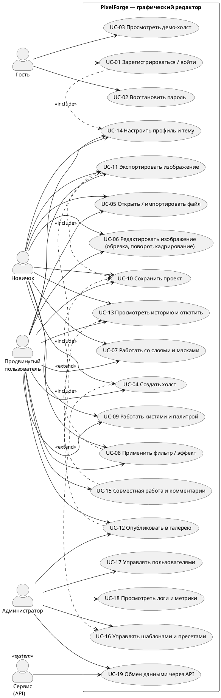
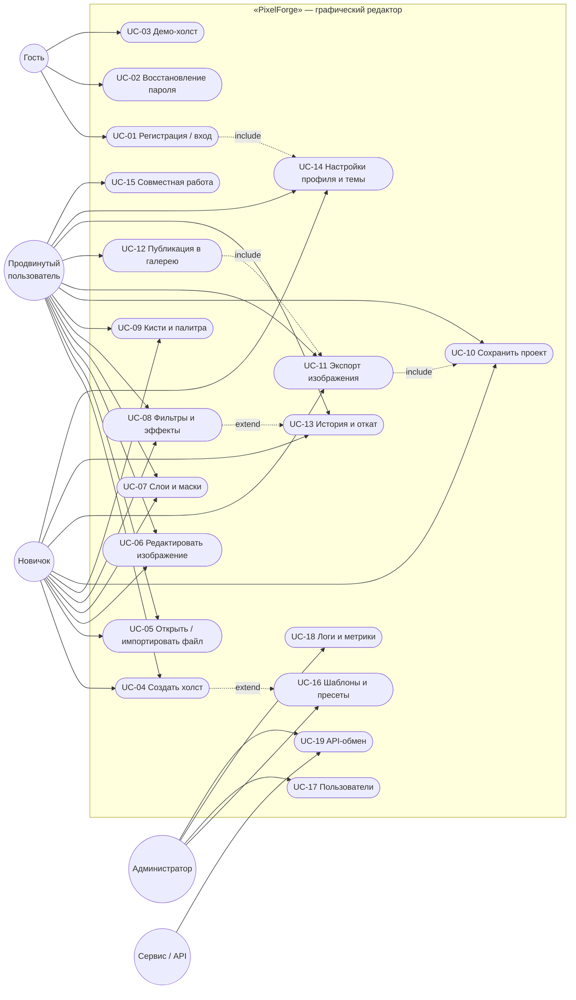

# Пользовательские сценарии

> Реестр задач, пошаговые сценарии, UML Use-Case диаграмма.
>
> Лабораторная работа S2G11, вариант № 3 «Графический редактор».

---

## 3.1. Список задач (пользовательских сценариев)

**Таблица 3.1.1. Реестр пользовательских сценариев**

| ID | Задача (сценарий) | Актор | Приоритет | Экран(ы) | Уровень |
|---|---|---|---|---|---|
| T-01 | Регистрация и вход в систему | Гость | Высокий | S1 | L0→L1 |
| T-02 | Создание нового холста (пустого или из шаблона) | Новичок, PRO | Высокий | S0, S2 | L1+ |
| T-03 | Открытие существующего файла (проект/импорт изображения) | Новичок, PRO | Высокий | S0, S2 | L1+ |
| T-04 | Работа со слоями (создание, порядок, маски, режимы наложения) | PRO | Высокий | S4 | L1+ |
| T-05 | Применение фильтра/эффекта | Новичок, PRO | Высокий | S5 | L0 (демо) / L1+ |
| T-06 | Обрезка и кадрирование изображения | Новичок, PRO | Высокий | S2 | L1+ |
| T-07 | Работа кистями и палитрой | PRO | Средний | S8 | L1+ |
| T-08 | Сохранение, экспорт и публикация | Новичок, PRO | Высокий | S6 | L1+ |
| T-09 | Откат и просмотр истории | Новичок, PRO | Средний | S7 | L1+ |
| T-10 | Настройка профиля, темы и интерфейса | Все авторизованные | Средний | S3 | L1+ |
| T-11 | Совместная работа и комментарии | PRO | Средний | S2, S4 | L2 |
| T-12 | Модерация шаблонов и пользователей | Администратор | Низкий | S11 (Admin) | L3 |

## 3.2. Пошаговое описание сценариев

### T-01. Регистрация и вход

| Шаг | Действие пользователя | Реакция системы |
|---|---|---|
| 1 | Открывает лендинг `/` | Показывает лендинг с CTA «Начать бесплатно» |
| 2 | Нажимает «Войти» / «Создать аккаунт» | Открывается экран S1 в режиме «Вход» |
| 3 | Вводит e-mail и пароль | Валидация «на лету»: формат e-mail, длина пароля ≥ 8 |
| 4 | Нажимает «Войти» | Кнопка меняет состояние на `loading`, спиннер 400 мс |
| 5 | (Альтернатива) Нажимает «Продолжить с Google» | OAuth-окно, затем возврат на S0 |
| 6 | (Регистрация) Переключается на вкладку «Регистрация» | Форма расширяется: имя, e-mail, пароль, чекбокс согласия |
| 7 | Заполняет и отправляет | Письмо-подтверждение; экран «Проверьте почту» |
| 8 | Переходит по ссылке из письма | Уровень доступа L1, редирект на S0 с онбординг-туром |
| 9 | (Ошибка) Неверный пароль | Инлайн-ошибка под полем, вход блокируется на 30 с после 5 попыток |
| 10 | (Ошибка) Забыл пароль | Экран восстановления, письмо со ссылкой сброса (TTL 30 мин) |

**Постусловие:** пользователь авторизован, доступен менеджер проектов.

### T-02. Создание нового холста

| Шаг | Действие | Реакция |
|---|---|---|
| 1 | На S0 нажимает «Создать проект» | Открывается модальное окно с 2 вкладками: «Свободный холст» / «Из шаблона» |
| 2 | Выбирает «Свободный холст» | Поля: название, единицы (px/mm/cm/in), ширина, высота, DPI, цвет фона (прозрачный/белый/свой), профиль цвета (sRGB/AdobeRGB) |
| 3 | Выбирает пресет «Instagram пост 1080×1080» | Поля заполняются, справа — превью пропорций |
| 4 | Нажимает «Создать» | Создание проекта, переход на S2 (холст), фон «шахматка» для прозрачности |
| 5 | (Альтернатива) «Из шаблона» | Сетка шаблонов с фильтрами по назначению/цвету, кнопка «Использовать» |
| 6 | (Валидация) Значение > 30000 px | Поле подсвечивается красным, подсказка «Максимум 30000 px для вашего уровня» |

### T-03. Открытие существующего файла

| Шаг | Действие | Реакция |
|---|---|---|
| 1 | S0 → «Мои проекты» | Сетка карточек с превью, датой, размером |
| 2 | Нажимает на карточку | Открывается S2 с загрузкой проекта; прогресс на карточке |
| 3 | Или: Ctrl+O / «Импорт» | Системный диалог выбора файла, форматы: PNG, JPG, WEBP, GIF, TIFF, SVG, PDF, PSD (базово), ABR |
| 4 | Выбирает файл 4800×3200 px | Появляется плашка «Импортировано как слой», холст подстраивается, масштаб «Вписать» |
| 5 | (Ошибка) Файл > 100 МБ / неподдерживаемый формат | Тост-сообщение об ошибке с причиной и «Что делать» |
| 6 | (Альтернатива) Drag&drop файла на S0 | Импорт без открытия диалога |

### T-04. Работа со слоями

| Шаг | Действие | Реакция |
|---|---|---|
| 1 | На S2 создаёт слой: `+` в панели слоёв | Создаётся пустой слой над активным, имя «Слой 4», режим редактирования имени |
| 2 | Открывает S4 «Слои» (полная панель) | Слева — список слоёв с миниатюрами 32×32, справа — свойства выбранного |
| 3 | Перетаскивает слой выше | Превью-линия вставки, холст обновляется мгновенно |
| 4 | Включает режим наложения «Умножение» | Результат виден сразу, в списке появляется бейдж режима |
| 5 | Создаёт группу и вкладывает 3 слоя | Группа получает отступ и «шеврон» сворачивания |
| 6 | Добавляет маску кистью | Маска отображается миниатюрой рядом со слоем |
| 7 | Блокирует слой | Иконка замка, попытка редактирования показывает тултип «Слой заблокирован» |
| 8 | Изменяет прозрачность 100→65 % | Числовое поле + слайдер, значение применяется в реальном времени |
| 9 | Отменяет действие Ctrl+Z | Изменение откатывается, в истории появляется новый шаг |

### T-05. Применение фильтра / эффекта

| Шаг | Действие | Реакция |
|---|---|---|
| 1 | На S2 нажимает «Фильтры» (или Ctrl+F) | Открывается панель S5 справа, холст сдвигается, не перекрываясь |
| 2 | Выбирает категорию «Цвет» | Список фильтров обновляется, у каждого — мини-превью результата |
| 3 | Наводит на «Тёплый закат» | Живой предпросмотр на холсте при наведении (hover-preview) |
| 4 | Настраивает «Интенсивность» слайдером | Обновление в реальном времени, до 60 fps |
| 5 | Сравнивает «До/После» (удержание кнопки) | Холст показывает оригинал, пока кнопка удержана |
| 6 | Нажимает «Применить» | Эффект фиксируется как шаг истории; панель можно закрыть |
| 7 | (Альтернатива) «Применить как смарт-фильтр» | Эффект остаётся редактируемым, в слое — бейдж `fx` |
| 8 | (Альтернатива) Пресеты: «Instagram-стиль» | Набор из 3 связанных фильтров применяется одним нажатием |
| 9 | (Отмена) Esc / «Отменить» | Настройки сбрасываются без изменения холста |

### T-06. Обрезка и кадрирование

| Шаг | Действие | Реакция |
|---|---|---|
| 1 | Выбирает инструмент «Рамка» (C) | Вокруг холста появляется рамка с 8 маркерами и затемнение снаружи |
| 2 | Тянет за угловой маркер | Пропорции сохраняются при Shift; показываются пиксельные размеры |
| 3 | Выбирает соотношение 1:1 | Кадр подстраивается, появляется сетка «правило третей» |
| 4 | Поворачивает кадр ползунком «Угол» | Сетка поворачивается, изображение выравнивается |
| 5 | Нажимает Enter / «Применить» | Холст обрезается, шаг добавляется в историю |
| 6 | (Альтернатива) «Кадрировать по содержимому» | Автоопределение границ объекта, предложение кадра |
| 7 | (Отмена) Esc | Рамка сбрасывается, изображение не изменяется |

### T-07. Работа кистями и палитрой

| Шаг | Действие | Реакция |
|---|---|---|
| 1 | На S2 нажимает «Кисти» | Открывается S8: библиотека кистей сеткой 4×n с превью штриха |
| 2 | Выбирает кисть «Мягкая круглая» | Превью штриха, параметры справа |
| 3 | Меняет размер (клавиши `[` / `]`) | Курсор-круг меняет диаметр, значение показывается у курсора |
| 4 | Меняет жёсткость/непрозрачность/наклон | Настройки применяются к текущему штриху |
| 5 | Открывает палитру (I — пипетка) | Палитра: базовые цвета, оттенки, RGB/HSL/HEX поля, «Недавние» |
| 6 | Берёт цвет пипеткой с холста | HEX обновляется, цвет добавляется в «Недавние» |
| 7 | Сохраняет набор кистей «Мой набор» | Набор появляется в списке пользовательских |
| 8 | (PRO) Импортирует `.abr` | Кисти добавляются в библиотеку, сообщение об успехе |

### T-08. Сохранение, экспорт и публикация

| Шаг | Действие | Реакция |
|---|---|---|
| 1 | Нажимает «Экспорт» (Ctrl+Shift+E) | Открывается S6 на весь экран |
| 2 | Слева — большое превью результата | Переключатель «Сетка/Слайсы», зум |
| 3 | Выбирает пресет «Instagram пост» | Формат PNG, 1080×1080, sRGB, качество 90 |
| 4 | Проверяет блок «Безопасные зоны» | Оверлей с зонами интерфейса соцсети |
| 5 | Меняет формат на JPG | Появляется слайдер качества, оценка размера файла |
| 6 | Нажимает «Экспортировать» | Прогресс, затем скачивание + запись в «Экспорты» |
| 7 | (Альтернатива) «Скопировать в буфер» | Изображение в буфере, тост-подтверждение |
| 8 | (Альтернатива) «Опубликовать в галерею» | Диалог: название, описание, теги, лицензия, модерация |
| 9 | (PRO) Батч-экспорт слайсами | Несколько файлов одним архивом ZIP, список очереди |

### T-09. Откат и просмотр истории

| Шаг | Действие | Реакция |
|---|---|---|
| 1 | На S2 нажимает «История» (Ctrl+H) | Открывается S7 слева, холст остаётся видимым |
| 2 | Видит список шагов с превью 56×56 и подписями | Активный шаг подсвечен |
| 3 | Кликает на шаг 12 из 40 | Холст откатывается к состоянию шага 12, шаги 13–40 показаны приглушённо (не удалены) |
| 4 | Возвращается вперёд на шаг 20 | Состояние восстанавливается |
| 5 | Делает новое действие из шага 12 | «Ветка»: шаги 13–40 становятся альтернативной ветвью, предлагается сохранить ветку |
| 6 | Переименовывает шаг «Смягчение кожи» | Подпись сохраняется в истории |
| 7 | Очищает историю | Диалог подтверждения, действие необратимо, предупреждение |

### T-10. Настройка профиля и интерфейса

| Шаг | Действие | Реакция |
|---|---|---|
| 1 | Открывает S3 из аватара в правом верхнем углу | Экран настроек с левой навигацией по разделам |
| 2 | Меняет аватар (загрузка/кроп) | Круглый кроп-редактор, сохранение |
| 3 | Выбирает тему «Тёмная» / «Системная» | Мгновенное применение, сохранение в профиле |
| 4 | Меняет масштаб интерфейса 100 → 125 % | Все панели пересчитываются |
| 5 | Настраивает хоткеи (профиль «Photoshop-совместимый») | Таблица переназначения с проверкой конфликтов |
| 6 | Включает «Режим новичка» | Скрываются продвинутые панели, показываются подсказки |
| 7 | Управляет хранилищем (2 ГБ из 2 ГБ) | Полоса заполнения, список крупных проектов, кнопка очистки кэша |
| 8 | Отключает 2FA / выходит со всех устройств | Деактивация сессий, подтверждение по e-mail |

## 3.3. UML Use-Case диаграмма

### 3.3.1. Диаграмма (код PlantUML)

### 3.3.2. Диаграмма (код Mermaid)

### 3.3.3. Спецификация прецедентов (фрагмент)

**Таблица 3.3.1. Описание ключевых прецедентов**

| ID | Прецедент | Акторы | Предусловие | Постусловие | Основной поток | Альтернативы |
|---|---|---|---|---|---|---|
| UC-01 | Регистрация / вход | Гость | Пользователь не авторизован | Пользователь авторизован (L1+) | Ввод e-mail/пароля → валидация → проверка → переход на S0 | OAuth, ошибка пароля, блокировка, восстановление |
| UC-04 | Создать холст | Новичок, PRO | Авторизован | Проект создан, открыт S2 | S0 → «Создать» → параметры → «Создать» | Из шаблона, превышение лимита |
| UC-07 | Слои и маски | Новичок, PRO | Открыт проект | Композиция изменена | S4 → создать/переместить слой → маска | Превышение лимита слоёв (L1: 20) |
| UC-08 | Фильтры и эффекты | Новичок, PRO | Открыт проект | Эффект применён | S5 → фильтр → настройка → «Применить» | Смарт-фильтр, отмена, пресеты |
| UC-11 | Экспорт | Новичок, PRO | Открыт проект | Файл получен | S6 → пресет → формат → «Экспортировать» | Батч, буфер обмена, публикация |
| UC-13 | История и откат | Новичок, PRO | Есть ≥ 1 действие | Состояние изменено | S7 → выбор шага → применение | Ветвление, очистка истории |

---
