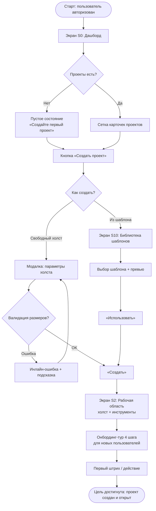
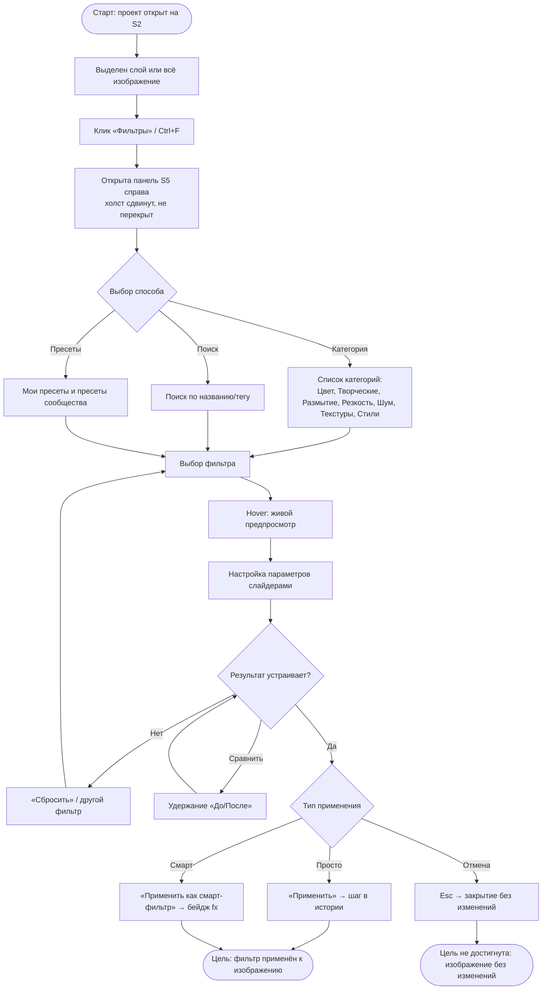
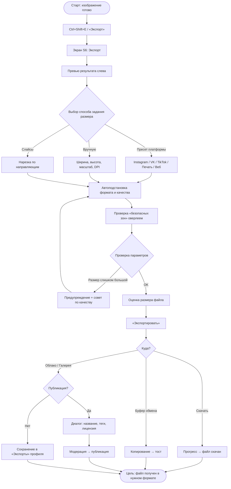
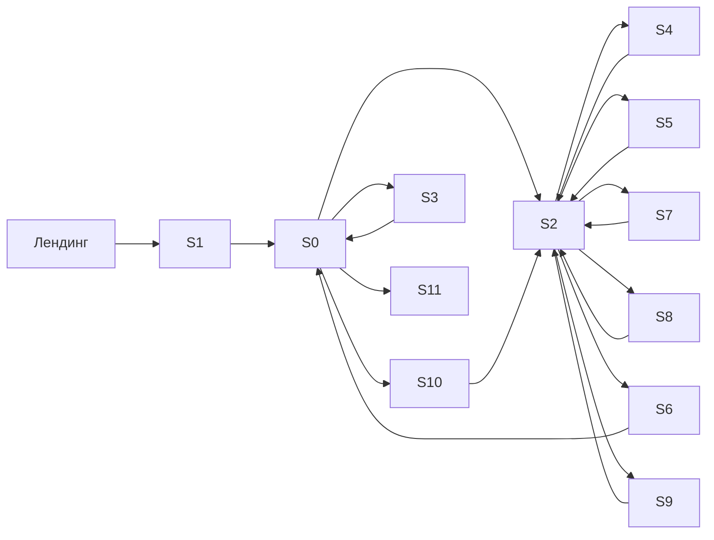

# Структура интерфейса

> Информационная архитектура, три User Flow, User Flow Map на A4, карта навигации.
>
> Лабораторная работа S2G11, вариант № 3 «Графический редактор».

---

## 4.1. Информационная архитектура

**Таблица 4.1.1. Карта разделов приложения**

| Уровень | Раздел | Экран | Доступ |
|---|---|---|---|
| 0 | Точка входа | Лендинг `index` | Все |
| 1 | Авторизация | S1 Вход / Регистрация / Восстановление | Гость |
| 1 | Менеджер проектов | S0 Дашборд «Мои проекты» | L1+ |
| 2 | Рабочая область | S2 Холст | L1+ (L0 — демо) |
| 3 | Слои | S4 Панель/экран слоёв | L1+ |
| 3 | Фильтры | S5 Панель фильтров и эффектов | L0+ |
| 3 | Кисти и палитра | S8 Библиотека кистей и цвет | L1+ |
| 3 | История | S7 История действий | L1+ |
| 3 | Экспорт | S6 Экспорт и публикация | L1+ |
| 2 | Шаблоны и ассеты | S10 Библиотека | L0+ |
| 2 | Профиль | S3 Настройки профиля | L1+ |
| 2 | Администрирование | S11 Admin-панель | L3 |
| 1 | Мобильная рабочая область | S9 (Mobile) | L1+ |

## 4.2. User Flow для ключевых сценариев

### 4.2.1. User Flow 1 — «Создание нового проекта»

**Таблица 4.2.1. Шаги и точки принятия решений**

| № | Шаг | Экран | Действие | Возможная развилка / ошибка |
|---|---|---|---|---|
| 1 | Вход в дашборд | S0 | Просмотр проектов | Пусто → пустое состояние |
| 2 | Инициирование | S0 | «Создать проект» | — |
| 3 | Выбор способа | Модалка | Свободный холст / Шаблон | Возврат в S0 |
| 4 | Задание параметров / выбор шаблона | Модалка / S10 | Размер, DPI, фон | Превышение лимита уровня |
| 5 | Создание | — | «Создать» | Сетевой сбой → повтор |
| 6 | Работа на холсте | S2 | Первое действие | Отмена через Ctrl+Z |

### 4.2.2. User Flow 2 — «Применение фильтра»

### 4.2.3. User Flow 3 — «Экспорт изображения»

## 4.3. User Flow Map всего приложения (лист A4)

### 4.3.1. Требуемые 8 ключевых элементов карты — как они реализованы

| № | Требование методички | Реализация в нашей карте |
|---|---|---|
| 1 | **Название** | Заголовок в левом верхнем углу листа: «User Flow Map — PixelForge, графический редактор. Вариант 3. Схема 1 из 1» + ФИО, группа, дата |
| 2 | **Одно направление** | Все потоки идут слева направо (десктоп) либо сверху вниз (мобильная ветка), пересечений и обратных стрелок без необходимости нет |
| 3 | **Одна цель** | Единственная цель на листе — **«Пользователь создал, отредактировал и экспортировал изображение»** (крайний правый блок, выделен зелёным) |
| 4 | **Легенда** | Блок «Условные обозначения» в правом нижнем углу: типы блоков, типы стрелок, цвета, символы развилок |
| 5 | **Точка входа** | Блок «Точка входа» слева: 3 входа — «Лендинг / реклама», «Приглашение по ссылке», «Прямой вход по URL» |
| 6 | **Подписи** | Каждый блок: номер шага, название экрана, номер экрана (S0–S11), краткое действие; стрелки подписаны условиями («если нет проектов», «если ошибка») |
| 7 | **Цвета** | Синий #2563EB — авторизация; фиолетовый #6C4CF1 — работа на холсте; оранжевый #F59E0B — развилки/решения; зелёный #16A34A — успешные финалы; красный #DC2626 — ошибки и тупики; серый #94A3B8 — служебные шаги |
| 8 | **Проверка цели** | В правом нижнем углу блок «Проверка достижения цели»: критерии успеха + таблица счётчиков (сколько тупиков/ошибок/лишних шагов найдено) |

### 4.3.2. Код диаграммы User Flow Map (одно направление, слева направо)

```mermaid
flowchart LR
  %% ===== ТОЧКА ВХОДА =====
  subgraph ENTRY[ТОЧКА ВХОДА]
    direction TB
    E1[Лендинг / реклама]
    E2[Приглашение по ссылке от коллеги]
    E3[Прямой вход по URL]
  end

  %% ===== АВТОРИЗАЦИЯ =====
  subgraph AUTH[БЛОК 1. ДОСТУП]
    direction TB
    A1[S1 Экран входа]
    A2{Есть аккаунт?}
    A3[S1 Регистрация]
    A4[Подтверждение e-mail]
    A5[Ошибка входа / блокировка]
  end

  %% ===== ВЫБОР ЗАДАЧИ =====
  subgraph START[БЛОК 2. СТАРТ]
    direction TB
    B1[S0 Дашборд «Мои проекты»]
    B2{Что нужно?}
    B3[Создать свободный холст]
    B4[Взять шаблон — S10]
    B5[Открыть / импортировать файл]
    B6[Демо-холст без сохранения]
  end

  %% ===== РЕДАКТИРОВАНИЕ =====
  subgraph EDIT[БЛОК 3. РЕДАКТИРОВАНИЕ — ЭКРАН S2]
    direction TB
    C1[Слои и маски — S4]
    C2[Фильтры и эффекты — S5]
    C3[Кисти и палитра — S8]
    C4[Обрезка и кадрирование]
    C5[Текст и фигуры]
    C6{Нужен откат?}
    C7[История действий — S7]
    C8[Автосохранение проекта]
  end

  %% ===== ЭКСПОРТ =====
  subgraph OUT[БЛОК 4. ВЫВОД]
    direction TB
    D1[S6 Экран экспорта]
    D2{Формат?}
    D3[PNG / JPG / WEBP]
    D4[SVG / PDF / TIFF]
    D5[Ошибка лимита уровня]
    D6[Публикация в галерею]
    D7[Сохранение в облако]
  end

  %% ===== ЦЕЛЬ =====
  GOAL([ЦЕЛЬ: изображение создано,<br/>отредактировано и экспортировано в нужном формате])

  ENTRY --> AUTH
  E1 --> A1
  E2 --> A1
  E3 --> A1
  A1 --> A2
  A2 -- Нет --> A3 --> A4 --> B1
  A2 -- Да --> B1
  A1 -. Ошибка .-> A5 -. Повтор .-> A1
  B1 --> B2
  B2 -- Создать --> B3 --> C1
  B2 -- Шаблон --> B4 --> C1
  B2 -- Импорт --> B5 --> C1
  B2 -- Демо --> B6 -. Без сохранения .-> GOAL
  C1 --> C2 --> C3 --> C4 --> C5
  C5 --> C6
  C6 -- Да --> C7 --> C5
  C6 -- Нет --> C8
  C8 --> D1
  D1 --> D2
  D2 -- Базовый --> D3 --> GOAL
  D2 -- PRO --> D4 --> GOAL
  D2 -- Недоступно --> D5 -. Апгрейд .-> D1
  D1 --> D6 --> GOAL
  D1 --> D7 --> GOAL

  %% ===== ЛЕГЕНДА =====
  subgraph LEGEND[ЛЕГЕНДА]
    direction TB
    L1[Прямоугольник = экран]
    L2{Ромб = развилка}
    L3([Скруглённый = старт/финал])
    L4[Сплошная = основной поток]
    L5[Пунктир = альтернативный / ошибочный]
    L6[Цвет: синий — доступ,<br/>фиолетовый — редактирование,<br/>оранжевый — решение,<br/>зелёный — цель,<br/>красный — ошибка]
  end

  GOAL --> CHECK[ПРОВЕРКА ЦЕЛИ:<br/>1 Все потоки ведут к цели<br/>2 Тупиков без возврата — 0<br/>3 Лишних шагов до первого результата — ≤ 4<br/>4 Целевое действие достижимо с L1]
```

### 4.3.3. Компоновка листа A4 (инструкция для Figma)

**Фрейм:** `A4_User-Flow-Map` — 2480 × 3508 px (A4 при 300 dpi), либо 794 × 1123 px для веб-версии. Отступы поля — 80 px.

| Зона | Координаты (x, y, w, h) | Содержимое |
|---|---|---|
| Заголовок | 80, 80, 2320, 220 | Название карты, вариант, ФИО, группа, дата, логотип |
| Точка входа | 80, 340, 320, 700 | 3 входных блока + маркер «▶ ТОЧКА ВХОДА» |
| Блок 1 «Доступ» | 440, 340, 480, 700 | S1 вход/регистрация, развилки, ошибки |
| Блок 2 «Старт» | 960, 340, 480, 900 | S0, S10, импорт, демо |
| Блок 3 «Редактирование» | 1480, 340, 520, 1500 | S2, S4, S5, S7, S8 |
| Блок 4 «Вывод» | 2040, 340, 360, 1100 | S6, форматы, публикация |
| **Цель** | 2040, 1500, 360, 180 | Зелёный блок с галочкой |
| Легенда | 80, 2700, 1100, 700 | Условные обозначения |
| Проверка цели | 1240, 2700, 1160, 700 | Критерии + таблица результатов проверки |
| Футер | 80, 3420, 2320, 60 | Подпись, страница 1 из 1 |

**Правила рисования листа:**
1. Все блоки — 200×64 px (экраны) и 240×88 px (развилки-ромбы), радиус 8 px, обводка 2 px.
2. Между блоками по горизонтали — 48 px, по вертикали — 32 px.
3. Соединители — 2 px, стрелка 8 px; подписи — Inter Medium 20 px, цвет #334155.
4. Единый визуальный вес: не более 3 шрифтовых кеглей (48 — заголовок, 26 — подписи блоков, 20 — легенда).
5. Пустое место внизу слева под легендой использовать для мини-карты навигации по экранам S0–S11.

## 4.4. Карта навигации между экранами

---
